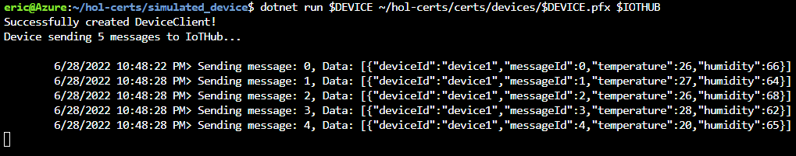
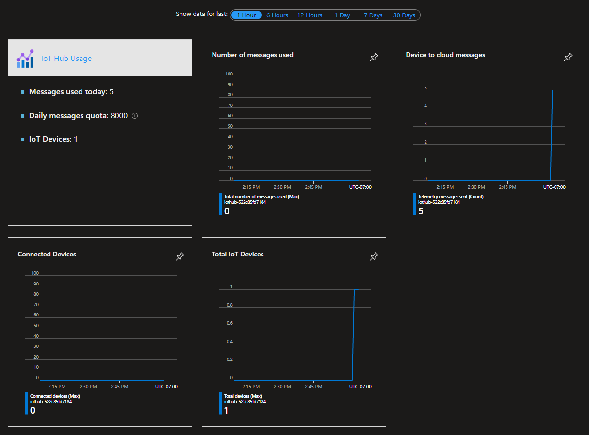

 Azure IoT 学院专题三: 动手实验二
===

**Course Content**
- [Azure IoT 学院专题三: 动手实验二](#azure-iot-学院专题三-动手实验二)
- [1. 介绍](#1-介绍)
- [2. 打开 Azure Cloud Shell](#2-打开-azure-cloud-shell)
- [3. 下载, unzip 文件, 和设置变量参数](#3-下载-unzip-文件-和设置变量参数)
- [4. 创建 CA 链和设备证书](#4-创建-ca-链和设备证书)
  - [1. 创建根 CA](#1-创建根-ca)
  - [2. 创建从属 CA](#2-创建从属-ca)
  - [3. 创建设备证书](#3-创建设备证书)
- [5. 创建和配置您的 IoT 中心](#5-创建和配置您的-iot-中心)
- [6. 运行模拟设备](#6-运行模拟设备)
  - [1. 验证 IoT 中心上的活动](#1-验证-iot-中心上的活动)
- [7. 清空资源](#7-清空资源)

# 1. 介绍

此动手实验室向您介绍如何使用 X.509 证书对 Azure IoT 服务的设备进行身份验证。

# 2. 打开 Azure Cloud Shell

在浏览器中，打开您的 Azure Cloud Shell：https://shell.azure.com/

确保你的 shell 设置为 Bash：


# 3. 下载, unzip 文件, 和设置变量参数

在 Cloud Shell 中，复制并粘贴以运行以下命令:

```bash
cd ~
wget https://github.com/AzureIoTGBB/iot-academy/raw/main/Month_3/Day_2/files/hol-certs.zip
unzip hol-certs.zip
RAND=`openssl rand -hex 6`
REGION="eastus"
RG="rg-hol-x509"
IOTHUB="iothub-$RAND"
DEVICE="device1"

```

无需更改上述任何变量，但供您参考，因为它们在本实验的其他地方使用:

| 变量名 | 描述 |
| -------- | ----------- |
| ***RAND*** | 6 个十六进制数字的随机字符串，使您的 IoT Hub 名称独一无二 |
| ***REGION*** | 用于创建资源组和 IoT Hub 的区域 |
| ***RG*** | 资源组名称 |
| ***IOTHUB*** |  IoT Hub 的唯一名称 |
| ***DEVICE*** | IoT Hub 中模拟设备的有效名称 |

# 4. 创建 CA 链和设备证书

## 1. 创建根 CA 

首先，在 rootca 目录中生成私钥和证书签名请求 (CSR)。

出现提示时输入根 CA 的密码并记住它，因为您将在以下步骤中需要它。

```bash
cd ~/hol-certs/certs/rootca
openssl rand -hex 16 > db/serial
openssl req -new -config rootca.conf -out rootca.csr -keyout private/rootca.key

```

接下来，创建一个自签名 CA 证书。 自签名适用于测试目的。 此根 CA 可用于签署证书和证书吊销列表 (CRL)。

出现提示时，签署证书并输入根 CA 密码短语。

```bash
openssl ca -selfsign -batch -config rootca.conf -in rootca.csr -out rootca.crt -extensions ca_ext

```

## 2. 创建从属 CA

在本实验中，我们还将创建一个从属或注册 CA。 因为您可以使用根 CA 来签署证书，所以创建从属 CA 并不是绝对必要的，但这模仿了现实世界的证书层次结构，其中根 CA 保持离线，从属 CA 颁发客户端证书。 输入从属 CA 的密码并记住它，因为您将在以下步骤中需要它。

```bash
cd ~/hol-certs/certs/subca
openssl rand -hex 16 > db/serial
openssl req -new -config subca.conf -out subca.csr -keyout private/subca.key

```

Create the subordinate CA and sign it. Enter the root CA pass phrase when prompted.

```bash
openssl ca -batch -config ../rootca/rootca.conf -in subca.csr -out subca.crt -extensions sub_ca_ext

```

Convert subca.crt to subca.pem so it can be imported to IoT Hub.

```bash
openssl x509 -in subca.crt -out subca.pem -outform PEM

```

## 3. 创建设备证书

为设备创建私钥并为密钥创建证书签名请求 (CSR)。 请注意，CN 必须等于设备 ID

```bash
openssl genpkey -out $DEVICE.key -algorithm RSA -pkeyopt rsa_keygen_bits:2048
openssl req -new -key $DEVICE.key -out $DEVICE.csr -subj "/CN=$DEVICE"
openssl req -text -in $DEVICE.csr -noout

```

创建并签署设备证书，创建将用于连接到 IoT 中心的 .pfx，复制重要文件并进行清理。 请注意，这里使用 .pfx 的空白密码，

```bash
openssl rand -hex 16 > db/serial
openssl ca -batch -config subca.conf -in $DEVICE.csr -out $DEVICE.crt -extensions client_ext

```

将证书导出为 .pfx 格式移至模拟设备将使用的目录

```bash
openssl pkcs12 -export -passout pass: -in $DEVICE.crt -inkey $DEVICE.key -out $DEVICE.pfx
mv $DEVICE.pfx ../devices

```

# 5. 创建和配置您的 IoT 中心

在指定区域创建新资源组，创建具有唯一名称的 IoT Hub ，添加从属 CA，并创建将使用 X.509 证书进行身份验证的设备。

```bash
az group create -l $REGION -g $RG
az iot hub create -n $IOTHUB -g $RG --sku F1 --partition-count 2
az iot hub certificate create --hub-name $IOTHUB --name "SubCA" --path ~/hol-certs/certs/subca/subca.pem --verified
az iot hub device-identity create -n $IOTHUB -d $DEVICE --am x509_ca

```

需要等待一下，才能完整创建资源。

# 6. 运行模拟设备

The below will restore the dotnet environment and run the simulated device with the name, pfx, and destination IoT Hub specified.

```bash
cd ~/hol-certs/simulated_device
dotnet restore
dotnet run $DEVICE ~/hol-certs/certs/devices/$DEVICE.pfx $IOTHUB

```

下面将恢复 dotnet 环境并使用指定的名称、pfx 和目标 IoT Hub 运行模拟设备:



发送的这些消息是确认模拟设备使用 X.509 证书身份验证连接

## 1. 验证 IoT 中心上的活动

打开您的 Azure 门户：https://portal.azure.com/

导航到资源组 **rg-hol-x509** 并单击此资源组中的 IoT Hub。

等待 1-5 分钟，将“显示最近的数据 - Show data for last”切换为 1 小时，观察“设备到云消息 - Device to cloud messages”已增加到 5。

如果没有看到，请尝试单击“刷新”。



# 7. 清空资源

使用模拟设备完成测试后， 执行以下命令进行资源清空

```bash
az group delete -g $RG --no-wait -y
cd ~
rm -rf hol-certs hol-certs.zip

```
