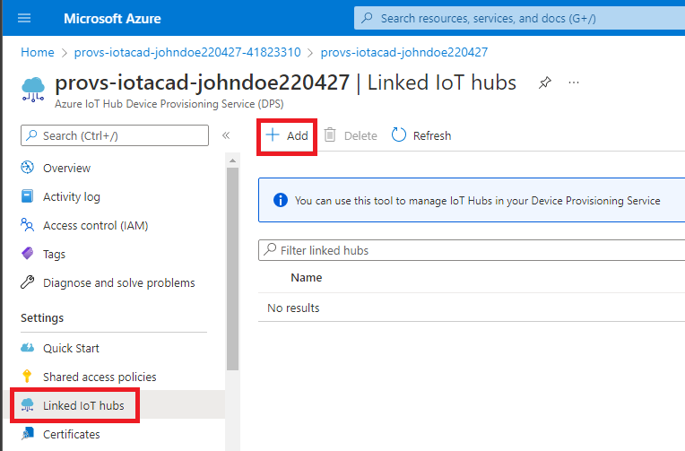
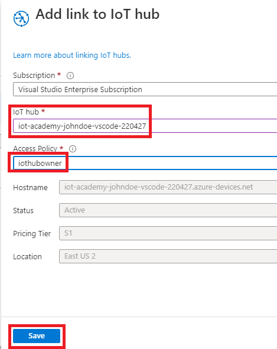
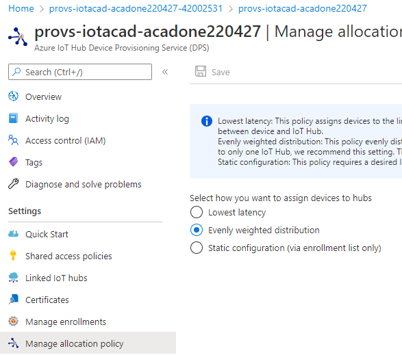
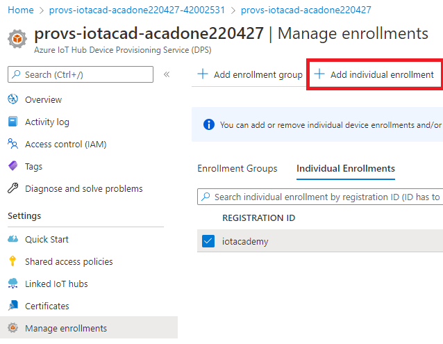
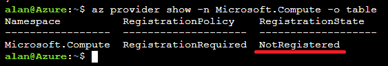
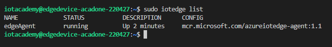
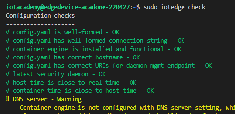

# Azure IoT Foundation

This hands on lab seeks to introduce the student to the following core Azure IoT services:
   - Azure IoT Hub
   - Azure Device Provisioning Service (DPS)
   - Azure IoT Edge, IoT Edge Runtime & Edge Modules
   - Azure Data Explorer (ADX)
   - Azure Stream Analytics (ASA)

Experience will also be gained with the following technologies:
   - Visual Studio Code
   - Azure Virtual Machines
   - Ubuntu 18
   - Bash 

These services are explored as they're often part of overall IoT solutions. A simplistic approach is taken with this lab to allow to reach many audiences of varying technical experience.

Ideally students taking this course have familiarity with the Azure Portal. [https://portal.azure.com](https://portal.azure.com/)

A good way to become familiar with Azure is to use the Microsoft Learn content and learning paths as part of the Azure Fundamentals certification. You can read more at the following link: [https://docs.microsoft.com/en-us/learn/certifications/exams/az-900](https://docs.microsoft.com/en-us/learn/certifications/exams/az-900)

Course Content

<!-- @import "[TOC]" {cmd="toc" depthFrom=2 depthTo=6 orderedList=false} -->

<!-- code_chunk_output -->

- [**Prerequisites**](#prerequisites)
  - [**Task 1: Install VS Code**](#task-1-install-vs-code)
  - [**Task 2: Install VS Code Extensions**](#task-2-install-vs-code-extensions)
- [**Exercise 1: IoT Hub provisioning**](#exercise-1-iot-hub-provisioning)
  - [**Task 1: Provision IoT Hub through the Portal**](#task-1-provision-iot-hub-through-the-portal)
  - [**Task 2: Provision IoT Hub through CLI**](#task-2-provision-iot-hub-through-cli)
  - [**Task 3: Provision IoT Hub through VS Code**](#task-3-provision-iot-hub-through-vs-code)
- [**Exercise 2: Azure IoT Hub Device Provisioning Service (DPS)**](#exercise-2-azure-iot-hub-device-provisioning-service-dps)
  - [**Task 1: Deploy DPS**](#task-1-deploy-dps)
  - [**Task 2: Connect IoT Hub to DPS**](#task-2-connect-iot-hub-to-dps)
  - [**Task 3: Create an Individual Enrollment**](#task-3-create-an-individual-enrollment)
  - [**Task 4: Gather Individual Enrollment Details**](#task-4-gather-individual-enrollment-details)
- [**Exercise 3: Create an Ubuntu-based Azure IoT Edge Device**](#exercise-3-create-an-ubuntu-based-azure-iot-edge-device)
  - [**Task 1: Ensure the Azure Resource Provider is Registered**](#task-1-ensure-the-azure-resource-provider-is-registered)
  - [**Task 2: Creating a VM to host an IoT Edge Device**](#task-2-creating-a-vm-to-host-an-iot-edge-device)
  - [**Task 3: Connecting to your Ubuntu Virtual Machine**](#task-3-connecting-to-your-ubuntu-virtual-machine)
  - [**Task 4: Install the Azure IoT Edge Runtime and Connect the Device**](#task-4-install-the-azure-iot-edge-runtime-and-connect-the-device)
  - [**Task 5: Observe the Enrollment and Device Status**](#task-5-observe-the-enrollment-and-device-status)
- [**Exercise 4: Deploy an IoT Edge Module to Simulate Device Telemetry**](#exercise-4-deploy-an-iot-edge-module-to-simulate-device-telemetry)
  - [**Task 1: Use the IoT Edge Module Marketplace to Provision the Simulated Temperature Sensor Module**](#task-1-use-the-iot-edge-module-marketplace-to-provision-the-simulated-temperature-sensor-module)
  - [**Task 2: Ensure the Module is Running**](#task-2-ensure-the-module-is-running)
- [**Exercise 5: Ingesting Telemetry Data with IoT Hub and Azure Data Explorer (ADX)**](#exercise-5-ingesting-telemetry-data-with-iot-hub-and-azure-data-explorer-adx)
  - [**Task 1: Creating the ADX Cluster**](#task-1-creating-the-adx-cluster)
  - [**Task 2: Adding an ADX Database**](#task-2-adding-an-adx-database)
  - [**Task 3: Creating the tempsensor table**](#task-3-creating-the-tempsensor-table)
  - [**Task 4: Connecting ADX to IoT Hub to Ingest Telemetry**](#task-4-connecting-adx-to-iot-hub-to-ingest-telemetry)
- [**Exercise 6: Analyzing Data with Azure Data Explorer (ADX)**](#exercise-6-analyzing-data-with-azure-data-explorer-adx)
  - [**Task 1: Connecting ASA to IoT Hub**](#task-1-connecting-asa-to-iot-hub)
- [**Exercise 7: Processing Telemetry with Azure Stream Analytics (ASA)**](#exercise-7-processing-telemetry-with-azure-stream-analytics-asa)
  - [**Task 1: Create a Table in ADX to Hold aggregated data**](#task-1-create-a-table-in-adx-to-hold-aggregated-data)
  - [**Task 2: Create a new ASA Job**](#task-2-create-a-new-asa-job)
  - [**Task 3: Creating an ASA Input**](#task-3-creating-an-asa-input)
  - [**Task 4: Creating an ASA Output**](#task-4-creating-an-asa-output)
  - [**Task 5: Writing an ASA Query**](#task-5-writing-an-asa-query)
  - [**Task 6: Start the ASA Job**](#task-6-start-the-asa-job)
  - [**Task 7: Review Collected Aggregated in ADX**](#task-7-review-collected-aggregated-in-adx)
- [**Exercise 8: Cleanup**](#exercise-8-cleanup)

<!-- /code_chunk_output -->

## **Prerequisites**

### **Task 1: Install VS Code**
[Visual Studio Code Download](https://code.visualstudio.com/Download)

### **Task 2: Install VS Code Extensions**
   1. Click extensions
   2. Search for `azure iot`
   3. Click install for the `Azure IoT Tools` extension pack

   

## **Exercise 1: IoT Hub provisioning**

### **Task 1: Provision IoT Hub through the Portal**

During this exercise you will use 3 different tools to create three different IoT Hubs, after this exercise we will delete two and continue the rest of the workshop with the first IoT Hub created through the Portal.

1. In your browser, navigate to the [Azure portal](https://portal.azure.com), select **+Create a resource** in the navigation pane, enter `iot hub` into the **Search the Marketplace** box.

   

2. Select **IoT Hub** from the results

   

3. Select **Create**.   

   

4. On the **IoT Hub** blade **Basics** tab, enter the following:

   - **Subscription**: Select the subscription you are using for this hands-on lab.

   - **Resource group**: Click Create new underneath Resource group. Enter the name `rg-iot-academy`

   <pre>

   </pre>

     

   - **IoT Hub Name**: Enter a unique name, such as `iot-academy-johndoe-220427`. 
   The name follows best practices for naming resources in Azure.
   Note: 
      1. the prefix `iot-`
      2. the inclusion of a name 'johndoe' and a date `220427(YYMMDD)` this combination such as `johndoe-220427` will be known as your **suffix**. You may want to copy this to your notepad so you can copy and paste it later.

      As some resources in Azure require unique names, the name and the date helps to avoid naming conflicts.
      More can be read concerning best practices for naming Azure resources at the following link: [Azure Naming and Tagging](https://docs.microsoft.com/en-us/azure/cloud-adoption-framework/ready/azure-best-practices/naming-and-tagging)
      For common resource prefixes refer to the following link: [Azure Resource Abbreviations](https://docs.microsoft.com/en-us/azure/cloud-adoption-framework/ready/azure-best-practices/resource-abbreviations)

     

   - **Region**: Select the location you are using for this hands-on lab.

   - Click **Next: Networking**.

   - On the **Networking** tab ensure `Public` is selected

   - Click **Next: Management**.

   - On the **Management** tab
      1. **Pricing and scale tier**: ensure `S1: Standard tier` is selected
      2. **Number of S1 IoT hub units**: ensure `1` is selected
      3. **Defender for IoT**: set to `On`
      4. **Role-based access control**: set to `Shared access policy + RBAC`
      5. **Assign me to the IoT Hub Data Contributor role**: select the check box
      6. **Device-to-cloud partitions**: leave the default setting of `4`

   - Click **Review + create**.

   - Ensure validation passes and click **Create**.

   
   

5. After clicking create you were directed to a deployment overview page. When the deployment completes click the **Go to resource** button.

   

### **Task 2: Provision IoT Hub through CLI**

1. Open the Azure Cloud Shell with the below link

    https://shell.azure.com/

   If you've never used the Azure Cloud 

   If you've never used the Azure Cloud Shell before:
      1. You will be prompted to select Bash or Powershell, select `Bash`
      
         

      3. You will be prompted to mount a storage account, click **Create Storage** to continue. If you used Azure Cloud Shell before, you will skip this step.
         - Click **Create storage**

            

2. If **Bash** isn't already selected switch to it

   

3. Once you are login run the following command to create an IoT Hub.

   In the following command replace **iot-johndoe-cli-220427** with your iothub name, replacing johndoe and the appropriate date, of the form iot-{yourname}-cli-{YYMMDD}

   ```bash  
   az iot hub create --name iot-academy-johndoe-cli-220427 --resource-group rg-iot-academy --sku S1
   ```

   As the command runs you'll observe the following result.

   

   When the command completes you'll see output as follows
   
   


4. In a new Edge tab, browse to the [Azure Portal](https://portal.azure.com) to verify your newly created IoT Hub.
   1. From the Azure Portal home page click **All resources**, under the Navigate section.
            
   2. Verify you see your two created IoT Hubs in the list of resorces
      

5. Delete the IoT Hub just created using the delete command.
   - Go back to your Cloud Shell tab

   - Run the following command to list your IoT Hubs
      ```bash 
      az iot hub list -o table
      ```
  
   - Run the following two commands in the Cloud Shell
    
      Again, replace johndoe and the appropriate date. You could also copy and paste the names from the previous `list` command
      ```bash 
      az iot hub delete --name iot-johndoe-cli-220427 --resource-group rg-iot-academy
      ```

      Also, delete the IoT Hub created through the portal
      ```bash
      az iot hub delete --name iot-academy-johndoe-220427 --resource-group rg-iot-academy   
      ```

   - Run the list command one more time to ensure your IoT Hub instances were deleted
      ```bash 
      az iot hub list -o table
      ```

### **Task 3: Provision IoT Hub through VS Code**

If you have not yet installed Visual Studio Code download and install from the following link:
   https://code.visualstudio.com/download

Our third way of creating an Azure resource, IoT Hub instance, is to use Visual Studio Code. 

1. Install IoT Tools extension pack for VS Code in one of two ways:
   - Use the following URL
   https://marketplace.visualstudio.com/items?itemName=vsciot-vscode.azure-iot-tools

   - Use the extension tab (highlighted in red) in VS Code, search for **iot tools**, select **Azure IoT Tools**, click **Install**

      

2. Sign in to your Azure account
   - Click the **View** menu on the top toolbar then select **Command Palette**. 
   - Type 'azure sign'
   - Click the `Azure: Sign in to Azure Cloud` command
   - Click `Azure (Current)` (or press enter)

      

   - After redirection to the browser select your account

      
   
   - Close the browser tab after seeing `You are signed in now and can close this page.`

2. Ensure your subscription is selected
   - Open the **Command Palette** (menu or shortcut)
   - Type 'azure sub' and select `Azure: Select Subscriptions`
      
   - To avoid confusion ensure your subscription is the only one selected during this hands on lab.
      
   

3. Click the View Menu and then Explorer

   

   - Ensure **Azure IoT Hub** is seen in the Explorer view

      

   - To create a new IoT Hub Go to the menu **View** on the top toolbar then select **Command Palette**. 

      

   - Type **Azure IoT Hub** in the search bar,  then you will see the list of commands available select  **Azure IoT Hub: Create IoT Hub** and click Enter.

      

   - Select the following parameters:
      - **Subscription**: Select your subscription.
      - **Resource group**: Use existing and select `rg-iot-academy`.
      - **Location**: Select the location you are using for resources in this hands-on lab.
      - **SKU**: Select **S1**.
      - **Name**: Assign a name to the IoTHub `iot-academy-johndoe-vscode-220427` change **johndoe** and **220427** using your name and the date YYMMDD.

      As the extension creates the IoT Hub instance you should see a status message as follows.

      

   - After the creation process you should be able to see the new IoT Hub in VS Code and the Azure Portal.

      

      Azure Portal Resource Group View

      

## **Exercise 2: Azure IoT Hub Device Provisioning Service (DPS)**
### **Task 1: Deploy DPS**

1. Create a DPS instance by:
   - Go to the Azure Portal home page
   - Click **Create a resource**
   - Search for `device prov`
   - Click **IoT Hub Device Provisioning Service**

   

2. Click **Create**
   
3. Create Details
   - Enter the following details
      - Resource group: `rg-iot-academy`
      - Name: `provs-iotacad-{SUFFIX}` e.g. `provs-iotacad-johndoe220427`
      - Region: `your region`

   

4. Click **Review and Create**, then click **Create**
   
5. When the deployment completes, click **Go to resource**

6. When the Overview page loads save the **ID Scope** to notepad   

### **Task 2: Connect IoT Hub to DPS**

1. Click **Linked IoT Hubs**, then click **Add**

   
2. Fill in the following details, then click **Save**

   
3. Click **Manage Allocation Policy**, review the options available
   
   

### **Task 3: Create an Individual Enrollment**

   1. Click **Manage enrollments**
   2. Click **Add individual enrollment**

      

   3. Fill in the following details
      - Mechanism: `Symmetric Key`
      - Auto-generate keys: `checked`
      - Registration ID: `iotacademy`
      - IoT Hub Device ID: `iot-academy-edge-device`
      - IoT Edge device: `True`
      - Select the IoT hubs this device can be assigned to: `select your hub`
      - Leave all other values at default
   4. Click **Save** at the top of the page


### **Task 4: Gather Individual Enrollment Details**
1. Click **Manage enrollments**, then click **Individual Enrollments**, then click your enrollment **iotacademy**
   
2. Take note of the following values in your notepad
   - Registration ID: `iotacademy`
   - IoT Hub Device ID: `iot-academy-edge-device`
   - Primary Key (click the copy icon shown in the image below)
      

## **Exercise 3: Create an Ubuntu-based Azure IoT Edge Device**

During this exercise you will learn how to set up an Azure IoT Edge device and connect it to IoT Hub to start streaming data.

### **Task 1: Ensure the Azure Resource Provider is Registered**
   1. Go back to your tab in Edge which has the Azure Cloud Shell, or open https://shell.azure.com
   2. Run the following command
      ```Bash
      az provider show -n Microsoft.Compute -o table
      ```
      
   3. If your status is `Registered` continue to Task 2
   4. If the status is `NotRegistered`, run the following command to Register the Resource Provider
      ```Bash
      az provider register -n 'Microsoft.Compute' --wait -o table
      ```
      
    
      
### **Task 2: Creating a VM to host an IoT Edge Device**

In this exercise we'll set up an IoT Edge device using an Ubuntu based VM.

1. From Azure Portal select **Create resource** then from the most Popular list select **Ubuntu Server 18.04 LTS**. If you don't see it use the search box titled **Search services and marketplace** to search for **Ubuntu Server 18.04 LTS**.

   
<br/>

2. Then you will need to complete the following parameters in the **Basics** tab:

   <span style="color:rgb(203,65,84);font-weight:700;font-size:20px">    

   Note: For the ``Region`` and ``Size`` options below. At the time of this writing there is a shortage of many VM sizes in various Azure regions for new subscriptions. This is believed to be from increased demand.

   The available VM skus are based on the region, or location, you're creating a VM resource within. 

   For ``Location`` you may need to look outside of your region your other resources are in. At the time of this writing `Sweden Central` seems to have many VM skus available and was used for this demonstration.

   Having your resources spread across different regions is not ideal as it can incur extra costs due to network usage. With the small scale and scope of this demo it won't have a meaningful impact on cost.

   For ``Size`` look for a VM sku that costs < $40 USD/month.

   A good small size to make the most of your Azure credit is `B1s` which includes free hours and is also < $8 USD/month
  
   </span>

   - **Subscription**: Select the subscription you are using for this hands-on lab.
   - **Resource group**: Use existing and select your resource group, `rg-iot-academy`.
   - **Virtual Machine Name**: edgedevice+SUFFIX e.g. `edgedevice-johndoe-220427`
   - **Region**: Refer to <span style="color:rgb(203,65,84)">Note</span>
   - **Availability Options**: Select `No Infrastructure redundancy required`.
   - **Image**: Keep default
   - **Size**: Refer to <span style="color:rgb(203,65,84)">Note</span>
   - **Authentication Type**: Select `Password`
   - **Username**: `iotacademy`
   - **Password**: `MSFTacademy01!` (For higher security you could create your own strong password)
   - **Public inbound ports**: `None`
<br/>

3. Click the **Management** tab at the top of the pane.
 

   Notice the Auto-shutdown feature. This feature is a helpful to control costs for development or infrequently used virtual machines. When the VM is shutdown you do not incur compute costs.
   
<br/>

4. Click the Tags tab
Add the following two tags
- environment: development
- product: iot-academy-training

   <br/>
   Diagram showing the tags tab while creating a VM

   

   <br/>

   Tags are an important aspect for management, governance, and hygiene of Azure resources. It's not uncommon to have thousands of resources in mature organizations. The tags can be used for search, reporting, and automation tools to ease management of large deployments.
   You can read more at [Azure Tagging Strategy](https://docs.microsoft.com/en-us/azure/cloud-adoption-framework/ready/azure-best-practices/resource-tagging)

<br/>

5. Last select **Review + Create** after successfull validation you should be able to click **Create**
<br/>

6. Once the resource is available click **Go to resource** to view the newly created Virtual Machine. You should see in the Overview section the Public IP to connect, copy the IP to your notepad.

   

<br/>

### **Task 3: Connecting to your Ubuntu Virtual Machine**

An important aspect of building cloud infrastructure is doing it in a secure manner.
As part of this exercise port 22 could be opened, for SSH, to allow quick connection to the VM. However, this could allow an attacker to attempt to breach this port.
Two safer approaches could be used
   - A safer approach would be to use an important feature of Azure Virtual Machines, Just-in-time (JIT) VM access. This feature allows enabling access to the VM for a specified amount of time. More information can found at [Just-in-time VM Access](https://docs.microsoft.com/en-us/azure/defender-for-cloud/just-in-time-access-usage)
   - Enabling SSH, port 22, access for just your IP address

For simplicity the 2nd option will be used.
<br/>

1. Go to [www.bing.com](https://www.bing.com) in your browser and search for `what is my ip`

   
<br/>
   Copy your IP address to your notepad.
<br/>

2. On your VM resource click the **Networking** tab. Click the `Add inbound port rule`

   

<br/>

3. Set the details for the new inbound port rule, click Add.

   - Source: `IP Addresses`
   - Source IP addresses/CIDR ranges: `Your IP address you saved in notepad`
   - Source port ranges: `*`
   - Service: `SSH`
   - Action: `Allow`
   - Priority: `100`
   - Name: `Port_22`

   

<br/>

4. Watch for the notification that the security rule created successfully

   

<br/>

5. Switch to VS Code, use the **View** menu and click **Terminal**

   

   

   If you don't see a `bash` terminal at the top, click the `+` and click `bash`
<br/>

6. Enter `ssh iotacademy@{the public IP address of your VM}` and press enter. You saved the VMs public IP address earlier in your notepad. Be sure to not confuse your public IP address with the IP address of the VM.
e.g. `ssh iotacademy@20.122.53.2`

<br/>
   
   If this is your first time connecting you'll see a prompt asking `Are you sure you want to continue connecting?`. Enter `yes` and press enter.

   

<br/>

7. Enter your password you defined earlier `MSFTacademy01!` and press enter. The password can be copied to your clipboard and pasted into the terminal by:
   - left clicking on the terminal window once, to focus the window
   - right clicking on the terminal window once, this pastes the clipboard contents
<br/>

   After successfully connecting you'll see the following in your terminal
   
   
<br/>

### **Task 4: Install the Azure IoT Edge Runtime and Connect the Device**

1. Now logged into the VM, Install the Edge Runtime

   Install the repository configuration that matches your device operating system.

   ```bash
   curl https://packages.microsoft.com/config/ubuntu/18.04/multiarch/prod.list > ./microsoft-prod.list
   ```

   Copy the generated list to the sources.list.d directory.

   ```bash
   sudo cp ./microsoft-prod.list /etc/apt/sources.list.d/
   ```

   Install the Microsoft GPG public key.
   ```bash
   curl https://packages.microsoft.com/keys/microsoft.asc | gpg --dearmor > microsoft.gpg
   sudo cp ./microsoft.gpg /etc/apt/trusted.gpg.d/
   ```

   Azure IoT Edge software packages are subject to the license terms located in each package (usr/share/doc/{package-name} or the LICENSE directory). Read the license terms prior to using a package. Your installation and use of a package constitutes your acceptance of these terms. If you do not agree with the license terms, do not use that package.

   After successfully running the previous commands you'll the following results depicted in the diagram.

   

2. Install a Container Engine

   Update package lists on your device.
   ```bash
      sudo apt-get update
   ```

   Install the Moby engine.
   ```bash
      sudo apt-get install moby-engine
   ```

3. Install the IoT Edge runtime package

   ```bash
      sudo apt-get install iotedge
   ```

4. Edit the IoT Edge config.yaml, updating the provisioning information
   
   - Configure the provisioning section with the information that we saved during the setup of DPS.

   ```bash
      sudo nano /etc/iotedge/config.yaml
   ```

   - Scroll down to **Manual Provisioning with an IoT Hub connection string** then comment out all the uncommented lines using the `#` symbol. You may have to use your arrow keys to navigate within Nano.

   

   - Scroll down further to locate the **DPS provisioning with symmetric key attestation** section. Uncomment the section and set the following values. Note: It's important that there are exactly two spaces for indentation used. When working with the template file the `#` and a space will need to be removed from each line.
      - scope_id: saved in notepad (e.g. `0ne115AEAFD`)
      - registration_id: `iotacademy`, saved in notepad
      - symmetric_key: the primary key saved in notepad

      

   After making the edits:
      - press **CrtL+X** to close the file 
      - select  **Y** to save the changes
      - press enter to accept the file name

   Now restart your edge daemon
   ```bash
      sudo systemctl restart iotedge
   ```

   In a few minutes you should receive a **Running** status after executing the following command. 

   <span style="color:rgb(203,65,84);font-weight:700;font-size:20px">    
      The following command may need to be run several times if enough time has not passed since restarting the IoT Edge runtime.  

      Periodically re-run the command, for up to 10 minutes.

   </span>

   ```bash
      sudo iotedge list
   ```

   

   Another command that is useful is **check** that is shown below. The **check** command:
      - checks the validity of the config.yaml file
      - the container engine is functional
      - time is correct
      - connections to DPS and IoT Hub can be established

   ```bash
      sudo iotedge check
   ```
   
   Note that it's normal to have some <span style="color:yellow;background-color:black">warnings</span> and <span style="color:red;background-color:black">errors</span>
   
   

### **Task 5: Observe the Enrollment and Device Status**
   1. Head back to the Azure Portal home page
   2. Navigate to your DPS instance by searching for `provs` and clicking your instance.
   3. Click **Manage Enrollments**
   4. Click **Individual Enrollments**
   5. Click **iotacademy**

      

## **Exercise 4: Deploy an IoT Edge Module to Simulate Device Telemetry**

### **Task 1: Use the IoT Edge Module Marketplace to Provision the Simulated Temperature Sensor Module**

   1. In Azure Portal, navigate to your IoT Hub created in previous steps, under **Device Management** click **IoT Edge**, then click your Edge Device
    
      

   3. Click **Set Modules**
    
      

   5. Click **Add**. Then click **Marketplace Module**
    
      
   
   7. The search box will appear, type **Simulated Temperature Sensor**, Then click the module to add it
   
      

   8. Review the presentation section **Routes** to learn about IoT Edge routing
   
   9. Click **Review + create** at the bottom of the pane. Review the available settings for the Deployment
   
   10. After validation passes click **Create** at the bottom of the pane

### **Task 2: Ensure the Module is Running**

   Review the running modules on your Edge device
   
   It may take a few minutes for the module to deploy and come to a running state. 
   Running modules can be verified in a few ways:

   - On device details review the **Modules** section at the bottom of the pane. 
      

      The **Refresh** button can also be used to get the latest status rather than refreshing the page. 

   - Using SSH, connect to your VM and run the `iotedge list` command as shown below
      ```bash
      sudo iotedge list
      ```
      

## **Exercise 5: Ingesting Telemetry Data with IoT Hub and Azure Data Explorer (ADX)**

### **Task 1: Creating the ADX Cluster**

   1. Find the Azure Data Explorer service to create a new cluster
   
      - Go to the Azure Portal home page by selecting **Microsoft Azure** at the top of the window. Then click **Azure Data Explorer Clusters**

         

      - Click **Create**
<br/>

   2. Enter the details for the new ADX cluster then click **Review + create**
      
      - Details
         - Resource group: `rg-iot-academy`
         - Cluster name: `{prefix|iot|acad|johnd|220427}` e.g. `deciotacadjohnd220427`. This name must be globally unique, alphanumeric only, limited to 22 characters.
         - Region: `{Your region}` e.g. `East US 2`
         - Workload: `Dev/test`
         - Compute specifications: `Dev(No SLA)_Standard_E2a_v4`
         - Availability Zones: uncheck all options. Availability zones provide resiliency, most often for production systems.  
         <br/>

         

      - After validation passes click **Create**

      - Wait until the cluster is created, which may take ~5-10 minutes, and click **Go to resource**
<br/>

### **Task 2: Adding an ADX Database**
   
   1. Now on the Overview tab for your new ADX cluster click **Add database**

      
<br/>

   2. Click **Create**

      

      - After a few moments you'll be back at the overview page. 
<br/>

### **Task 3: Creating the tempsensor table**

   Create the tempsensor table with schema and mapping

   - Click **Query**. Click your **tempsensor** database. Paste the create table code from below into the windows. Then click **Run**.

      <span style="color:rgb(203,65,84);font-weight:700;font-size:16px">          
      Note: If Query is greyed out refresh your browser page.
      </span>

      ```
      .create table tempsensor (timeCreated: datetime, temperature: real, humidity: real)
      ```
         

   - A message as follows will be received when successful.

         

   - Next, create the tempsensor ingestion mapping. Replace the command in the window with the command from the following code block. Then, click **Run**.
   When successfull a similar result from the last command will be observed.

      ```
      .create table tempsensor ingestion json mapping 'tempsensorMapping' '[{"column":"timeCreated","path":"$.timeCreated","datatype":"datetime"},{"column":"humidity","path":"$.ambient.humidity","datatype":"real"},{"column":"temperature","path":"$.ambient.temperature","datatype":"real"}]'
      ```
<br/>

### **Task 4: Connecting ADX to IoT Hub to Ingest Telemetry**

   1. Add a new Consumer Group to your IoT Hub
      - Use the Azure Portal search bar, type `vscode`. Your IoT Hub instance will be shown. Click your IoT Hub name to navigate to the resource.

         

      - Click **Built-in endpoints**. Add a new consumer group under the **Consumer Groups** section. Type `adx` in the box and press tab. When you press tab your entry will be saved.

         

   2. Create a data connection to ingest your tempsensor telemetry data
   
      - Use the Azure Portal search bar to search for `dec`, the standard prefix for Azure Data Explorer resources. Then, click your instance to load the resource.
      
      - Click **Create data connection** and select IoT Hub.
         
         

      - Fill in all the fields as follows:
         - Data connection name: `tempsensor`
         - Subscription: {Your subscription}
         - IoT Hub: {Your IoT Hub that includes vscode in the name}
         - Shared Access Policy: {iothubowner}
         - Consumer Group: `adx`
         - Event system properites: Click the dropdown and select `iothub-connection-device-id`
         - Database Name: `tempsensor`
         - Table name: `tempsensor`
         - Data format: `JSON`
         - Mapping name: `tempsensorMapping`

      - Click **Create**

         
      
      - Watch for the notification for when the data connection creation is successful.

         

## **Exercise 6: Analyzing Data with Azure Data Explorer (ADX)**
### **Task 1: Connecting ASA to IoT Hub**
   
   1. Restart the temperature sensor module to ensure fresh telemetry is flowing

      The `Simulated Temperature Sensor` module sends 500 telemetry messages, once every 5 seconds. This means ~40 minutes worth of messages. As our lab takes some time to work through we'll restart the module to ensure we have plenty of data to analyze with ADX.

      - Create a 2nd browser tab to have both ADX and IoT Hub open in the Azure Portal. Right click the browser tab and click **Duplicate tab**.

         
         <br/>

      - Switch to your 2nd tab, then click Microsoft Azure at the top of window to take you to the home page.

      - In your recent resources click your IoT Hub instance such as `iot-academy-johndoe-vscode-220427`

         
         <br/>
      
      - Click **IoT Edge**, then click your device **iot-academy-edge-device**

         
         <br/>

      - Click the **Simulated Temperature Sensor** module at the bottom of the window

         
         <br/>

      - Click the **Troubleshoot** at the top of the window

         
         <br/>
      
      - Click **Restart Simulated Temperature Sensor** 
         Notice the status that's received `Initializing simulated temperature sensor to send 500 messages, at an interval of 5 seconds`

         
         <br/>
   
   2. Review the data received by ADX
      - Click your 1st browser tab where ADX is still loaded.
      - Click **Query** and enter the following query. Also, click the `>>` and ensure the `tempsensor` database scope is selected.
         ```
         tempsensor
         | order by timeCreated desc 
         | limit  10
         ```
         
         <br/>
      - Click the **Run** button. If you're used to SQL don't press F5 as it will refresh your browser.
         
         <br/>
         
## **Exercise 7: Processing Telemetry with Azure Stream Analytics (ASA)**

### **Task 1: Create a Table in ADX to Hold aggregated data**

   - Replace the contents of the query window with the create table statement below.

   - Create a new table named `tempsensoragg` in the `tempsensor` database. Reference Exercise 5 - Task 3 if help is needed.

      ```bash
      .create table tempsensoragg (WindowEnd: datetime, AverageTemperature: real)
      ```
      
### **Task 2: Create a new ASA Job**
   1. Go to the Azure Portal home page
   2. Click **Create a resource**
   3. Search for `stream analytics job`

      

   4. Click **Stream Analytics job**
   5. Click **Create**
   6. Enter the details for the job:
      - Job name: `asajob-tempagg`
      - Resource group: `rg-iot-academy`
      - Location: your region e.g. `East US 2`
      - Hosting environment: `Cloud`
      - Streaming units: `1`
      
      

   7. When the deployment is complete click **Go to resource**
   
### **Task 3: Creating an ASA Input**

   - In another Edge tab navigate to your IoT Hub resource. 
   - Create a new consumer group named `asa`. Reference Exercise 5 - Task 4 if help is needed.
   - Go back to your tab that has your ASA instance.
   - Click **Inputs**, Click **Add stream input**, Click **IoT Hub**

      

   - Enter the input details:
     - Subscription: your subscription
     - IoT Hub: your IoT Hub instance
     - Input alias: `vscodeiothub`
     - Consumer group: `asa`
     - Endpoint: `Messaging`
     - All other values: default

      <br/>

      
      
   - Click **Save**
 
### **Task 4: Creating an ASA Output**

   1. Click **Outputs**
   2. Click **Add**, then click **Azure Data Explorer**

      
   
   3. Enter the details as shown below:
      - Output alias: `adx`
      - Cluster: your cluster created earlier
      - Database: your database created earlier
      - Table: `tempsensoragg`

      

   4. Click **Save**

### **Task 5: Writing an ASA Query**

   1. Click **Query**
   2. Copy and paste the query below into the query window
```SQL
SELECT System.Timestamp() AS WindowEnd, avg(ambient.temperature) AverageTemperature
INTO adx
FROM vscodeiothub
GROUP BY TumblingWindow(Duration(minute, 1))
```
   3. Click **Save query**

      
   
   4. In another Edge tab navigate to your IoT Hub Instance
   5. Reset the **SimulatedTemperatureSensor** module as described in Exercise 6 Task 1 to ensure telmetry being sent
   6. Now back to your asa job, in the other open Edge tab
   7. Click **Test Query**
   8. Review the results in the output under the **Test Results** tab

      

### **Task 6: Start the ASA Job**
   1. Go to the **Overview** tab
   2. Click **Start**

      

   3. Click **Start** once more

      

   4. Watch the notification to ensure that the ASA job starts successfully.

      
   
### **Task 7: Review Collected Aggregated in ADX**
   1. Navigate to your ADX resource in another Edge tab
   2. Click **Query**
   3. Enter the query below
      ```
      tempsensoragg
      | take 10 
      | order by WindowEnd desc 
      ```
   4. Click **Run**
   5. Continue clicking **Run** occassionally for 10 - 15 minutes until you see your data appear in the results as shown

      

## **Exercise 8: Cleanup**

   It's important to not leave your Azure resources provisioned until the next Azure IoT Academy session as there may not be enough Azure credit for the next sessions.

   1. Navigate to the Azure Portal home page
   2. Click **Resource groups**
   3. Click **rg-iot-academy**
   4. Click **Delete resource group**

      
   
   5. Type the type the name of your resource group and click **Delete**

      


