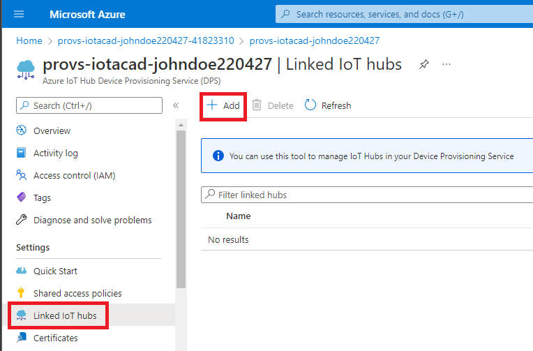
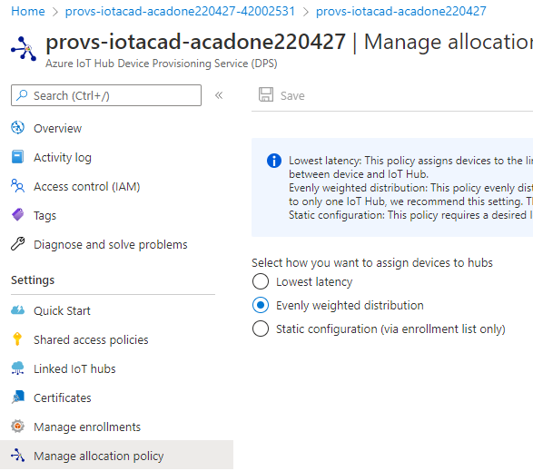
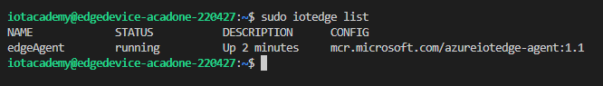

# **Azure IoT 基础学习**

此动手实验室旨在向各位介绍以下核心 Azure IoT 服务：
   - Azure IoT Hub
   - Azure Device Provisioning Service (DPS)
   - Azure IoT Edge, IoT Edge Runtime & Edge Modules
   - Azure Data Explorer (ADX)
   - Azure Stream Analytics (ASA)

还将通过以下技术配合实践：
   - Visual Studio Code
   - Azure Virtual Machines
   - Ubuntu 18
   - Bash 

这些服务是物联网整体解决方案的一部分。 该动手实验用简单的方法介绍了这些服务，可以让不同技术经验的各位学习。

各位需要了解 Azure 门户 [https://portal.azure.com](https://portal.azure.com/)

熟悉 Azure 的一个好方法是使用 Microsoft Learn 模块和学习路径。 您可以通过以下链接阅读更多信息：[https://docs.microsoft.com/en-us/learn/certifications/exams/az-900](https://docs.microsoft.com/en-us/learn/certifications/exams/az-900)

课程内容

<!-- @import "[TOC]" {cmd="toc" depthFrom=2 depthTo=6 orderedList=false} -->

<!-- code_chunk_output -->
- [**Azure IoT 基础学习**](#azure-iot-基础学习)
  - [**准备工作**](#准备工作)
    - [**任务一: 安装 VS Code**](#任务一-安装-vs-code)
    - [**任务二: 安装 VS Code 相关插件**](#任务二-安装-vs-code-相关插件)
  - [**实验一: 认识 Azure IoT 中心配置相关内容**](#实验一-认识-azure-iot-中心配置相关内容)
    - [**任务一: 通过 Azure 门户配置 IoT 中心**](#任务一-通过-azure-门户配置-iot-中心)
    - [**任务二: 通过命令行配置 IoT Hub**](#任务二-通过命令行配置-iot-hub)
    - [**任务三: 通过 VS Code 配置 IoT Hub**](#任务三-通过-vs-code-配置-iot-hub)
  - [**实验二: Azure IoT Hub 设备预配服务 (DPS)**](#实验二-azure-iot-hub-设备预配服务-dps)
    - [**任务一: 部署 DPS**](#任务一-部署-dps)
    - [**任务二: 链接 IoT Hub 到 DPS**](#任务二-链接-iot-hub-到-dps)
    - [**任务三: 创建 Individual Enrollment**](#任务三-创建-individual-enrollment)
    - [**任务四：收集 Individual Enrollment 详细信息**](#任务四收集-individual-enrollment-详细信息)
  - [**实验三：创建基于 Ubuntu 的 Azure IoT Edge 设备**](#实验三创建基于-ubuntu-的-azure-iot-edge-设备)
    - [**任务一: 确保 Azure Resource Provider 已经注册**](#任务一-确保-azure-resource-provider-已经注册)
    - [**任务二: 创建 VM 以托管 IoT Edge 设备**](#任务二-创建-vm-以托管-iot-edge-设备)
    - [**任务三: 链接创建好的 Unbuntu 虚拟机**](#任务三-链接创建好的-unbuntu-虚拟机)
    - [**任务四: 安装 Azure IoT Edge 运行时并连接设备**](#任务四-安装-azure-iot-edge-运行时并连接设备)
    - [**任务五: 观察 Enrollments 设备状态**](#任务五-观察-enrollments-设备状态)
  - [**实验四: 部署 IoT Edge 模块以模拟设备遥测**](#实验四-部署-iot-edge-模块以模拟设备遥测)
    - [**任务一: 使用 Azure IoT Edge 模块市场提供的模块实现模拟温度传感器**](#任务一-使用-azure-iot-edge-模块市场提供的模块实现模拟温度传感器)
    - [**任务二: 确保模块正常在运行**](#任务二-确保模块正常在运行)
  - [**实验五：使用 IoT Hub 和 Azure Data Explorer 提取遥测数据 (ADX)**](#实验五使用-iot-hub-和-azure-data-explorer-提取遥测数据-adx)
    - [**任务一: 创建 ADX 集群**](#任务一-创建-adx-集群)
    - [**任务二: 添加 ADX 数据库**](#任务二-添加-adx-数据库)
    - [**任务三：创建温度传感器表格**](#任务三创建温度传感器表格)
    - [**任务四: 将 ADX 连接到 IoT Hub 以提取遥测数据**](#任务四-将-adx-连接到-iot-hub-以提取遥测数据)
  - [**实验六: 用 Azure Data Explorer (ADX) 进行数据分析**](#实验六-用-azure-data-explorer-adx-进行数据分析)
    - [**任务1: 将 ASA 连接到 IoT 中心**](#任务1-将-asa-连接到-iot-中心)
  - [**实验七: 使用 Azure Stream Analytics (ASA) 处理遥测**](#实验七-使用-azure-stream-analytics-asa-处理遥测)
    - [**任务一: 在 ADX 中创建一个表来保存聚合数据**](#任务一-在-adx-中创建一个表来保存聚合数据)
    - [**任务二: 创建新的 ASA 作业**](#任务二-创建新的-asa-作业)
    - [**任务三: 创建一个 ASA 输入**](#任务三-创建一个-asa-输入)
    - [**任务四: 创建一个 ASA 输出**](#任务四-创建一个-asa-输出)
    - [**任务五: 写入 ASA 查询**](#任务五-写入-asa-查询)
    - [**任务六： 开始调度 ASA 任务**](#任务六-开始调度-asa-任务)
    - [**任务七: 查看 ADX 中收集的聚合**](#任务七-查看-adx-中收集的聚合)
  - [**任务八 - 清空资源**](#任务八---清空资源)

<!-- /code_chunk_output -->

## **准备工作**

### **任务一: 安装 VS Code**
[Visual Studio Code Download](https://code.visualstudio.com/Download)

### **任务二: 安装 VS Code 相关插件**
   1. 点击插件按钮
   2. 查找 `azure iot`
   3. 点击安装 `Azure IoT Tools` 插件包

   

## **实验一: 认识 Azure IoT 中心配置相关内容**

### **任务一: 通过 Azure 门户配置 IoT 中心**

在该任务中，您将使用三种不同的工具来创建三个不同的 IoT 中心，在该动手实验之后，我们将删除其中的两个并使用通过门户创建的第一个 IoT 中心继续动手实验的其余部分。

1. In your browser, navigate to the [Azure portal](https://portal.azure.com), select **+Create a resource** in the navigation pane, enter `iot hub` into the **Search the Marketplace** box.

2. 在浏览器中，导航到 [Azure 门户](https://portal.azure.com)，在导航中选择 **+创建资源 - +Create a resource**，在 **搜索框中输入`iot hub`** 可以在 Azure MarketPlace 上找到对应内容。

   

3. 从查找结果中选择 **IoT Hub**

   

4. 选择创建 **创建 - Create**.   

   

5. 在 **IoT Hub** 的 **Basics** 选项卡上，输入以下内容：

    - **订阅 - Subscription**：选择用于此动手实验的订阅。

    - **资源组 - Resource group**：单击资源组下的新建。 输入名称“rg-iot-academy”

   <pre>

   </pre>

     

   - **IoT Hub Name - IoT Hub 名称**：输入唯一名称，例如 `iot-academy-johndoe-220427`。
    该名称遵循在 Azure 中命名资源的标准做法。
    注意：
       1. 前缀`iot-`

       2. 包含名称“johndoe”和日期“220427(YYMMDD)”这种组合，例如“johndoe-220427”，将被称为您的**后缀**。 您可能会将其复制到记事本中，以便稍后复制和粘贴。

       由于 Azure 中的某些资源需要唯一名称，因此名称和日期有助于避免命名冲突。
       可以在以下链接中阅读有关命名 Azure 资源的最佳实践的更多信息：[Azure 命名和标记](https://docs.microsoft.com/en-us/azure/cloud-adoption-framework/ready/azure-best-practices/naming-and-tagging)
       有关常见资源前缀的内容，请参阅以下链接：[Azure Resource Abbreviations](https://docs.microsoft.com/en-us/azure/cloud-adoption-framework/ready/azure-best-practices/resource-abbreviations)

     

   - **区域 - Region**：选择您用于此动手实验室的位置。

    - 单击**下一步：网络 - Next: Networking**。

    - 在 **网络 - Networking** 选项卡上，确保选择了“Public”

    - 单击**下一步：管理**。

    - 在**管理**选项卡上
       1. **定价和规模层 - Pricing and scale tier**：确保选择“S1：标准层”
       2. **S1 IoT 集线器单元的数量 - Number of S1 IoT hub units**：确保选择“1”
       3. **物联网防火墙 - Defender for IoT**：设置为“开”
       4. **将我分配给 IoT 中心数据参与者角色 - Assign me to the IoT Hub Data Contributor role**：选中复选框
       5. **设备到云分区 - Device-to-cloud partitions**：保留默认设置 `4`

    - 点击**查看+创建**。

    - 确保验证通过并单击**创建**。

   
   

6. 单击创建后，您将被定向到部署概述的页面。 部署完成后，单击 **进入资源组 - Go to resource** 按钮。

   

### **任务二: 通过命令行配置 IoT Hub**

1. 使用以下链接打开 Azure Cloud Shell

    https://shell.azure.com/

   如果您从未使用过 Azure 云

    如果您以前从未使用过 Azure Cloud Shell：
      1. 系统会提示你选择 Bash 或 Powershell，选择 `Bash`
      
         

      2. 系统将提示您安装存储帐户，单击 **Create Storage** 继续。 如果您之前使用过 Azure Cloud Shell，您将跳过此步骤。
          - 点击**创建存储 - Create Storage**

            

2. 如果尚未选择 **Bash** 请确认切换到 **Bash**

   

3. 登录后，运行以下命令来创建 IoT 中心。

    在以下命令中，将 **iot-johndoe-cli-220427** 替换为您的 iothub 名称，替换 johndoe 和适当的日期，形式为 iot-{yourname}-cli-{YYMMDD}

   ```bash  
   az iot hub create --name iot-academy-johndoe-cli-220427 --resource-group rg-iot-academy --sku S1
   ```

   当命令运行时，将会显示以下结果。

   

   当命令执行完成后，你将会看到
   
   


4. 在浏览器选项卡中，进入到 [Azure 门户](https://portal.azure.com) 以验证您新创建的 IoT 中心。

   1. 在 Azure 门户主页单击导航部分下的**所有资源 - All resources**
            
   2. 验证您在资源列表中看到您已经创建的两个 IoT 中心
      

5. 使用 delete 命令删除刚刚创建的 IoT Hub。
   - 返回您的 Cloud Shell 选项卡

   - 运行以下命令列出您的 IoT 中心
      ```bash 
      az iot hub list -o table
      ```
  
   - 在 Cloud Shell 中运行以下两个命令
    
      再次，替换 johndoe 和适当的日期。 您还可以复制并粘贴上一个 `list` 命令中的名称
      ```bash 
      az iot hub delete --name iot-johndoe-cli-220427 --resource-group rg-iot-academy
      ```

      此外，删除通过门户创建的 IoT 中心
      ```bash
      az iot hub delete --name iot-academy-johndoe-220427 --resource-group rg-iot-academy   
      ```

   - 再次运行 list 命令以确保您的 IoT Hub 实例已被删除
      ```bash 
      az iot hub list -o table
      ```

### **任务三: 通过 VS Code 配置 IoT Hub**

如果您尚未安装 Visual Studio Code，请从以下链接下载并安装：
   https://code.visualstudio.com/download

我们创建 Azure 资源 IoT 中心实例的第三种方法是使用 Visual Studio Code。

1. 通过以下两种方式之一安装 VS Code 的 IoT Tools 扩展包：
   - 使用以下网址
   https://marketplace.visualstudio.com/items?itemName=vsciot-vscode.azure-iot-tools

   - 使用 VS Code 中的扩展选项卡（以红色突出显示），搜索 **iot tools**，选择**Azure IoT Tools**，点击**Install**

      

2. 登录您的 Azure 帐户
    - 单击顶部工具栏上的 **View** 菜单，然后选择 **Command Palette**。
    - 输入“azure sign”
    - 单击“Azure: Sign in to Azure Cloud”命令
    - 单击“Azure (Current)”（或按 Enter）

      

    - 重定向到浏览器后选择您的帐户

      
   
    - 看到“您现在已登录并且可以关闭此页面 - You are signed in now and can close this page”后关闭浏览器选项卡。

3. 确保选择您的订阅
    - 打开 **命令面板 - Command Palette**（菜单或快捷方式）
    - 输入“azure sub”并选择“Azure：选择订阅 - Azure: Select Subscriptions`”
      
    - 为避免混淆，请确保您的订阅是否和此次动手实验期间订阅一致。
      
   

4. 单击查看菜单，然后单击资源管理器

   

   - 确保在 Explorer 视图中可以看到 **Azure IoT Hub**

      

   - 创建新的 IoT Hub 转到顶部工具栏上的菜单 **视图 - View**，然后选择 **命令面板 - Command Palette**。

      

   - 在搜索栏中键入 **Azure IoT Hub**，然后您将通过可用命令列表选择 **Azure IoT Hub: Create IoT Hub** 并按回车。

      

   - 设置如下参数:
      - **订阅 - Subscription**: 选择您的订阅
      - **资源组 - Resource group**: 使用现有资源组，选择 `rg-iot-academy`。
      - **位置 - Location**: 选择您在此动手实验室中用于资源的位置
      - **SKU**: 选择 **S1**.
      - **名称 - Name**: 使用您的姓名和日期 YYMMDD 为 IoTHub `iot-academy-johndoe-vscode-220427` 更改 **johndoe** 和 **220427** 分配一个名称。

      通过插件创建 IoT 中心实例时，您应该会看到如下状态消息。

      

   - 创建成功后，您应能在 VS Code 和 Azure 门户中看到通过 Visual Studio Code 插件创建的 IoT Hub。

      

      Azure 门户资源组视图

      

## **实验二: Azure IoT Hub 设备预配服务 (DPS)**
### **任务一: 部署 DPS**

1. 通过以下方式创建 DPS 实例：
    - 转到 Azure 门户主页
    - 点击**创建资源 - reate a resource**
    - 搜索 “device prov”
    - 单击**IoT Hub 设备配置服务 - IoT Hub Device Provisioning Service**

   

2. 点击 **创建 - Create**
   
3. 创建详细信息
    - 输入以下详细信息
       - 资源组 - Resource group：`rg-iot-academy`
       - 名称 - Name：`provs-iotacad-{SUFFIX}` 例如 `provs-iotacad-johndoe220427`
       - 地区 - Region：`你的地区`

   
   
4. 点击 **预览和创建 - Review and Create**，然后点击 **Create**
   
5. 部署完成后，点击**进入资源 - Go to resource**

6. 加载概览页面时，将 **ID Scope** 保存到记事本 

### **任务二: 链接 IoT Hub 到 DPS**

1. 选择 **链接的物联网中心 - Linked IoT Hubs**, 并点击 **添加 - Add**

   

2. 填写以下详细信息，然后点击 **保存 - Save**

   

3. 单击 **管理分配策略 - Manage Allocation Policy**，查看可用选项
   
   

### **任务三: 创建 Individual Enrollment**

   1. 选择 **管理 enrollments -  Manage enrollments**
   2. 点击 **添加 individual enrollment - Add individual enrollment**

      

   3. 填写以下详细信息
       - 机制：`Symmetric Key`
       - 自动生成密钥：`checked`
       - 注册 ID：`iotacademy`
       - IoT 中心设备 ID：`iot-academy-edge-device`
       - IoT Edge 设备：“真”
       - 选择此设备可以分配到的 IoT 中心：`select your hub`
       - 将所有其他值保留为默认值
  
   4. 在页面顶部点击 **保存 - Save**


### **任务四：收集 Individual Enrollment 详细信息**

1. 选择**管理注册 - Manage enrollments**，然后单击**Individual Enrollments**，然后选择您的注册**iotacademy**
   
2. 在记事本中记下以下值
    - 注册 ID：`iotacademy`
    - IoT Hub ID：`iot-academy-edge-device`
    - 主键（单击下图所示的复制图标）
      

## **实验三：创建基于 Ubuntu 的 Azure IoT Edge 设备**

在本练习中，您将学习如何设置 Azure IoT Edge 设备并将其连接到 IoT 中心以开始流式传输数据。

### **任务一: 确保 Azure Resource Provider 已经注册**

   1. 返回到 Azure Cloud Shell 的浏览器的选项卡中，或打开 https://shell.azure.com
   2. 执行以下命令
      ```Bash
      az provider show -n Microsoft.Compute -o table
      ```
      
   3. 如果状态为 “已注册 - Registered”，请继续执行任务二
   4. 如果状态为 “未注册 - NotRegistered”, 执行以下命令注册 Resource Provider
      ```Bash
      az provider register -n 'Microsoft.Compute' --wait -o table
      ```
      
    
      
### **任务二: 创建 VM 以托管 IoT Edge 设备**

在该任务中，我们将使用基于 Ubuntu 的 VM 设置 IoT Edge 设备。

1. 从 Azure 门户中选择**Create resource - 创建资源**，然后从列表中选择**Ubuntu Server 18.04 LTS**。 如果您没有看到它，请使用标题为 **查找服务和市场应用 - Search services and marketplace** 的搜索框来搜索 **Ubuntu Server 18.04 LTS**。

   
<br/>

2. 然后您将需要在 **Basics** 选项卡中完成以下参数设置:

   <span style="color:rgb(203,65,84);font-weight:700;font-size:20px">  

   注意：对于下面的 ``区域 - Region`` 和 ``大小 - Size`` 选项。在撰写本文时，各个 Azure 区域的新订阅都缺少许多 VM 大小。

   可用的 VM SKU 基于您在其中创建 VM 资源的区域或位置。

   对于“位置 - Location”，您可能需要查看您所在区域之外的其他资源。在撰写内容时，“瑞典中心”似乎有许多可用的 VM SKU 并用于此演示。

   让您的资源分布在不同的区域并不理想，因为它会因网络使用而产生额外的成本。由于此演示的规模和范围很小，它不会对成本产生有意义的影响。

   对于“大小 - Size”，请查找成本低于 40 美元/月的 VM sku。

   建议使用用 Azure 信用额度 - “B1s”，其中包括免费时间，而且价格也低于 8 美元/月
  
   </span>

   - **订阅 - Subscription**：选择您用于此动手实验的订阅。
   - **资源组 - Resource group**：使用现有并选择您的资源组，`rg-iot-academy`。
   - **虚拟机名称 - Virtual Machine Name**：输入 edgedevice+后序 例如`edgedevice-johndoe-220427`
   - **区域 - Region**：参考<span style="color:rgb(203,65,84)">注意提及的</span>
   - **可用性选项 - Availability Options**：选择“不需要基础设施冗余”。
   - **镜像 - Image**：保持默认
   - **尺寸 - Size**：参考<span style="color:rgb(203,65,84)">注意</span>
   - **身份验证类型 -Authentication Type**：选择“密码”
   - **用户名 - Username**：`iotacademy`
   - **密码 - Password**：`MSFTacademy01!`（为了更高的安全性，您可以创建自己的强密码）
   - **公共入站端口 - Public inbound ports**：`无` 

<br/>

3. 单击窗格顶部的 **管理 - Management** 选项卡。
 

   注意自动关机功能。 此功能有助于控制开发或不经常使用的虚拟机的成本。 当 VM 关闭时，您不会产生计算成本。
   
<br/>

4. 单击标签选项卡
添加以下两个标签
- 环境 - environment：development
- 产品 - product：物联网学院培训

   <br/>
   创建 VM 时显示标签选项卡的图表

   

   <br/>

   标签是 Azure 资源管理、治理的一个重要方面。 在成熟的组织中拥有成千上万的资源并不少见。 这些标签可用于搜索、报告和自动化工具，以简化大型部署的管理。
   你可以阅读 [Azure Tagging Strategy](https://docs.microsoft.com/en-us/azure/cloud-adoption-framework/ready/azure-best-practices/resource-tagging)

<br/>

5. 最后选择 **检查+创建 - Review + Create** 验证成功后应该可以点击**创建 - Create**
<br/>

6. 一旦资源可用，请单击 **进入资源 - Go to resource** 以查看新创建的虚拟机。 您应该在浏览部分看到要连接的公共 IP，请将 IP 复制到记事本。

   

<br/>

### **任务三: 链接创建好的 Unbuntu 虚拟机**

构建云基础设施的一个重要方面是以安全为前提条件。

作为此任务的一部分，可以为 SSH 打开端口 22，以允许快速连接到 VM。 但是，这可能让黑客尝试破坏此端口。

可以使用两种更安全的方法

    - 更安全的方法是使用 Azure 虚拟机的一项重要功能，Just-in-time  (JIT) VM 访问。 此功能允许在指定的时间内启用对 VM 的访问。 更多信息可以在 [Just-in-time VM Access](https://docs.microsoft.com/en-us/azure/defender-for-cloud/just-in-time-access-usage) 中找到
    - 启用 SSH，端口 22，仅访问您的 IP 地址

为简单起见，将使用第二个选项。
<br/>

1. 在浏览器中转到 [www.bing.com](https://www.bing.com) 并搜索“what is my ip”

   
<br/>
   在笔记本中复制该 IP
<br/>

2. 在您的 VM 资源上，单击 **网络 - Networking** 选项卡。 点击`添加入站端口规则 - Add inbound port rule`

   

<br/>

4. 设置新入站端口规则的详细信息，单击添加。

    - 来源 - Source：`IP 地址`
    - 源 IP 地址/CIDR 范围 - Source IP addresses/CIDR ranges：`您保存在记事本中的 IP 地址`
    - 源端口范围 - Source port ranges：`*`
    - 服务 - Service：`SSH`
    - 行动 - Action：`允许`
    - 优先级 - Priority：`100`
    - 名称 - Name：`Port_22`

   

<br/>

5. 观察安全规则创建成功的通知

   

<br/>

6. 切换到 VS Code，使用 **视图 - View** 菜单并单击 **终端 - Terminal**

   

   

   If you don't see a `bash` terminal at the top, click the `+` and click `bash`
<br/>

7. 输入`ssh iotacademy@{你的VM的公共IP地址}`然后回车。 您之前在记事本中保存了 VM 的公共 IP 地址。 确保不要将您的公共 IP 地址与 VM 的 IP 地址混淆。
例如 `ssh iotacademy@20.122.53.2`

<br/>
   
   如果这是您第一次连接，您会看到一个提示，询问“您确定要继续连接吗？ - Are you sure you want to continue connecting?”。 输入“是 - yes”，然后按 Enter。

   

<br/>

8. 输入您之前定义的密码“MSFTacademy01！”，然后按 Enter。 可以通过以下方式将密码复制到剪贴板并粘贴到终端中：
    - 左键单击终端窗口一次，聚焦窗口
    - 右键单击终端窗口一次，这将粘贴剪贴板内容
<br/>

   成功连接后，您将在终端中看到以下内容
   
   
<br/>

### **任务四: 安装 Azure IoT Edge 运行时并连接设备**

1. 现在登录到 VM，安装 Edge Runtime

   安装与您的设备操作系统匹配的存储库配置

   ```bash
   curl https://packages.microsoft.com/config/ubuntu/18.04/multiarch/prod.list > ./microsoft-prod.list
   ```

   将生成的列表复制到 sources.list.d 目录

   ```bash
   sudo cp ./microsoft-prod.list /etc/apt/sources.list.d/
   ```

   安装 Microsoft GPG 公钥
   ```bash
   curl https://packages.microsoft.com/keys/microsoft.asc | gpg --dearmor > microsoft.gpg
   sudo cp ./microsoft.gpg /etc/apt/trusted.gpg.d/
   ```

   Azure IoT Edge 软件包受每个软件包（usr/share/doc/{package-name} 或 LICENSE 目录）中的许可条款的约束。 在使用软件包之前阅读许可条款。 您安装和使用软件包即表示您接受这些条款。 如果您不同意许可条款，请不要使用该软件包。

   成功运行前面的命令后，您将看到图中所示的以下结果。

   

2. 安装容器引擎

   更新设备上的软件包列表.
   ```bash
      sudo apt-get update
   ```

   安装 Moby 引擎
   ```bash
      sudo apt-get install moby-engine
   ```

3. 安装 IoT Edge Runtime 包

   ```bash
      sudo apt-get install iotedge
   ```

4. 编辑 IoT Edge config.yaml，更新预配信息
   
    - 使用我们在设置 DPS 期间保存的信息配置部分。

   ```bash
      sudo nano /etc/iotedge/config.yaml
   ```

   - 向下滚动到 **使用手动配置 IoT 中心连接字符串 - Manual Provisioning with an IoT Hub connection string** 然后使用 `#` 符号注释掉所有未注释的行。 您可能必须使用箭头键在 Nano 中导航.

   

   - 向下滚动以找到 **使用对称密钥的 DPS 配置 - DPS provisioning with symmetric key attestation** 部分。 取消注释部分并设置以下值。 注意：重要的是使用缩进。 使用模板文件时，需要从每一行中删除 `#` 和空格。
       - scope_id：在记事本中保存过（例如 `0ne115AEAFD`）
       - registration_id：`iotacademy`已经保存在记事本中
       - symmetric_key：记事本中保存过的主键

      

   进行编辑后：
       - 按 **CrtL+X** 关闭文件
       - 选择 **Y** 保存更改
       - 按 Enter 接受文件名

    现在重新启动您的边缘程序

   ```bash
      sudo systemctl restart iotedge
   ```

   在执行以下命令后，应该会在几分钟内接收到 **运行中 - Running** 状态。

   <span style="color:rgb(203,65,84);font-weight:700;font-size:20px">    
      如果重新启动 IoT Edge Runtime 后没有经过足够的时间，则可能需要运行以下命令多次。

       定期重新运行命令，设置最多 10 分钟。

   </span>

   ```bash
      sudo iotedge list
   ```

   

   另一个有用的命令是 **检查 - check**，如下所示。 **检查 - check**命令：
       - 检查 config.yaml 文件的有效性
       - 容器引擎功能是否正常
       - 时间是否正确的
       - 是否建立到 DPS 和 IoT Hub 的连接

   ```bash
      sudo iotedge check
   ```
   
   出现一些 <span style="color:yellow;background-color:black">警告</span> 和 <span style="color:red;background-color:black">错误</span>是正常的
   
   

### **任务五: 观察 Enrollments 设备状态**

   1. 返回 Azure 门户主页
   2. 通过搜索“provs”并单击您的实例，导航到您的 DPS 实例。
   3. 点击**管理 Enrollments - Manage Enrollments**
   4. 点击**个人 Enrollments  - Individual Enrollments**
   5. 点击**iotacademy**

      

## **实验四: 部署 IoT Edge 模块以模拟设备遥测**

### **任务一: 使用 Azure IoT Edge 模块市场提供的模块实现模拟温度传感器**

   1. 在 Azure 门户中，导航到在前面步骤中创建的 IoT Hub，在 **设备管理 - Device Management** 下单击 **IoT Edge**，然后单击 Edge Device
    
      

   2. 选择 **设置模块 - Set Modules**
    
      

   3. 点击 **添加 - Add**. 再点击 **市场模块 - Marketplace Module**
    
      
      
   4. 在出现的搜索框中输入**Simulated Temperature Sensor**，然后点击添加模块
   
       

   5. 查看演示部分 **Routes** 以了解 IoT Edge 路由
   
   6. 单击窗格底部的 **预览 + 创建 - Review + create**。 查看部署的可用设置
   
   7. 验证通过后，单击窗格底部的**创建**

### **任务二: 确保模块正常在运行**

   查看 Edge 设备上正在运行的模块
   
    模块部署并进入运行状态可能需要几分钟。
    可以通过以下几种方式验证正在运行的模块：

    - 在设备详细信息中查看窗格底部的 **Modules** 部分

      

      The **Refresh** button can also be used to get the latest status rather than refreshing the page. 

   - 使用 SSH，连接到您的 VM 并运行 `iotedge list` 命令，如下
      ```bash
      sudo iotedge list
      ```
      

## **实验五：使用 IoT Hub 和 Azure Data Explorer 提取遥测数据 (ADX)**

### **任务一: 创建 ADX 集群**

   1. 查找 Azure Data Explorer service 去创建集群
   
       - 通过选择窗口顶部的 **Microsoft Azure** 转到 Azure 门户主页。 然后单击 **Azure 数据资源管理器集群 - Azure Data Explorer Clusters**

         

       - 点击 **Create - 创建**
<br/>

   2. 输入新 ADX 集群的相关信息，然后单击 **预览 + 创建 - Review + create**
      
      - 详细内容
          - 资源组 - Resource group：`rg-iot-academy`
          - 集群名称 - Cluster name：`{prefix|iot|acad|johnd|220427}` 例如 `deciotacadjohnd220427`。 此名称必须是全球唯一的，仅限字母数字，最多 22 个字符。
          - 地区 - Region：`{您的地区}` 例如 `美国东部2`
          - 工作负载 - Workload：`Dev/test`
          - 计算规范 - Compute specifications：`Dev(No SLA)_Standard_E2a_v4`
          - 可用区 - vailability Zones：取消选中所有选项。 可用区提供弹性，通常用于生产系统。
          <br/>

         

      - 验证通过后点击 **创建 - Create**

      - 等待集群创建完成，这可能需要大约 5-10 分钟，然后单击 **进入资源组 - Go to resource**
<br/>

### **任务二: 添加 ADX 数据库**
   
   1. 现在在新 ADX 集群的概览选项卡上单击 **添加数据库 - Add database**

      
<br/>

   2. 点击 **创建 - Create**

      

      - 片刻之后，您将返回概览页面。
<br/>

### **任务三：创建温度传感器表格**

   使用结构和映射创建温度传感器表

   - 选择 **查询 - Query**。 单击您的 **温度传感 -tempsensor** 数据库。 将下面的创建表代码粘贴到窗口中。 然后点击**运行 - Run**。

      <span style="color:rgb(203,65,84);font-weight:700;font-size:16px">          
      注意：如果查询如果是灰色的，请刷新您的浏览器页面。
      </span>

      ```
      .create table tempsensor (timeCreated: datetime, temperature: real, humidity: real)
      ```
         

   - 创建成功后会收到如下信息

         

   - 接下来，创建温度传感器摄取映射。 将窗口中的命令替换为以下代码块中的命令。 然后，单击**运行 -Run**。
    成功后，将观察到来自上一个命令的类似结果。

      ```
      .create table tempsensor ingestion json mapping 'tempsensorMapping' '[{"column":"timeCreated","path":"$.timeCreated","datatype":"datetime"},{"column":"humidity","path":"$.ambient.humidity","datatype":"real"},{"column":"temperature","path":"$.ambient.temperature","datatype":"real"}]'
      ```
<br/>

### **任务四: 将 ADX 连接到 IoT Hub 以提取遥测数据**

   1. 将新的消费者组添加到您的 IoT 中心
       - 使用 Azure 门户搜索栏，输入“vscode”。 将显示您的 IoT 中心实例。 单击您的 IoT 中心名称以导航到该资源。

         

      - 单击**内置端点 - Built-in endpoints**。 在 **消费者组 - Consumer Groups** 部分下添加一个新的消费者组。 在框中键入“adx”，然后按 Tab保存您的输入。

         

   2. 创建数据连接以获取温度传感器的遥测数据
   
       - 使用 Azure 门户搜索栏搜索“dec”，这是 Azure Data Explorer 资源的标准前缀。 然后，单击您的实例以加载资源。
      
       - 单击**创建数据连接 - Create data connection**，然后选择 IoT 中心
         
         

      - 填写以下所有字段：
          - 数据连接名称 - Data connection name ：`tempsensor`
          - 订阅 - Subscription：{您的订阅}
          - IoT 中心 - IoT Hub：{名称中包含 vscode 的 IoT 中心}
          - 共享访问策略 - Shared Access Policy：{iothubowner}
          - 消费者组 - Consumer Group：`adx`
          - 事件系统属性 - Event system properites：单击下拉菜单并选择“iothub-connection-device-id”
          - 数据库名称 - Database Name：`tempsensor`
          - 表名 - Table name：`tempsensor`
          - 数据格式 - Data format：`JSON`
          - 映射名称 - Mapping name：`tempsensorMapping`

      - 点击 **创建 - Create**

         
      
      - 查看数据连接创建成功时的通知。

         

## **实验六: 用 Azure Data Explorer (ADX) 进行数据分析**

### **任务1: 将 ASA 连接到 IoT 中心**
   
   1. 重新启动温度传感器模块以确保新的遥测数据正在流动

       “模拟温度传感器 - Simulated Temperature Sensor”模块每 5 秒发送 500 条遥测消息。 这个过程需要大约 40 分钟的消息。 由于我们动手实验需要一些时间来完成，我们将重新启动模块以确保我们有大量数据可以通过 ADX 进行分析。

       - 创建第二个浏览器选项卡以在 Azure 门户中打开 ADX 和 IoT 中心。 右键单击浏览器选项卡，然后单击**复制选项卡 - Duplicate tab**。

         
         <br/>
         
       - 切换到您的第二个选项卡，然后单击窗口顶部的 Microsoft Azure 将您带到主页。

       - 在资源中单击您的 IoT Hub 实例，例如“iot-academy-johndoe-vscode-220427”

         
         <br/>
      
      - 选择 **IoT Edge**, 点击你的设备 **iot-academy-edge-device**

         
         <br/>

      - 点击窗口底部的 **模拟温度传感器 - Simulated Temperature Sensor** 模块

         
         <br/>

      - 点击窗口顶部的 **疑难解答 -Troubleshoot**

         
         <br/>
      
      - 单击 **重新启动模拟温度传感器 - Restart Simulated Temperature Sensor**
          请注意收到的状态“初始化模拟温度传感器以每5秒发送 500 条消息”

         
         <br/>
   
   2. 查看 ADX 收到的数据
       - 单击仍然加载 ADX 的第一个浏览器选项卡。
       - 选择 **查询**并输入以下查询。 此外，点击击`>>` 并确保选择了`tempsensor` 数据库范围。
         ```
         tempsensor
         | order by timeCreated desc 
         | limit  10
         ```
         
         <br/>
      - 单击**运行 - Run**按钮。 如果您习惯使用 SQL，请不要按 F5，因为它会刷新您的浏览器。
         
         <br/>
         
## **实验七: 使用 Azure Stream Analytics (ASA) 处理遥测**

### **任务一: 在 ADX 中创建一个表来保存聚合数据**

   - 用下面的 create table 语句替换查询窗口的内容。

   - 在 `tempsensor` 数据库中创建一个名为 `tempsensoragg` 的新表。 如果需要帮助，请参考实验五 - 任务三

      ```bash
      .create table tempsensoragg (WindowEnd: datetime, AverageTemperature: real)
      ```
      
### **任务二: 创建新的 ASA 作业**
   1. 转到 Azure 门户主页
   2. 点击 **创建资源 - Create a resource**
   3. 搜索“stream analytics job”

      

   4. 点击 **流分析作业 - Stream Analytics job**
   5. 点击 **创建 - Create **
   6. 输入作业的详细信息：
       - 工作名称 - Job name：`asajob-tempagg`
       - 资源组 - Resource group：`rg-iot-academy`
       - 位置 - Location：您所在的地区，例如 `美国东部2`
       - 托管环境 - Hosting environment：`云`
       - 流媒体单位 - Streaming units：`1`
      
      

   7. 部署完成后点击**转到资源**
   
### **任务三: 创建一个 ASA 输入**

   - 在另一个 Edge 选项卡中导航到您的 IoT Hub 资源。
   - 创建一个名为“asa”的新消费者组。 如果需要帮助，请参考实验五 - 任务四。
   - 返回包含 ASA 实例的选项卡。
   - 点击**输入 - Inputs**，点击**添加流输入 - Add stream input**，点击**IoT Hub**

      

   - 输入以下内容细节：
      - 订阅 - Subscription：您的订阅
      - IoT Hub：您的 IoT 中心实例
      - 输入别名 - Input alias：`vscodeiothub`
      - 消费者组 - Consumer group：`asa`
      - 端点 - Endpoint：`消息`
      - 所有其他值 - All other values：默认

      <br/>

      
      
   - 点击 **保存 - Save**
 
### **任务四: 创建一个 ASA 输出**

   1. 选择 **输出 - Outputs**
   2. 选择 **添加 Add**, 点击 **Azure Data Explorer**

      
   
   3. 输入以下内容细节:
      - 输出别名 - Output alias: `adx`
      - 集群 - Cluster: your cluster created earlier
      - 数据库 - Database: your database created earlier
      - 表格 - Table: `tempsensoragg`

      

   4. 点击 **保存 - Save**

### **任务五: 写入 ASA 查询**

   1. 选择 **查询 - Query**
   2. 复制和粘贴以下语句到查询窗体
```SQL
SELECT System.Timestamp() AS WindowEnd, avg(ambient.temperature) AverageTemperature
INTO adx
FROM vscodeiothub
GROUP BY TumblingWindow(Duration(minute, 1))
```
   3. 点击 **保存查询 - Save query**

      
   
   4. 在另一个 Edge 选项卡中导航到您的 IoT 中心实例
   5. 按照实验六任务一中的说明重置 **SimulatedTemperatureSensor** 模块，以确保发送遥测数据
   6. 现在回到你的 asa 工作(在另一个打开的 Edge 选项卡中)
   7. 点击 **测试查询 - Test Query**
   8. 在 **测试结果 - Test Results** 选项卡下查看输出中的结果

      

### **任务六： 开始调度 ASA 任务**

   1. 进入 **预览 - Overview** 选项卡
   2. 选择 **开始 - Start**

      

   3. 再次选择 **开始 - Start** 

      

   4. 观看通知以确保 ASA 作业成功启动。

      
   
### **任务七: 查看 ADX 中收集的聚合**

   1. 在另一个 Edge 选项卡中导航到您的 ADX 资源
   2. 点击 **查询-Query**
   3. 在下方输入查询
      ```
      tempsensoragg
      | take 10 
      | order by WindowEnd desc 
      ```
   4. 点击 **运行 - Run**
   5. 10 - 15 分钟后再单击一下 **运行 - Run** ，直到您看到您的数据出现在结果中，如图所示

      

## **任务八 - 清空资源**

   不要在下一次 Azure IoT Academy 动手实验之前超额使用 Azure 资源，

   1. 导航到 Azure 门户主页
   2. 选择 **资源组 - Resource groups**
   3. 选择 **rg-iot-academy**
   4. 点击 **删除资源组 - Delete resource group**

      
   
   5. 键入您的资源组的名称，然后点击 **删除 - Delete**

      


