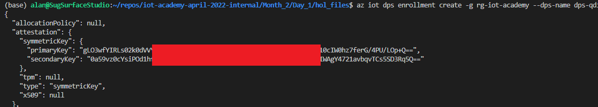

# 1. Azure IoT Academy Month Two Day One

This hands on lab seeks to introduce the student to the following Azure Services and Technologies:
   - Visual Studio Code
   - Azure IoT Hub
   - Azure Device Provisioning Service (DPS)
   - Azure Virtual Machines
   - Azure Edge for Linux on Windows (EFLOW)
   - Azure IoT Edge Routing
   - Azure IoT Edge Stream Analytics (ASA) Module
   - Azure Logic Apps
   - Azure Monitor & Azure Log Analytics
   
These services are explored as they're often part of overall IoT solutions. A simplistic approach is taken with this lab to allow to reach many audiences of varying technical experience.

Ideally students taking this course will have:
   - familiarity with the Azure Portal. [https://portal.azure.com](https://portal.azure.com/)
   - Completed IoT Academy Month One Content

A good way to become familiar with Azure IoT is to follow Azure IoT Developer Specialty certification path. You can read more at the following link: [https://docs.microsoft.com/en-us/learn/certifications/exams/az-220](https://docs.microsoft.com/en-us/learn/certifications/exams/az-220)

Course Content

- [1. Azure IoT Academy Month Two Day One](#1-azure-iot-academy-month-two-day-one)
  - [1.1. Prerequisites](#11-prerequisites)
    - [1.1.1. Install VS Code](#111-install-vs-code)
    - [1.1.2. Install VS Code Extensions](#112-install-vs-code-extensions)
    - [1.1.3. Please ensure you cloned the IoT Academy Repo locally to your machine](#113-please-ensure-you-cloned-the-iot-academy-repo-locally-to-your-machine)
    - [1.1.4. Install Azure CLI](#114-install-azure-cli)
    - [1.1.5. Install Azure CLI Bicep Extension](#115-install-azure-cli-bicep-extension)
    - [1.1.6. Supporting Materials](#116-supporting-materials)
  - [1.2. Exercise: Deploy Azure IoT Hub and DPS with Bicep](#12-exercise-deploy-azure-iot-hub-and-dps-with-bicep)
    - [1.2.1. Supporting Materials](#121-supporting-materials)
    - [1.2.2. Review the Bicep file](#122-review-the-bicep-file)
    - [1.2.3. Use the Bicep visualizer to review the resources](#123-use-the-bicep-visualizer-to-review-the-resources)
    - [1.2.4. Edit your bicep parameters file](#124-edit-your-bicep-parameters-file)
    - [1.2.5. Ensure you've selected your subscription and correct tenant](#125-ensure-youve-selected-your-subscription-and-correct-tenant)
    - [1.2.6. Create an Azure Resource Group](#126-create-an-azure-resource-group)
    - [1.2.7. Deploy IoT Hub and DPS with an Azure Resource Manager Deployment](#127-deploy-iot-hub-and-dps-with-an-azure-resource-manager-deployment)
  - [1.3. Exercise: Deploy a Windows 10 Azure VM](#13-exercise-deploy-a-windows-10-azure-vm)
    - [1.3.1. Deploy another bicep template to create the VM](#131-deploy-another-bicep-template-to-create-the-vm)
    - [1.3.2. Create an Azure IoT DPS Enrollment](#132-create-an-azure-iot-dps-enrollment)
    - [1.3.3. Login to your Windows 10 VM](#133-login-to-your-windows-10-vm)
  - [1.4. Exercise: Install Azure IoT Edge for Linux on Windows (EFLOW)](#14-exercise-install-azure-iot-edge-for-linux-on-windows-eflow)
    - [1.4.1. Install EFLOW](#141-install-eflow)
      - [1.4.1.1. Supportive Materials](#1411-supportive-materials)

## 1.1. Prerequisites

### 1.1.1. Install VS Code
[Visual Studio Code Download](https://code.visualstudio.com/Download)

### 1.1.2. Install VS Code Extensions
   1. Click extensions
   2. Search for `azure iot`
   3. Click install for the `Azure IoT Tools` extension pack
   4. Search for `bicep`
   5. Click install for the `Bicep` 

### 1.1.3. Please ensure you cloned the IoT Academy Repo locally to your machine

### 1.1.4. Install Azure CLI
   - [https://docs.microsoft.com/en-us/cli/azure/install-azure-cli](https://docs.microsoft.com/en-us/cli/azure/install-azure-cli)

### 1.1.5. Install Azure CLI Bicep Extension

### 1.1.6. Supporting Materials
   - [https://docs.microsoft.com/en-us/azure/azure-resource-manager/bicep/install](https://docs.microsoft.com/en-us/azure/azure-resource-manager/bicep/install)  

   Open your terminal in VS Code and run the following commands
   Terminal -> New Terminal if not open yet

   ```
   az bicep install
   az bicep upgrade
   az bicep version
   ```

## 1.2. Exercise: Deploy Azure IoT Hub and DPS with Bicep

### 1.2.1. Supporting Materials
[https://docs.microsoft.com/en-us/azure/azure-resource-manager/bicep/overview?tabs=bicep](https://docs.microsoft.com/en-us/azure/azure-resource-manager/bicep/overview?tabs=bicep)  

### 1.2.2. Review the Bicep file
[https://docs.microsoft.com/en-us/azure/azure-resource-manager/bicep/parameters](https://docs.microsoft.com/en-us/azure/azure-resource-manager/bicep/parameters)

1. Within the github repo: (https://github.com/AzureIoTGBB/iot-academy-april-2022-internal/tree/main/Month_2/Day_1/hol_files) 
2. Locate the file at the following location and review the contents.`Month_2/Day_1/hol_files_new/month2_day1.bicep`
   
You'll see in the file:
- two resources
- two accepted parameters for iot_hub_name and location


### 1.2.3. Use the Bicep visualizer to review the resources
1. Within VS Code trigger the command pallette Ctrl+Shift+P, or click View, command pallette from the menu.
2. Type `visual` and select the `Bicep: Open Bicep Visualizer to the Side` entry, press enter.
3. Select your Bicep file located at `Month_2/Day_1/hol_files_new/month2_day1.bicep`
4. Review the diagram as seen below
   

### 1.2.4. Edit your bicep parameters file 

1. Look for the `Month_2/Day_1/hol_files_new/month2_day1_params.json` file and open it
2. Edit the following values:
   1. first_name
   2. last_name
   3. favorite_animal: this could be any random string value. This is used in the Bicep template to ensure unique resource names are achieved

### 1.2.5. Ensure you've selected your subscription and correct tenant
1. Run the following command to ensure your subscription is currently default
    ```
    az account show -o table
    ```

3. If the correct subscription is selected skip this step
   1. If your subscription is listed but not default run this step
    ```
    az account set -s "YourSubscriptionIdGoesHere"
    ```
   2. Skip the following steps if you subscription is already set correctly. If not, continue.
   3. If your subscription is not listed you've logged into the wrong tenant. Run the following command to logout and login to the correct tenant. 
    ```
    az logout
    az login -o table
    ```
   4. List all of your subscriptions to find the right subscriptionId
    ```
    az account show -o table
    ```
   5. Find your SubscriptionId and run step 1 to make it default

### 1.2.6. Create an Azure Resource Group

In your terminal run the following command. Ensure you replace the location with the correct value.
After the command is run `"provisioningState": "Succeeded"` can be observed in the result

```
az group create --name rg-iot-academy --location northcentralus
```

### 1.2.7. Deploy IoT Hub and DPS with an Azure Resource Manager Deployment

[https://docs.microsoft.com/en-us/azure/azure-resource-manager/templates/](https://docs.microsoft.com/en-us/azure/azure-resource-manager/templates/)

1. Change your terminal to the hol_files directory
```
cd Month_2/Day_1/hol_files
```

2. Run the following command in your terminal in VS Code
```
az deployment group create --resource-group rg-iot-academy --template-file month2_day1.bicep --parameters month2_day1_params.json
```

3. Go to the Azure Portal, find an open the `rg-iot-academy` resource group. 
4. Click Deployments, and click the first your deployment in the list. Review the following screenshots for what to expect


5. When the command is done running expect the following in your terminal


## 1.3. Exercise: Deploy a Windows 10 Azure VM 

Next, let's:
- Deploy an Azure Windows 10 VM using Bicep
- Add an IoT Edge Device
- Retrieve Device Credentrials for the Edge Device
- RDP to the Windows 10 VM to install and configure EFLOW

Some links that cover EFLOW and the steps in this section
[https://docs.microsoft.com/en-us/azure/iot-edge/iot-edge-for-linux-on-windows?view=iotedge-2020-11](https://docs.microsoft.com/en-us/azure/iot-edge/iot-edge-for-linux-on-windows?view=iotedge-2020-11)
[https://docs.microsoft.com/en-us/azure/iot-edge/quickstart?view=iotedge-2020-11#code-try-0](https://docs.microsoft.com/en-us/azure/iot-edge/quickstart?view=iotedge-2020-11#code-try-0)

### 1.3.1. Deploy another bicep template to create the VM

Note: when picking the vm_size it the VM has to support Nested Virtualization. Some good options are:
Standard_D2_v3
Standard_D2_v4
Standard_D2s_v3
Standard_D2s_v4

All the VM Skus can be reviewed at the following link:
[https://docs.microsoft.com/en-us/azure/virtual-machines/sizes-general](https://docs.microsoft.com/en-us/azure/virtual-machines/sizes-general)

1. Open the `Month_2/Day_1/hol_files/month2_day1_createvm.bicep` file and review the contents. Notice many resources in this file and the time savings this provides.
2. Open the `Month_2/Day_1/hol_files/month2_day1_createvm_params.json` file
3. Set the values of the fields similarly to the previous Bicep deployment
   1. vm_size: you may need to find an available size in your selected location. This could be done by using the Azure Portal to create a VM and cancelling the process before **Review and Create**
   2. vm_admin_password: change the value to your preference or leave default. 
   3. client_ipaddress: as in Month 1. Use bing and search for `what is my ip`, replace with the found value
   4. first_name: ensure you use the same value from your other Bicep params file
   5. last_name: ensure you use the same value from your other Bicep params file
   6. favorite_animal: ensure you use the same value from your other Bicep params file

3. Create your deployment group to Deploy your VM Bicep template
```
az deployment group create --resource-group rg-iot-academy --template-file month2_day1_createvm.bicep --parameters month2_day1_createvm_params.json
```
When you complete you'll see Succeeded


### 1.3.2. Create an Azure IoT DPS Enrollment

Resources
[https://docs.microsoft.com/en-us/cli/azure/iot/dps/enrollment?view=azure-cli-latest#az-iot-dps-enrollment-create](https://docs.microsoft.com/en-us/cli/azure/iot/dps/enrollment?view=azure-cli-latest#az-iot-dps-enrollment-create)

1. Find your Azure IoT DPS name with the following command. Take note of your DPS resource name
```
az iot dps list -o table
```


2. Run the following command after replace your dps_name with yours found in the previous command 
```
az iot dps enrollment create -g rg-iot-academy --dps-name {dps_name} --enrollment-id iot-academy-edge-device --edge-enabled true --props "{'location':{'region':'USA'}}" --attestation-type symmetrickey 
e.g. az iot dps enrollment create -g rg-iot-academy --dps-name dps-qdiyctqfomakk --enrollment-id iot-academy-edge-device --edge-enabled true --props "{'location':{'region':'USA'}}" --attestation-type symmetrickey 
```

3. Run the following command to retrieve the scopeId for your DPS instance. Replace the {name} with your value found in step 1 of this section

```
az iot dps show --name {name}
```

4. find idScope and note the value in your notepad e.g. "idScope": "0ne00600B86"

You'll then see results as follows



1. Copy the primaryKey and save it to your notepad

### 1.3.3. Login to your Windows 10 VM

1. Browse to the Azure Portal and search for your resource group


2. Find your VM in the list of resources, prefixed with `vm-`, and click it

3. Click `Connect` and then `RDP`


4. Click `Download RDP File`


Notice the download in your browser


5. Optional Step: You can also edit the RDP file, from Windows Explorer, to change settings such as resolution, the RDP session will default to full screen.


6. Open the RDP file
   
7. If presented with a confirmation for if you would like to connect due to a certificate issue, click yes


6. Enter your credentials, you can find this in the `Month_2/Day_1/hol_files/month2_day1_createvm.bicep` file


7. After logging in confirm privacy settings and click `Accept`


## 1.4. Exercise: Install Azure IoT Edge for Linux on Windows (EFLOW)

### 1.4.1. Install EFLOW

#### 1.4.1.1. Supportive Materials
[https://docs.microsoft.com/en-us/azure/iot-edge/how-to-provision-single-device-linux-on-windows-symmetric?view=iotedge-2020-11&tabs=azure-portal%2Cpowershell](https://docs.microsoft.com/en-us/azure/iot-edge/how-to-provision-single-device-linux-on-windows-symmetric?view=iotedge-2020-11&tabs=azure-portal%2Cpowershell)
[https://docs.microsoft.com/en-us/azure/iot-edge/nested-virtualization?view=iotedge-2020-11](https://docs.microsoft.com/en-us/azure/iot-edge/nested-virtualization?view=iotedge-2020-11)
[https://docs.microsoft.com/en-us/azure/iot-edge/troubleshoot?view=iotedge-2020-11](https://docs.microsoft.com/en-us/azure/iot-edge/troubleshoot?view=iotedge-2020-11)
[https://docs.microsoft.com/en-us/azure/iot-edge/reference-iot-edge-for-linux-on-windows-functions?view=iotedge-2020-11](https://docs.microsoft.com/en-us/azure/iot-edge/reference-iot-edge-for-linux-on-windows-functions?view=iotedge-2020-11)

Now that you're logged into the VM

1. Run PowerShell, click into the search box on the bottom left, and search for `powershell`, Click `Open`


2. Run the following scripts
```
$msiPath = $([io.Path]::Combine($env:TEMP, 'AzureIoTEdge.msi'))
$ProgressPreference = 'SilentlyContinue'
Invoke-WebRequest "https://aka.ms/AzEflowMSI" -OutFile $msiPath
```
```
Start-Process -Wait msiexec -ArgumentList "/i","$([io.Path]::Combine($env:TEMP, 'AzureIoTEdge.msi'))","/qn"
```

Accept the agreement and the next question


3. Run the following script and press `enter` to restart when prompted

```
Deploy-Eflow
```


4. After the VM restarts, reconnect your RDP session as in the earlier step. You may need to wait a few minutes for it to restart.

5. Open PowerShell and run the `Deploy-Eflow` command again
```
Deploy-Eflow
```

AFter some time, maybe 5 minutes, you should a success message as seen in the screenshot below.


5. Replace the `{primaryKey}` and {scopeId} values that you took note of in earlier and then run the followign command

```
Provision-EflowVm -provisioningType DpsSymmetricKey -scopeId {scopeId} -registrationId iot-academy-edge-device -symmKey {primaryKey}
e.g. Provision-EflowVm -provisioningType DpsSymmetricKey -scopeId 0ne00600B86 -registrationId iot-academy-edge-device -symmKey Yh1Y5pVwuo1Kroa7yZWmD42CTNpB5aTcJvFl1mu5E=
```

After running the command you will see a success message as follows.


6. Now navigate back to the Azure Portal and find your resource group and navigate to it

7. Find your IoT Hub resource in the list prefixed with `iot-`. Click it

8. Click IoT Edge. Click your device `iot-academy-edge-device`


9. After some time you'll notice the edgeAgent running and a normal condition for edgeHub to be in error state since we have not provided configuration


