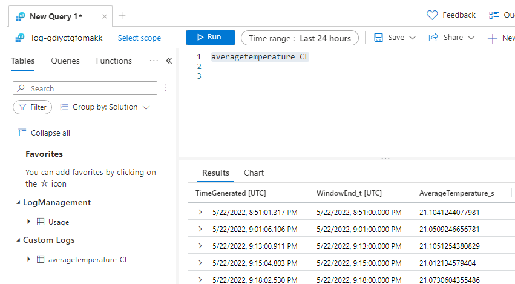

 
 Azure IoT Academy Month Two Day One<!-- omit in toc -->
==============

# 1. Introduction

Video: [https://youtu.be/IJK0h1f7avY](https://youtu.be/IJK0h1f7avY)

This hands on lab seeks to introduce the student to the following Azure Services and Technologies:
   - Visual Studio Code
   - Azure IoT Hub
   - Azure Device Provisioning Service (DPS)
   - Azure Virtual Machines
   - Azure Edge for Linux on Windows (EFLOW)
   - Azure IoT Edge Routing
   - Azure IoT Edge Stream Analytics (ASA) Module
   - Azure Logic Apps
   - Azure Monitor & Azure Log Analytics
   
These services are explored as they're often part of overall IoT solutions. A simplistic approach is taken with this lab to allow to reach many audiences of varying technical experience.

Ideally students taking this course will have:
   - Familiarity with the Azure Portal. [https://portal.azure.com](https://portal.azure.com/)
   - Completed IoT Academy Month One Content

A good way to become familiar with Azure IoT is to follow Azure IoT Developer Specialty certification path. You can read more at the following link: [https://docs.microsoft.com/en-us/learn/certifications/exams/az-220](https://docs.microsoft.com/en-us/learn/certifications/exams/az-220)

Course Content

- [1. Introduction](#1-introduction)
- [2. Prerequisites](#2-prerequisites)
- [3. Exercise: Deploy Azure Lab Resources with Bicep](#3-exercise-deploy-azure-lab-resources-with-bicep)
- [4. Exercise: Deploy a Windows 10 Azure VM](#4-exercise-deploy-a-windows-10-azure-vm)
- [5. Exercise: Install Azure IoT Edge for Linux on Windows (EFLOW)](#5-exercise-install-azure-iot-edge-for-linux-on-windows-eflow)
- [6. Exercise: Create a Azure Stream Analytics Job](#6-exercise-create-a-azure-stream-analytics-job)
- [7. Exercise: Update the Azure IoT Edge manifest to add modules and routes](#7-exercise-update-the-azure-iot-edge-manifest-to-add-modules-and-routes)
- [8. Exercise: Review the data being sent to Grafana](#8-exercise-review-the-data-being-sent-to-grafana)
- [9. Exercise: Monitor IoT Hub Events](#9-exercise-monitor-iot-hub-events)
- [10. Exercise: Create an Azure Logic App to Monitor Events from IoT Hub](#10-exercise-create-an-azure-logic-app-to-monitor-events-from-iot-hub)
- [11. Exercise: View Log Analytics data and setup an alert](#11-exercise-view-log-analytics-data-and-setup-an-alert)
- [12. Cleanup](#12-cleanup)


# 2. Prerequisites

## 2.1. Install VS Code
[Visual Studio Code Download](https://code.visualstudio.com/Download)

## 2.2. Install VS Code Extensions
   1. Click extensions
   2. Search for `azure iot`
   3. Click install for the `Azure IoT Tools` extension pack
   4. Search for `bicep`
   5. Click install for the `Bicep` 

## 2.3. Please ensure you cloned the IoT Academy Repo locally to your machine

## 2.4. Install Azure CLI
   - [https://docs.microsoft.com/en-us/cli/azure/install-azure-cli](https://docs.microsoft.com/en-us/cli/azure/install-azure-cli)

## 2.5. Install Azure CLI Bicep Extension

## 2.6. Supporting Materials
   - [https://docs.microsoft.com/en-us/azure/azure-resource-manager/bicep/install](https://docs.microsoft.com/en-us/azure/azure-resource-manager/bicep/install)  

   Open your terminal in VS Code and run the following commands
   Terminal -> New Terminal if not open yet

   ```
   az bicep install
   az bicep upgrade
   az bicep version
   ```

# 3. Exercise: Deploy Azure Lab Resources with Bicep

Video: [https://youtu.be/TMgfs9Eh2xY](https://youtu.be/TMgfs9Eh2xY)

## 3.1. Resources

[https://docs.microsoft.com/en-us/azure/azure-resource-manager/bicep/overview?tabs=bicep](https://docs.microsoft.com/en-us/azure/azure-resource-manager/bicep/overview?tabs=bicep)  
[https://docs.microsoft.com/en-us/azure/azure-resource-manager/bicep/parameters](https://docs.microsoft.com/en-us/azure/azure-resource-manager/bicep/parameters)
[https://docs.microsoft.com/en-us/azure/azure-resource-manager/templates/](https://docs.microsoft.com/en-us/azure/azure-resource-manager/templates/)


## 3.2. Review the Bicep file

1. Within the github repo: (https://github.com/AzureIoTGBB/iot-academy-april-2022-internal/tree/main/Month_2/Day_1/hol_files) 
2. Locate the file at the following location and review the contents.`Month_2/Day_1/hol_files/month2_day1.bicep`
   
You'll see in the file:
- two resources
- two accepted parameters for iot_hub_name and location


## 3.3. Use the Bicep visualizer to review the resources
1. Within VS Code trigger the command pallette Ctrl+Shift+P, or click View, command pallette from the menu.
2. Type `visual` and select the `Bicep: Open Bicep Visualizer to the Side` entry, press enter.
3. Select your Bicep file located at `Month_2/Day_1/hol_files/month2_day1.bicep`
4. Review the diagram as seen below
   

## 3.4. Edit your bicep parameters file 

1. Look for the `Month_2/Day_1/hol_files/month2_day1_params.json` file and open it
2. Edit the following values:
   1. first_name
   2. last_name
   3. favorite_animal: this could be any random string value. This is used in the Bicep template to ensure unique resource names are achieved

## 3.5. Ensure you've selected your subscription and correct tenant
1. Run the following command to ensure your subscription is currently default
    ```
    az account show
    ```

3. If the correct subscription is selected skip this step
   1. If your subscription is listed but not default run this step
    ```
    az account set -s "YourSubscriptionIdGoesHere"
    ```
   2. Skip the following steps if you subscription is already set correctly. If not, continue.
   3. If your subscription is not listed you've logged into the wrong tenant. Run the following command to logout and login to the correct tenant. 
    ```
    az logout
    az login 
    ```
   4. List all of your subscriptions to find the right subscriptionId
    ```
    az account show
    ```
   5. Find your SubscriptionId and run step 1 to make it default
4. Save your SubscriptionId in your notepad. When running `az account show` your SubscriptionID is the `"id"` field

## 3.6. Create an Azure Resource Group

In your terminal run the following command. Ensure you replace the location with the correct value.
After the command is run `"provisioningState": "Succeeded"` can be observed in the result

```
az group create --name rg-iot-academy --location northcentralus
```

## 3.7. Deploy Lab resources with an Azure Resource Manager Deployment

The resources deployed are:
- IoT Hub
- DPS 
- Logic App: used in a later part of the lab

1. Change your terminal to the hol_files directory
```
cd Month_2/Day_1/hol_files
```

2. Run the following command in your terminal in VS Code
```
az deployment group create --resource-group rg-iot-academy --template-file month2_day1.bicep --parameters month2_day1_params.json
```

3. Go to the Azure Portal, find an open the `rg-iot-academy` resource group. 
4. Click Deployments, and click the first your deployment in the list. Review the following screenshots for what to expect


5. When the command is done running expect the following in your terminal


# 4. Exercise: Deploy a Windows 10 Azure VM 

Video: [https://youtu.be/JffdKqj1kGA](https://youtu.be/JffdKqj1kGA)

Next, let's:
- Deploy an Azure Windows 10 VM using Bicep
- Add an IoT Edge Device
- Retrieve Device Credentials for the Edge Device
- RDP to the Windows 10 VM to install and configure EFLOW

Some links that cover EFLOW and the steps in this section
[https://docs.microsoft.com/en-us/azure/iot-edge/iot-edge-for-linux-on-windows?view=iotedge-2020-11](https://docs.microsoft.com/en-us/azure/iot-edge/iot-edge-for-linux-on-windows?view=iotedge-2020-11)
[https://docs.microsoft.com/en-us/azure/iot-edge/quickstart?view=iotedge-2020-11#code-try-0](https://docs.microsoft.com/en-us/azure/iot-edge/quickstart?view=iotedge-2020-11#code-try-0)

## 4.1. Deploy another bicep template to create the VM

Note: when picking the vm_size it the VM has to support Nested Virtualization. Some good options are:
Standard_D2_v3
Standard_D2_v4
Standard_D2s_v3
Standard_D2s_v4

All the VM SKUs can be reviewed at the following link:
[https://docs.microsoft.com/en-us/azure/virtual-machines/sizes-general](https://docs.microsoft.com/en-us/azure/virtual-machines/sizes-general)

1. Open the `Month_2/Day_1/hol_files/createvm.bicep` file and review the contents. Notice many resources in this file and the time savings this provides.
2. Open the `Month_2/Day_1/hol_files/createvm_params.json` file
3. Set the values of the fields similarly to the previous Bicep deployment
   1. vm_size: you may need to find an available size in your selected location. This could be done by using the Azure Portal to create a VM and cancelling the process before **Review and Create**
   2. vm_admin_password: change the value to your preference or leave default. 
   3. client_ipaddress: as in Month 1. Use bing and search for `what is my ip`, replace with the found value
   4. first_name: ensure you use the same value from your other Bicep params file
   5. last_name: ensure you use the same value from your other Bicep params file
   6. favorite_animal: ensure you use the same value from your other Bicep params file

3. Create your deployment group to Deploy your VM Bicep template
```
az deployment group create --resource-group rg-iot-academy --template-file createvm.bicep --parameters createvm_params.json
```
When you complete you'll see Succeeded


## 4.2. Create an Azure IoT DPS Enrollment

Resources
[https://docs.microsoft.com/en-us/cli/azure/iot/dps/enrollment?view=azure-cli-latest#az-iot-dps-enrollment-create](https://docs.microsoft.com/en-us/cli/azure/iot/dps/enrollment?view=azure-cli-latest#az-iot-dps-enrollment-create)

1. Find your Azure IoT DPS name with the following command. Take note of your DPS resource name
```
az iot dps list -o table
```


2. Run the following command after replace your dps_name with yours found in the previous command 
```
az iot dps enrollment create -g rg-iot-academy --dps-name {dps_name} --enrollment-id iot-academy-edge-device --edge-enabled true --tags "{'environment':'dev'}" --attestation-type symmetrickey 
e.g. az iot dps enrollment create -g rg-iot-academy --dps-name dps-qdiyctqfomakk --enrollment-id iot-academy-edge-device --edge-enabled true --tags "{'environment':'dev'}" --attestation-type symmetrickey 
```
3. Copy the primaryKey and save it to your notepad

4. Run the following command to retrieve the scopeId for your DPS instance. Replace the {name} with your value found in step 1 of this section

```
az iot dps show --name {name}
```

5. find idScope and note the value in your notepad e.g. "idScope": "0ne00600B86"

You'll then see results as follows


## 4.3. Login to your Windows 10 VM

1. Browse to the Azure Portal and search for your resource group


2. Find your VM in the list of resources, prefixed with `vm-`, and click it

3. Click `Connect` and then `RDP`


4. Click `Download RDP File`


Notice the download in your browser


5. Optional Step: You can also edit the RDP file, from Windows Explorer, to change settings such as resolution, the RDP session will default to full screen.


6. Open the RDP file
   
7. If presented with a confirmation for if you would like to connect due to a certificate issue, click yes


6. Enter your credentials, you can find this in the `Month_2/Day_1/hol_files/createvm.bicep` file


7. After logging in confirm privacy settings and click `Accept`


# 5. Exercise: Install Azure IoT Edge for Linux on Windows (EFLOW)

Video: [https://youtu.be/AlFSLh7ihAw](https://youtu.be/AlFSLh7ihAw)

## 5.1. Install EFLOW

## 5.2. Resources
[https://docs.microsoft.com/en-us/azure/iot-edge/how-to-provision-single-device-linux-on-windows-symmetric?view=iotedge-2020-11&tabs=azure-portal%2Cpowershell](https://docs.microsoft.com/en-us/azure/iot-edge/how-to-provision-single-device-linux-on-windows-symmetric?view=iotedge-2020-11&tabs=azure-portal%2Cpowershell)
[https://docs.microsoft.com/en-us/azure/iot-edge/nested-virtualization?view=iotedge-2020-11](https://docs.microsoft.com/en-us/azure/iot-edge/nested-virtualization?view=iotedge-2020-11)
[https://docs.microsoft.com/en-us/azure/iot-edge/troubleshoot?view=iotedge-2020-11](https://docs.microsoft.com/en-us/azure/iot-edge/troubleshoot?view=iotedge-2020-11)
[https://docs.microsoft.com/en-us/azure/iot-edge/reference-iot-edge-for-linux-on-windows-functions?view=iotedge-2020-11](https://docs.microsoft.com/en-us/azure/iot-edge/reference-iot-edge-for-linux-on-windows-functions?view=iotedge-2020-11)

Now that you're logged into the VM

1. Run PowerShell, click into the search box on the bottom left, and search for `powershell`, Click `Open`


2. Run the following scripts
```
$msiPath = $([io.Path]::Combine($env:TEMP, 'AzureIoTEdge.msi'))
$ProgressPreference = 'SilentlyContinue'
Invoke-WebRequest "https://aka.ms/AzEflowMSI" -OutFile $msiPath
```
```
Start-Process -Wait msiexec -ArgumentList "/i","$([io.Path]::Combine($env:TEMP, 'AzureIoTEdge.msi'))","/qn"
```

3. Run the following script

```
Deploy-Eflow
```

4. Accept the agreement and the next question


5. When prompted allow the VM to restart. Wait a few minutes before moving on to the next step.


6. After the VM restarts, reconnect your RDP session as in the earlier step. You may need to wait a few minutes for it to restart.

7. Open PowerShell and run the `Deploy-Eflow` command again
```
Deploy-Eflow -memoryInMB 2048 -acceptEula Yes -acceptOptionalTelemetry Yes
```

After some time, maybe 5 minutes, you should a success message as seen in the screenshot below.


8. Replace the `{primaryKey}` and {scopeId} values that you took note of in earlier and then run the following command

```
Provision-EflowVm -provisioningType DpsSymmetricKey -scopeId {scopeId} -registrationId iot-academy-edge-device -symmKey {primaryKey}
e.g. Provision-EflowVm -provisioningType DpsSymmetricKey -scopeId 0ne00600B86 -registrationId iot-academy-edge-device -symmKey Yh1Y5pVwuo1Kroa7yZWmD42CTNpB5aTcJvFl1mu5E=
```

After running the command you will see a success message as follows.


9. Now navigate back to the Azure Portal and find your resource group and navigate to it

10. Find your IoT Hub resource in the list prefixed with `iot-`. Click it

11. Click IoT Edge. Click your device `iot-academy-edge-device`


12. After some time you'll notice the edgeAgent running and a normal condition for edgeHub to be in error state since we have not provided configuration


# 6. Exercise: Create a Azure Stream Analytics Job

Video: [https://youtu.be/1T64Xnu0m3U](https://youtu.be/1T64Xnu0m3U)

## 6.1. Resources

[https://docs.microsoft.com/en-us/azure/iot-edge/reference-iot-edge-for-linux-on-windows-functions?view=iotedge-2020-11](https://docs.microsoft.com/en-us/azure/iot-edge/reference-iot-edge-for-linux-on-windows-functions?view=iotedge-2020-11)

## 6.2. Create a new ASA Job
1. Go to the Azure Portal home page
2. Click **Create a resource**
3. Search for `stream analytics job`


4. Click **Stream Analytics job**
5. Click **Create**
6. Enter the details for the job:
- Job name: `asa-average-temperature`
- Resource group: `rg-iot-academy`
- Location: your region e.g. `East US 2`
- Hosting environment: `Edge`
   


7. When the deployment is complete click **Go to resource**

## 6.3. Creating an ASA Input

   - Click **Inputs**, Click **Add stream input**, Click **Edge Hub**

      

   - Enter the input details:
     - Input alias: `temperatureSensor`
     - All other values: default

      <br/>

      
      
   - Click **Save**
 
## 6.4. Creating an ASA Output

 1. Click **Outputs**
 2. Click **Add**, then click **Edge Hub**

    
 
 3. Enter the details as shown below:
 - Output alias: `averageTemperature`
 - All other values: default


 4. Click **Save**

## 6.5. Writing an ASA Query

1. Click **Query**
2. Copy and paste the query below into the query window

```SQL
SELECT
    System.Timestamp() AS WindowEnd, avg(ambient.temperature) AverageTemperature
INTO
    averageTemperature
FROM
    temperatureSensor
GROUP BY TumblingWindow(Duration(minute, 1))
```

3. Click **Save query**

4. Click Publish, Click **Storage account settings**, then click **Add storage account**


5. Select your subscription, then select the storage account formed such as `st******edge`. Your common student prefix will be in place of the ******.


6. Click **Save**

7. Click **Publish**. Then, click **Yes**


8. Copy the SAS URL to your notepad for later


# 7. Exercise: Update the Azure IoT Edge manifest to add modules and routes

Video: [https://youtu.be/UbGhG7gxmnU](https://youtu.be/UbGhG7gxmnU)

## 7.1. Intro and Edge Architecture

This section of the lab focuses on deploying Azure IoT Edge Modules and configuring routes.

The diagram below shows how the data flows between each step.


A quick review of the components:
- Simulated Temperature Sensor Module
  - Generates a message every 5 seconds, for 2000, messages. The payload includes temperature and humidity data.
  - Distributed by Microsoft on the Azure Marketplace
- Azure IoT Edge ASA Module
  - Provides the capability to run stream analytics jobs at the edge
  - Distributed by Microsoft on the Azure Marketplace
- Average Temperature Persistence Module
  - A custom module, written for this lab, which gives example for how to implement the Azure IoT Edge Module SDK. This module inserts records into an Azure SQL Edge database.
  - `Month_2/Day_1/hol_files/avg_temp_persistence_module`
- Azure SQL Edge Module
  - A module designed to run SQL Server.
  - Distributed by Microsoft on the Azure Marketplace
- cron-exec Module
  - A module that runs a custom docker container for running cron jobs. The only cron job in this implementation connects to AzureSqlEdge and creates the database and table for this PoC if it does not exist.
  - `Month_2/Day_1/hol_files/cron_exec`
- Grafana
  - runs a container image that provides Grafana for telemetry visualization. This PoC pulls telemetry from the Azure SQL Edge AverageTemperature database.
  - `Month_2/Day_1/hol_files/grafana_average_temp`

Some alternatives to this approach would be to use the following. This current architecture was chosen for exposure and example to different approaches.

1. An Azure Function in place of the custom module
   1. [https://docs.microsoft.com/en-us/azure/iot-edge/tutorial-deploy-function?view=iotedge-2020-11](https://docs.microsoft.com/en-us/azure/iot-edge/tutorial-deploy-function?view=iotedge-2020-11)
2. Use Azure SQL Edge Data streaming
   1. [https://docs.microsoft.com/en-us/azure/azure-sql-edge/stream-data](https://docs.microsoft.com/en-us/azure/azure-sql-edge/stream-data)
   2. [https://docs.microsoft.com/en-us/azure/azure-sql-edge/create-stream-analytics-job](https://docs.microsoft.com/en-us/azure/azure-sql-edge/create-stream-analytics-job)

## 7.2. Resources

[https://docs.microsoft.com/en-us/azure/iot-hub/iot-hub-devguide-messages-d2c](https://docs.microsoft.com/en-us/azure/iot-hub/iot-hub-devguide-messages-d2c)
[https://docs.microsoft.com/en-us/azure/iot-edge/module-composition?view=iotedge-2020-11](https://docs.microsoft.com/en-us/azure/iot-edge/module-composition?view=iotedge-2020-11)
[https://docs.microsoft.com/en-us/azure/stream-analytics/stream-analytics-edge](https://docs.microsoft.com/en-us/azure/stream-analytics/stream-analytics-edge)
[https://docs.microsoft.com/en-us/azure/iot-edge/how-to-vs-code-develop-module?view=iotedge-2020-11](https://docs.microsoft.com/en-us/azure/iot-edge/how-to-vs-code-develop-module?view=iotedge-2020-11)
[https://docs.microsoft.com/en-us/azure/azure-sql-edge/tutorial-set-up-iot-edge-modules](https://docs.microsoft.com/en-us/azure/azure-sql-edge/tutorial-set-up-iot-edge-modules)
[https://docs.microsoft.com/en-us/azure/iot-edge/how-to-use-create-options?view=iotedge-2020-11](https://docs.microsoft.com/en-us/azure/iot-edge/how-to-use-create-options?view=iotedge-2020-11)
[https://docs.docker.com/engine/api/v1.32/#operation/ContainerCreate](https://docs.docker.com/engine/api/v1.32/#operation/ContainerCreate)
[https://github.com/marvin-garcia/AzureSqlEdge](https://github.com/marvin-garcia/AzureSqlEdge)

## 7.3. Review the deployment manifest

Now, we'll review the details for the how the integration of all the components is orchestrated with Azure IoT Edge. 

Open the `Month_2/Day_1/hol_files/edge_manifest_modules.json` file to review the contents
   
Notice the modules and routes sections  
The following screenshots shows the configured routes. You can use the line numbers to navigate the actual file.


```
FROM /messages/modules/SimulatedTemperatureSensor/* INTO BrokeredEndpoint("/modules/asa-average-temperature/inputs/temperatureSensor
FROM /messages/modules/asa-average-temperature/* INTO BrokeredEndpoint("/modules/AvgTempPersistenceModule/inputs/input1
FROM /messages/modules/asa-average-temperature/* WHERE $body.Weather.Temperature > 21 INTO BrokeredEndpoint("/modules/AvgTempPersistenceModule/inputs/input1")
```

## 7.4. Create the an IoT Edge deployment using the CLI

In the previous steps you successfully deployed an Azure IoT Edge device using EFLOW.  
In this step you'll be configured your Edge device to run Azure IoT Edge Modules.

1. List your iot hubs to get the name

```
az iot hub list -o table
```
2. Edit the `Month_2/Day_1/hol_files/edge_manifest_modules.json` 
3. Replace `{sas_url}` with your SAS URL saved in notepad earlier
4. Replace `{subscription_id}` with your SubscriptionID that you saved in notepad earlier

5. Run the command below after replacing `{hub_name}` below

Notice the **target-condition** this is what is going to target your Edge device since it does in fact have the **dev** tag as follows: **tags.environment='dev'**.

```
az iot edge deployment create -d deploy-tempsensor-sink -n {hub_name} --content edge_manifest_modules.json --target-condition "tags.environment='dev'" --priority 3

Some Examples
e.g. az iot edge deployment create -d deploy-tempsensor-sink -n iot-qdiyctqfomakk --content edge_manifest_modules.json --target-condition "tags.environment='dev'" --priority 3
e.g. to delete, az iot edge deployment delete -d deploy-tempsensor-sink -n iot-qdiyctqfomakk
```

## 7.5. Review the IoT Edge deployment in the Azure Portal

1. Visit the Azure Portal, view your IoT Hub, click IoT Edge, then click IoT Edge Deployments


2. Click your deployment, the details of your deployment can be viewed here: modules, routes, and rollout metrics for your deployment


3. Wait for your deployment to rollout to your device and then move on to the next section. This could take a bit of time for the deployment to roll out.

   If you go back to the page used on step 1. You can use the refresh button until System Metrics states `1 Targeted, 1 Applied`

# 8. Exercise: Review the data being sent to Grafana

Video: [https://youtu.be/TvzvFG79spE](https://youtu.be/TvzvFG79spE)

## 8.1. Login to your Windows 10 VM

You should still have your RDP session from earlier. If you closed it or it ended, follow the steps in section `Login to your Windows 10 VM` once again

## 8.2. Get the IP address of the EFLOW VM

1. Go to, or open, the PowerShell window
2. Run the following command to get the IP address of the EFlow VM
```
Get-EflowVmAddr
```
You'll get a result such as `172.20.126.50` Replace `{eflow_vm_ip}` below with the value

## 8.3. Login to Grafana

1. In the VM open Edge browser and navigate to http://{eflow_vm_ip}:3000

2. After the page loads, login with:
- username: `admin`
- password: `admin`

3. When prompted to change your password use `password1!` in password and confirmation boxes and click ok.

## 8.4. Review the provided dashboard and chart provided by this hands on lab

1. Review the data on the provided chart.

You may need to allow some time to pass for a lot of data to show on the graph


You can also change the time range to a shorter time and see a bit better graph. There is also an auto-refresh option available.


2. After seeing data, move on to the next Exercise

# 9. Exercise: Monitor IoT Hub Events

Video: [https://youtu.be/cWtMkYIblI0](https://youtu.be/cWtMkYIblI0)

## 9.1. Resources
[https://docs.microsoft.com/en-us/azure/iot-hub/iot-hub-vscode-iot-toolkit-cloud-device-messaging](https://docs.microsoft.com/en-us/azure/iot-hub/iot-hub-vscode-iot-toolkit-cloud-device-messaging)

## 9.2. Sign in and select the correct IoT Hub

1. Open VSCode
2. Use the command pallette, View -> Command Pallette
3. Type `select iot` and press enter after selecting `Azure IoT Hub: Select IoT Hub`
4. Select your subscription. If successful skip to step 6
5. If it's not visible you'll need to sign in with the correct account
   1. Command Pallette: `Azure: Sign Out`
   2. Command Pallette: `Azure: Sign In to Azure Cloud`
6. Select your IoT Hub created for this lab`

## 9.3. Start monitoring the IoT Hub built-in event endpoint

1. Right click `Explorer -> Azure IoT Hub -> Your Hub -> Built-in endpoints -> events` and click `Start Monitoring`


2. Average Temperature telemetry is produced once a minute. As not all averages temperatures meet the criteria for `AverageTemperature > 21`, it may take some time to see events flowing. You'll events in your output window when they arrive.


# 10. Exercise: Create an Azure Logic App to Monitor Events from IoT Hub

Video: [https://youtu.be/n0ATDWwxfRg](https://youtu.be/n0ATDWwxfRg)

## 10.1. Resources
[https://docs.microsoft.com/en-us/azure/event-grid/publish-iot-hub-events-to-logic-apps](https://docs.microsoft.com/en-us/azure/event-grid/publish-iot-hub-events-to-logic-apps)
[https://docs.microsoft.com/en-us/connectors/azureloganalyticsdatacollector/#creating-a-connection](https://docs.microsoft.com/en-us/connectors/azureloganalyticsdatacollector/#creating-a-connection)


## 10.2. Open your pre-created Logic App in the portal

Go to the Azure Portal, search for `logic-`, search for `Logic App` and select it


## 10.3. Add a HTTP Request Trigger to your Logic App

1. Click `Blank Logic App`


2. Search for `http request` and click `When a HTTP request is received`


4. Click `Use sample payload to generate schema` Copy the json to your clipboard

```json
[
        {
            "id": "5749a230-6ebf-950f-3d26-53cc8315a4ad",
            "topic": "/SUBSCRIPTIONS/7451D6D6-9082-46D9-9373-CCD5FCDA6673/RESOURCEGROUPS/RG-IOT-ACADEMY/PROVIDERS/MICROSOFT.DEVICES/IOTHUBS/IOT-QDIYCTQFOMAKK",
            "subject": "devices/iot-academy-edge-device/asa-average-temperature",
            "eventType": "Microsoft.Devices.DeviceTelemetry",
            "data": {
                "properties": {},
                "systemProperties": {
                    "iothub-content-type": "application/json",
                    "iothub-content-encoding": "utf-8",
                    "iothub-connection-device-id": "iot-academy-edge-device",
                    "iothub-connection-module-id": "asa-average-temperature",
                    "iothub-connection-auth-method": "{\"scope\":\"module\",\"type\":\"sas\",\"issuer\":\"iothub\",\"acceptingIpFilterRule\":null}",
                    "iothub-connection-auth-generation-id": "637886649142604368",
                    "iothub-enqueuedtime": "2022-05-22T20:19:00.3160000Z",
                    "iothub-message-source": "Telemetry"
                },
                "body": {
                    "WindowEnd": "2022-05-22T20:19:00.0000000Z",
                    "AverageTemperature": 21.038353595978126
                }
            },
            "dataVersion": "",
            "metadataVersion": "1",
            "eventTime": "2022-05-22T20:19:00.316Z"
        }
    ]
```
5. Paste in your json
6. Click `Done`


7. Click `Save`
8. Copy the `HTTP Post URL` to your clipboard, save in your notepad

## 10.4. Add a Step for sending data to an Azure Log Analytics workspace

1. Click `New step`
2. Search for `Send data`. Look for and select `Send Data: Azure Log Analytics Data Collector`


3. Next you'll notice that connection information for your Log Analytics Workspace is needed.


4. Name: `log-analytics`
5. In another browser tab go to the Azure Portal. Search for `log-`. Click your Log Analytics resource.
6. Copy the `Workspace ID` to your clipboard, such as `7cee66af-aefc-4cf5-aa0d-a82c2ea8afe9`


7. Back to your Logic App browser tab. Paste your `Workspace ID` in the appropriate box
8. Back to your Log Analytics tab. Click `Agents Management`. Copy the `Primary Key` to your clipboard


9. Back to your Logic App browser tab. Paste your `Primary Key`. Click Ok.
10. Click `Create`
11. Click `Save`

12. Paste the following json into the `JSON Request body` box

```json
{
"WindowEnd": "@{items('For_each')?['data']?['body']?['WindowEnd']}",
"AverageTemperature":"@{items('For_each')?['data']?['body']?['AverageTemperature']}"
}
```

13. Click in the JSON Request Body field and select `WindowEnd` in the Dynamic Content box. 


14. Notice, the Logic App designer automatically inserts a foreach for you, due to the nesting of the json.


15. Click the `x` on the WindowEnd field. Place your cursor between the two `"`. Look on the right panel dynamic fields and click WindowEnd.

16. Enter the details the click `Save`


## 10.5. Configure IoT Hub to send events to your logic app

1. In a new browser tab, search for `iot-`. Click your IoT Hub instance.

2. Click Events. Click `+ Event Subscription`


3. Enter the following details
- Name: logicapp
- Event Grid Schema
- Filter to Event Types: Only Device Telemetry
- Endpoint: The `HTTP Post URL` you saved to your notepad


4. Click `Create`

Note: Filters can also be added here similar to how we filtered telemetry for > 21 earlier in the lab.

## 10.6. Ensure your Logic is receiving the webhook and succeeding

1. Navigate back to your browser tab where you have the Logic App open
2. Review the execution history on the Overview page. If you don't see any runs, give it a few minutes to show up. Use the refresh button if necessary.


# 11. Exercise: View Log Analytics data and setup an alert

Video: [https://youtu.be/GhwsPXFdye0](https://youtu.be/GhwsPXFdye0)

## 11.1. Query the Log Analytics Data 

1. Go back to your browser tab where Log Analytics is open. If you can't find it search for `iot-`
2. Click `Logs` and close the `Queries` window that pops up.


3. Ensure you see the `averagetemperature_CL` table. If not, it may take some time to show up

4. Paste `averagetemperature_CL` into the query window and click the `Run button`



5. Once you see logs move onto the next section
   
## 11.2. Create an Azure Monitor Alert

1. On the upper right click `New alert rule`


2. Now on the `Condition` tab. Enter the following
- Search Query: `averagetemperature_CL`
- Measure: `Table Rows`
- Aggregation Type: `Count`
- Aggregation Granularity: `5 minutes`
- Operator: `Greater than`
- Threshold Value: 2
- Frequency of Evaluation: `5 minutes`

3. Click `Next`. Review the `Actions` tab. Here you can configure emails or SMS to be sent.
4. Click `Next: Details`
5. Enter a name: `alert-averagetemperature`
6. Change Severity to: `Warning`
7. Region: Default or your region
8. Leave the result default, ensure it's enabled
   


9.  Click `Review and Create`
10. Click `Create`

## 11.3. Review your Alert in Azure Monitor

1. Open a new browser tab to https://portal.azure.com and search for Monitor. Click Monitor


2. Click `Alerts`. Review the Alerts page


3. Wait some time, after a while an alert should trigger based on the temperature simulator data being sent. The `Refresh` button will need to be used to see new alerts arrive.


# 12. Cleanup

<span style="color:red;font-weight:700;font-size:24px">   
Note: If you are continuing to Month 2 Day 2, this should be done after Day 2 is complete, as the IoT Hub resource is re-used.
</span>

It's important to not leave your Azure resources provisioned until the next Azure IoT Academy session as there may not be enough Azure credit for the next sessions.

1. Navigate to the Azure Portal home page
2. Click **Resource groups**
3. Click **rg-iot-academy**
4. Click **Delete resource group**

   

5. Type the type the name of your resource group and click **Delete**

   


