 
 Azure IoT 专题二: 动手实验一<!-- omit in toc -->
==============

# 1. 本次动手实验介绍

课程视频: [https://youtu.be/IJK0h1f7avY](https://youtu.be/IJK0h1f7avY)

本次动手实验室旨在向大家介绍以下 Azure 相关服务和技术：
   - Visual Studio Code
   - Azure IoT Hub
   - Azure Device Provisioning Service (DPS)
   - Azure Virtual Machines
   - Azure Edge for Linux on Windows (EFLOW)
   - Azure IoT Edge Routing
   - Azure IoT Edge Stream Analytics (ASA) Module
   - Azure Logic Apps
   - Azure Monitor & Azure Log Analytics
   
探索这些服务是因为它们通常是整体物联网解决方案的一部分。 该实验室采用了一种简单的方法，可以接触到具有不同技术经验的许多受众。

理想情况下，参加本课程的各位需具备以下知识：
    - 熟悉 Azure 门户。 [https://portal.azure.com](https://portal.azure.com/)
    - 完成物联网学院专题一的内容

熟悉 Azure IoT 的一个好方法是遵循 Azure IoT Developer Specialty 认证路径。 您可以在以下链接中阅读更多内容：[https://docs.microsoft.com/en-us/learn/certifications/exams/az-220](https://docs.microsoft.com/en-us/learn/certifications/exams/az-220)

课程内容

- [1. Introduction](#1-introduction)
- [2. Prerequisites](#2-prerequisites)
- [3. Exercise: Deploy Azure Lab Resources with Bicep](#3-exercise-deploy-azure-lab-resources-with-bicep)
- [4. Exercise: Deploy a Windows 10 Azure VM](#4-exercise-deploy-a-windows-10-azure-vm)
- [5. Exercise: Install Azure IoT Edge for Linux on Windows (EFLOW)](#5-exercise-install-azure-iot-edge-for-linux-on-windows-eflow)
- [6. Exercise: Create a Azure Stream Analytics Job](#6-exercise-create-a-azure-stream-analytics-job)
- [7. Exercise: Update the Azure IoT Edge manifest to add modules and routes](#7-exercise-update-the-azure-iot-edge-manifest-to-add-modules-and-routes)
- [8. Exercise: Review the data being sent to Grafana](#8-exercise-review-the-data-being-sent-to-grafana)
- [9. Exercise: Monitor IoT Hub Events](#9-exercise-monitor-iot-hub-events)
- [10. Exercise: Create an Azure Logic App to Monitor Events from IoT Hub](#10-exercise-create-an-azure-logic-app-to-monitor-events-from-iot-hub)
- [11. Exercise: View Log Analytics data and setup an alert](#11-exercise-view-log-analytics-data-and-setup-an-alert)
- [12. Cleanup](#12-cleanup)


# 2. 课前准备

## 2.1. 安装 Visual Studio Code
[Visual Studio Code Download](https://code.visualstudio.com/Download)

## 2.2. 安装 VS Code 插件
   1. 点击 extensions
   2. 查找 `azure iot`
   3. 点击安装 `Azure IoT Tools` 插件包
   4. 查找 `bicep`
   5. 点击安装  `Bicep` 插件 

## 2.3. 请确认您已经在本地机器 Clone 好 IoT Academy Repo 

## 2.4. 安装 Azure CLI
   - [https://docs.microsoft.com/en-us/cli/azure/install-azure-cli](https://docs.microsoft.com/en-us/cli/azure/install-azure-cli)

## 2.5. 安装 Azure CLI Bicep Extension

## 2.6. 辅助学习材料
   - [https://docs.microsoft.com/en-us/azure/azure-resource-manager/bicep/install](https://docs.microsoft.com/en-us/azure/azure-resource-manager/bicep/install)  

   在 VS Code 中打开终端并运行以下命令
    终端 -> 新终端（如果尚未打开）

   ```
   az bicep install
   az bicep upgrade
   az bicep version
   ```

# 3. 练习：使用 Bicep 部署 Azure 实验室资源

相关视频: [https://youtu.be/TMgfs9Eh2xY](https://youtu.be/TMgfs9Eh2xY)

## 3.1. 资源

[https://docs.microsoft.com/en-us/azure/azure-resource-manager/bicep/overview?tabs=bicep](https://docs.microsoft.com/en-us/azure/azure-resource-manager/bicep/overview?tabs=bicep)  
[https://docs.microsoft.com/en-us/azure/azure-resource-manager/bicep/parameters](https://docs.microsoft.com/en-us/azure/azure-resource-manager/bicep/parameters)
[https://docs.microsoft.com/en-us/azure/azure-resource-manager/templates/](https://docs.microsoft.com/en-us/azure/azure-resource-manager/templates/)


## 3.2. 浏览 Bicep 文件

1. 相关 github repo: (https://github.com/AzureIoTGBB/iot-academy-april-2022-internal/tree/main/Month_2/Day_1/hol_files) 
   
2. 在以下位置找到相关文件并查看该文件的内容。`Month_2/Day_1/hol_files/month2_day1.bicep`
   
    您将在文件中看到：
    - 两种资源
    - iot_hub_name 和 location 的两个可接受参数


## 3.3. 使用 Bicep 可视化工具查看资源

1. 在 VS Code 中使用 Ctrl+Shift+P 启动 command pallette ，或单击菜单中的查看 command pallette 

2. 输入 `visual` 并选择 `Bicep: Open Bicep Visualizer to the Side` 条目，按回车。

3. 选择位于`Month_2/Day_1/hol_files/month2_day1.bicep`的 Bicep 文件
4. 
5. 查看下图
    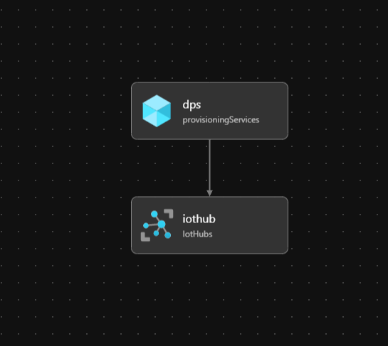

## 3.4. 编辑你的 bicep 参数文件 

1. 查找`Month_2/Day_1/hol_files/month2_day1_params.json`文件并打开它

2. 编辑相关值：
    1. 名字 - first_name
    2. 姓氏 - last_name
    3. 喜爱的动物 - favorite_animal：这可以是任何随机字符串值。 这在 Bicep 模板中使用，以确保获得唯一的资源名称

3. 查找 `Month_2/Day_1/hol_files/month2_day1_params.json` file 并打开该文件
   
4. 编辑相关值:
    1. 名字 - first_name
    2. 姓氏 - last_name
    3. 喜爱的动物 - favorite_animal：这可以是任何随机字符串值。 这在 Bicep 模板中使用，以确保获得唯一的资源名称

## 3.5. 确保您选择了订阅和正确的 Azure 用户

1. 运行以下命令以确保您的订阅成为开发环境的默认值
    ```
    az account show
    ```

2. 如果选择了正确的订阅，请跳过此步骤
   1. 如果您的订阅已列出但未设置为默认，请运行以下步骤
    ```
    az account set -s "YourSubscriptionIdGoesHere"
    ```
   2. 如果您的订阅已正确设置，请跳过以下步骤。 如果没有，请继续。
   
   3. 如果您的订阅未列出，则说明您登录了错误的租户。 运行以下命令以注销并登录到正确的租户。
   
    ```
    az logout
    az login 
    ```

   4. 出所有订阅以找到正确的订阅 ID
    ```
    az account show
    ```

   5. 找到您的 SubscriptionId 并运行步骤 1 以使其成为默认值

3. 将您的 SubscriptionId 保存在记事本中。 运行 `az account show` 时，您的 SubscriptionID 对应在 `"id"` 字段

## 3.6. 创建 Azure 资源组

在您的终端中运行以下命令。 

命令运行后，如果运行成功会返回 `"provisioningState": "Succeeded"` 

```
az group create --name rg-iot-academy --location northcentralus
```

## 3.7. 使用 Azure 资源管理器部署部署实验室资源

部署的资源是：
- 物联网中心
- DPS
- Logic App: 在实动手实验的后半部分会使用到

1. 将终端更改为 hol_files 目录

```
cd Month_2/Day_1/hol_files
```

2. 在 VS Code 的终端中运行以下命令
   
```
az deployment group create --resource-group rg-iot-academy --template-file month2_day1.bicep --parameters month2_day1_params.json
```

3. 转到 Azure 门户，打开 `rg-iot-academy` 资源组。

4. 单击部署，然后单击列表中的第一个部署。 查看以下屏幕截图以了解预期结果
   
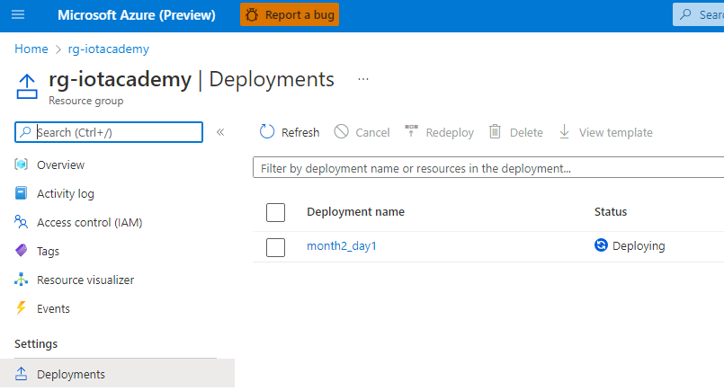


5. 当命令运行完成后，在您的终端中可以看到以下内容
   


# 4. 练习: 部署 Windows 10 Azure 虚拟机

相关视频: [https://youtu.be/JffdKqj1kGA](https://youtu.be/JffdKqj1kGA)

接下来，我们会学习到：
- 使用 Bicep 部署 Azure Windows 10 VM
- 添加 IoT Edge 设备
- 检索边缘设备的设备凭据
- RDP 到 Windows 10 VM 以安装和配置 EFLOW

一些涵盖 EFLOW 和本节中的步骤的链接
[https://docs.microsoft.com/en-us/azure/iot-edge/iot-edge-for-linux-on-windows?view=iotedge-2020-11](https://docs.microsoft.com/en-us/azure/iot-edge/iot-edge-for-linux-on-windows?view=iotedge-2020-11)
[https://docs.microsoft.com/en-us/azure/iot-edge/quickstart?view=iotedge-2020-11#code-try-0](https://docs.microsoft.com/en-us/azure/iot-edge/quickstart?view=iotedge-2020-11#code-try-0)

## 4.1. 部署另一个 bicep 模板以创建 VM

注意：选择 vm_size 时，VM 必须支持 Nested Virtualization。 一些 VM 选择的建议：
Standard_D2_v3
Standard_D2_v4
Standard_D2s_v3
Standard_D2s_v4

可以通过以下链接查看所有 VM SKU：
[https://docs.microsoft.com/en-us/azure/virtual-machines/sizes-general](https://docs.microsoft.com/en-us/azure/virtual-machines/sizes-general)

1. 打开 `Month_2/Day_1/hol_files/createvm.bicep` 文件并查看内容。 请注意此文件中的许多资源以及由此提供的时间节省。

2. 打开`Month_2/Day_1/hol_files/createvm_params.json`文件

3. 设置字段的值类似于之前的 Bicep 部署
    1. vm_size：您可能需要在您选择的位置找到可用的大小。 这可以通过使用 Azure 门户创建 VM 并在 **预览和创建 - Review and Create** 之前取消该过程来完成
   
    2. vm_admin_password：将值更改为您的偏好值或保留默认值。

    3. client_ipaddress：和专题一一样。使用bing搜索`what is my ip`，替换为找到的 ip 值

    4. first_name：确保您使用与其他 Bicep 参数文件相同的值

    5. last_name：确保您使用与其他 Bicep 参数文件相同的值

    6. favorite_animal：确保你使用与其他 Bicep 参数文件相同的值

4. 创建您的部署组以部署您的 VM Bicep 模板

```
az deployment group create --resource-group rg-iot-academy --template-file createvm.bicep --parameters createvm_params.json
```
完成后你可以看到以下内容


## 4.2. 创建 Azure IoT DPS Enrollment

Resources
[https://docs.microsoft.com/en-us/cli/azure/iot/dps/enrollment?view=azure-cli-latest#az-iot-dps-enrollment-create](https://docs.microsoft.com/en-us/cli/azure/iot/dps/enrollment?view=azure-cli-latest#az-iot-dps-enrollment-create)

1. 使用以下命令查找您的 Azure IoT DPS 名称 , 并记下您的 DPS 资源名称

```
az iot dps list -o table
```
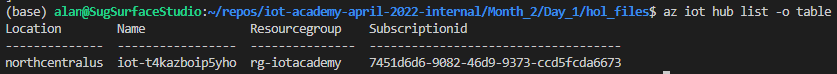

2. 将您的 dps_name 替换为您在上一个命令中找到的名称后运行以下命令

```
az iot dps enrollment create -g rg-iot-academy --dps-name {dps_name} --enrollment-id iot-academy-edge-device --edge-enabled true --tags "{'environment':'dev'}" --attestation-type symmetrickey 
e.g. az iot dps enrollment create -g rg-iot-academy --dps-name dps-qdiyctqfomakk --enrollment-id iot-academy-edge-device --edge-enabled true --tags "{'environment':'dev'}" --attestation-type symmetrickey 
```

3. 复制主键并将其保存到记事本

4. 运行以下命令以检索 DPS 实例的 scopeId。 将 {name} 替换为您在本节第 1 步中找到的值

```
az iot dps show --name {name}
```

5. 找到 idScope 并记下记事本中的值，例如 “idScope”：“0ne00600B86”

然后你会看到如下结果


## 4.3. 登入你的 Windows 10 VM

1. 进入 Azure 门户并搜索您的资源组

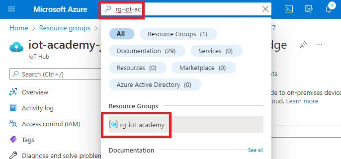

2. 在资源列表中找到你的虚拟机，前缀为 `vm-`，然后点击它

3. 选择 `连接 - Connect` 并 点击 `RDP`


4. 选择 `下载 RDP 文件 - Download RDP File`


Notice the download in your browser


5. 可选步骤：您还可以从 Windows 资源管理器编辑 RDP 文件，以更改分辨率等设置，RDP 会话默认为全屏显示。


6. 打开 RDP 文件
   
7. 如果出现由于证书问题而提示您是否要连接的确认信息时，请单击 '是 - Yes'


8. 输入您的凭据，您可以在 `Month_2/Day_1/hol_files/createvm.bicep` 文件中找到它
   


9. 登录后确认隐私设置并点击 “接受 - Accept”


# 5. 练习: 在 Windows 上安装适用于 Linux 的 Azure IoT Edge (EFLOW)

相关视频: [https://youtu.be/AlFSLh7ihAw](https://youtu.be/AlFSLh7ihAw)

## 5.1. 安装 EFLOW

## 5.2. Resources
[https://docs.microsoft.com/en-us/azure/iot-edge/how-to-provision-single-device-linux-on-windows-symmetric?view=iotedge-2020-11&tabs=azure-portal%2Cpowershell](https://docs.microsoft.com/en-us/azure/iot-edge/how-to-provision-single-device-linux-on-windows-symmetric?view=iotedge-2020-11&tabs=azure-portal%2Cpowershell)
[https://docs.microsoft.com/en-us/azure/iot-edge/nested-virtualization?view=iotedge-2020-11](https://docs.microsoft.com/en-us/azure/iot-edge/nested-virtualization?view=iotedge-2020-11)
[https://docs.microsoft.com/en-us/azure/iot-edge/troubleshoot?view=iotedge-2020-11](https://docs.microsoft.com/en-us/azure/iot-edge/troubleshoot?view=iotedge-2020-11)
[https://docs.microsoft.com/en-us/azure/iot-edge/reference-iot-edge-for-linux-on-windows-functions?view=iotedge-2020-11](https://docs.microsoft.com/en-us/azure/iot-edge/reference-iot-edge-for-linux-on-windows-functions?view=iotedge-2020-11)

现在您已登录到虚拟机

1. 运行PowerShell，点击左下角的搜索框，搜索`powershell`, 点击 `Open`
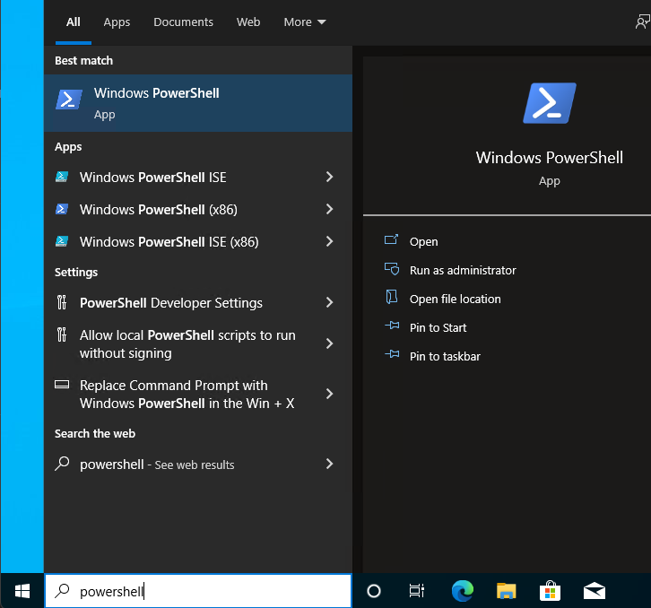

2. 执行以下脚本
```
$msiPath = $([io.Path]::Combine($env:TEMP, 'AzureIoTEdge.msi'))
$ProgressPreference = 'SilentlyContinue'
Invoke-WebRequest "https://aka.ms/AzEflowMSI" -OutFile $msiPath
```
```
Start-Process -Wait msiexec -ArgumentList "/i","$([io.Path]::Combine($env:TEMP, 'AzureIoTEdge.msi'))","/qn"
```

3. 执行以下脚本

```
Deploy-Eflow
```

4. 接受协议和并进入下一个问题

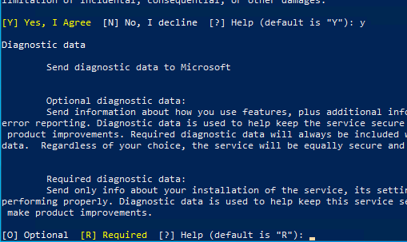

5. 出现提示时，允许 VM 重新启动。 等待几分钟，然后继续下一步。


6. VM 重新启动后，按照前面的步骤重新连接 RDP 会话。 您可能需要等待几分钟才能重新启动。

7. 打开 PowerShell 再次运行 `Deploy-Eflow` 
```
Deploy-Eflow -memoryInMB 2048 -acceptEula Yes -acceptOptionalTelemetry Yes
```

一段时间后，大概五分钟5 分钟，您应该会看到一条成功消息，如下面的屏幕截图所示。


8. 替换您之前记下的 `{primaryKey}` 和 {scopeId} 值，然后运行以下命令

```
Provision-EflowVm -provisioningType DpsSymmetricKey -scopeId {scopeId} -registrationId iot-academy-edge-device -symmKey {primaryKey}
e.g. Provision-EflowVm -provisioningType DpsSymmetricKey -scopeId 0ne00600B86 -registrationId iot-academy-edge-device -symmKey Yh1Y5pVwuo1Kroa7yZWmD42CTNpB5aTcJvFl1mu5E=
```

运行命令成功后，您将看到一条消息，如下所示。

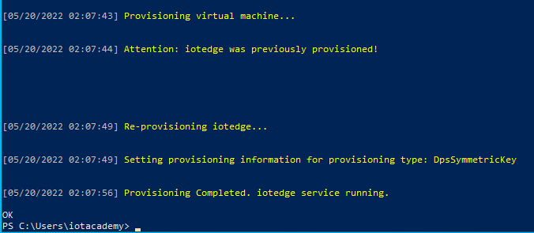

9.  现在回到 Azure 门户并找到您的资源组并导航到它

10.  在前缀为“iot-”的列表中找到您的 IoT Hub 资源并选择它

11.  单击 IoT Edge。 点击您的设备“iot-academy-edge-device”

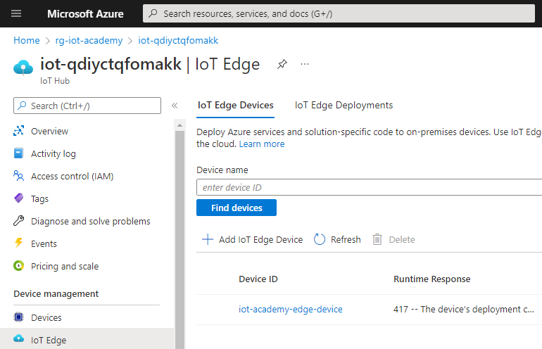

12.   一段时间后，您会注意到 edgeAgent 正在运行，并且 edgeHub 处于错误状态的情况，这是正常的因为我们没有提供配置

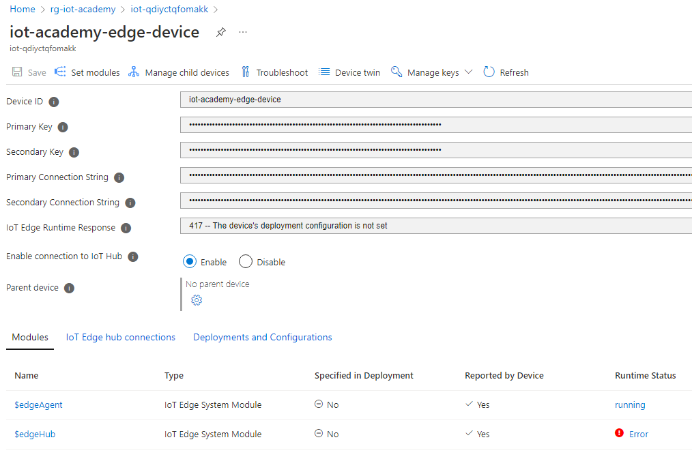

# 6. 练习: 创建 Azure Stream Analytics 任务

相关视频: [https://youtu.be/1T64Xnu0m3U](https://youtu.be/1T64Xnu0m3U)

## 6.1. 相关学习资源

[https://docs.microsoft.com/en-us/azure/iot-edge/reference-iot-edge-for-linux-on-windows-functions?view=iotedge-2020-11](https://docs.microsoft.com/en-us/azure/iot-edge/reference-iot-edge-for-linux-on-windows-functions?view=iotedge-2020-11)

## 6.2. 创建新的 ASA 任务
1. 进入 Azure 门户主页
2. 选择 **创建资源 - Create a resource**
3. 搜索 `stream analytics job`


4. 选择 **Stream Analytics job**
5. 点击 **创建 - Create**
6. 输入以下详细信息:
- 任务名称 - Job name: `asa-average-temperature`
- 资源组 - Resource group: `rg-iot-academy`
- 位置 - Location: 你的区域，如 `East US 2`
- 托管环境 - Hosting environment: `Edge`
   


7. 部署完成后点击**转到资源 - Go to resource**

## 6.3. 创建 ASA 输入

   - 选择 **输入 Inputs**, 再选择 **添加流输入 - Add stream input**, 点击 **Edge Hub**

      

   - 输入以下细节信息：
     - 输入别名 - Input alias: `temperatureSensor`
     - 其他值 - All other values: default

      <br/>

      
      
   - 选择 **Save**
 
## 6.4. 创建 ASA 输出

 1. 选择 **输出 - Outputs**
 2. 选择 **添加 - Add**, 然后点击 **Edge Hub**

    
 
 3. 输入以下细节信息
 - 输出别名 - Output alias: `averageTemperature`
 - 其他值 - All other values: default


 4. 点击 **保存 - Save**

## 6.5. 写一个 ASA 查询

1. 选择 **查询 Query**
2. 将下面的查询复制并粘贴到查询窗口中

```SQL
SELECT
    System.Timestamp() AS WindowEnd, avg(ambient.temperature) AverageTemperature
INTO
    averageTemperature
FROM
    temperatureSensor
GROUP BY TumblingWindow(Duration(minute, 1))
```

3. 选择 **保存查询 - Save query**

4. 选择 发布 - Publish, 再选择 **存储账户设定 - Storage account settings**, 点击 **添加存储账户 - Add storage account**


5. 选择您的订阅，然后选择形成的存储帐户，例如“st******edge”。 您的常用前缀将代替 ******。

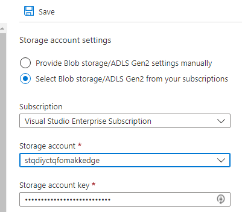

6. 选择 **保存 - Save**

7. 选择 **发布 - Publish**. 然后点击 **是 - Yes**


8. 将 SAS URL 复制到记事本以供接下来使用

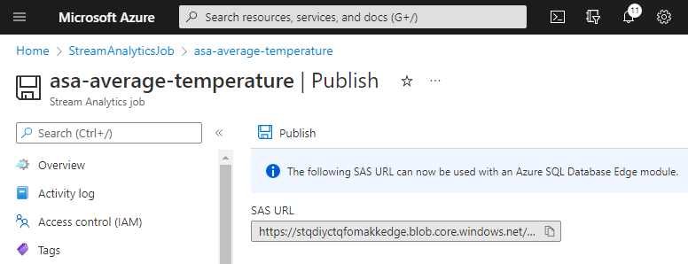

# 7. 练习: 更新 Azure IoT Edge 配置清单以添加模块和路由

Video: [https://youtu.be/UbGhG7gxmnU](https://youtu.be/UbGhG7gxmnU)

## 7.1. 介绍 Edge 相关架构

这个部分的动手实验侧重于部署 Azure IoT Edge 模块和如何配置路由

下图显示了数据如何在每个步骤之间流动。


快速回顾组件：
- 模拟温度传感器模块
  - 每 5 秒生成一条消息，共 2000 条消息。有效载荷包括温度和湿度等数据。
  - 由 Microsoft 在 Azure 市场上分发
- Azure IoT Edge ASA 模块
  - 提供在边缘运行流分析作业的能力
  - 由 Microsoft 在 Azure 市场上分发
- 平均温度持续模块
  - 为本次动手实验编写的自定义模块，提供了如何实施 Azure IoT Edge 模块 SDK 的示例。此模块将记录插入 Azure SQL Edge 数据库。
  -`Month_2/Day_1/hol_files/avg_temp_persistence_module`
- Azure SQL 边缘模块
  - 设计用于运行 SQL Server 的模块。
  - 由 Microsoft 在 Azure 市场上分发
- cron-exec 模块
  - 运行自定义 docker 容器以运行 cron 作业的模块。此实现中唯一的 cron 作业连接到 AzureSqlEdge 并为此 PoC 创建数据库和表（如果它不存在）。
  -`Month_2/Day_1/hol_files/cron_exec`
- Grafana
  - 运行一个容器镜像，为遥测可视化提供 Grafana。此 PoC 从 Azure SQL Edge AverageTemperature 数据库中提取遥测数据。
  -`Month_2/Day_1/hol_files/grafana_average_temp`

这种方法的一些替代方法是使用以下方法。选择此当前架构是为了展示和说明不同的方法。

1. 代替自定义模块的 Azure Function
   1. [https://docs.microsoft.com/en-us/azure/iot-edge/tutorial-deploy-function?view=iotedge-2020-11](https://docs.microsoft.com/en-us/azure/iot-edge/tutorial-deploy-function?view=iotedge-2020-11)
2. 使用 Azure SQL Edge 数据流
   1. [https://docs.microsoft.com/en-us/azure/azure-sql-edge/stream-data](https://docs.microsoft.com/en-us/azure/azure-sql-edge/stream-data)
   2. [https://docs.microsoft.com/en-us/azure/azure-sql-edge/create-stream-analytics-job](https://docs.microsoft.com/en-us/azure/azure-sql-edge/create-stream-analytics-job)

## 7.2. 相关资源

[https://docs.microsoft.com/en-us/azure/iot-hub/iot-hub-devguide-messages-d2c](https://docs.microsoft.com/en-us/azure/iot-hub/iot-hub-devguide-messages-d2c)
[https://docs.microsoft.com/en-us/azure/iot-edge/module-composition?view=iotedge-2020-11](https://docs.microsoft.com/en-us/azure/iot-edge/module-composition?view=iotedge-2020-11)
[https://docs.microsoft.com/en-us/azure/stream-analytics/stream-analytics-edge](https://docs.microsoft.com/en-us/azure/stream-analytics/stream-analytics-edge)
[https://docs.microsoft.com/en-us/azure/iot-edge/how-to-vs-code-develop-module?view=iotedge-2020-11](https://docs.microsoft.com/en-us/azure/iot-edge/how-to-vs-code-develop-module?view=iotedge-2020-11)
[https://docs.microsoft.com/en-us/azure/azure-sql-edge/tutorial-set-up-iot-edge-modules](https://docs.microsoft.com/en-us/azure/azure-sql-edge/tutorial-set-up-iot-edge-modules)
[https://docs.microsoft.com/en-us/azure/iot-edge/how-to-use-create-options?view=iotedge-2020-11](https://docs.microsoft.com/en-us/azure/iot-edge/how-to-use-create-options?view=iotedge-2020-11)
[https://docs.docker.com/engine/api/v1.32/#operation/ContainerCreate](https://docs.docker.com/engine/api/v1.32/#operation/ContainerCreate)
[https://github.com/marvin-garcia/AzureSqlEdge](https://github.com/marvin-garcia/AzureSqlEdge)

## 7.3. 查看部署配置清单

现在，我们将详细了解如何使用 Azure IoT Edge 协调所有组件的集成。

打开“Month_2/Day_1/hol_files/edge_manifest_modules.json”文件查看内容
   
注意模块和路由部分
以下屏幕截图显示了配置的路由。 您可以使用行号来浏览实际文件。

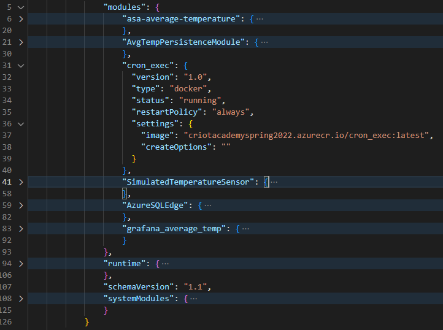


```
FROM /messages/modules/SimulatedTemperatureSensor/* INTO BrokeredEndpoint("/modules/asa-average-temperature/inputs/temperatureSensor
FROM /messages/modules/asa-average-temperature/* INTO BrokeredEndpoint("/modules/AvgTempPersistenceModule/inputs/input1
FROM /messages/modules/asa-average-temperature/* WHERE $body.Weather.Temperature > 21 INTO BrokeredEndpoint("/modules/AvgTempPersistenceModule/inputs/input1")
```

## 7.4. 使用 CLI 创建 IoT Edge 部署

在前面的步骤中，你使用 EFLOW 成功部署了 Azure IoT Edge 设备。
在此步骤中，您将配置边缘设备以运行 Azure IoT Edge 模块。

1. 列出您的 iot hubs 以获取名称

```
az iot hub list -o table
```

2. 编辑 `Month_2/Day_1/hol_files/edge_manifest_modules.json` 

3. 将 `{sas_url}` 替换为之前保存在记事本中的 SAS URL

4. 将“{subscription_id}”替换为您之前保存在记事本中的 SubscriptionID

5. 替换下面的 `{hub_name}` 后，运行以下的命令

Notice the **target-condition** this is what is going to target your Edge device since it does in fact have the **dev** tag as follows: **tags.environment='dev'**.

```
az iot edge deployment create -d deploy-tempsensor-sink -n {hub_name} --content edge_manifest_modules.json --target-condition "tags.environment='dev'" --priority 3

Some Examples
e.g. az iot edge deployment create -d deploy-tempsensor-sink -n iot-qdiyctqfomakk --content edge_manifest_modules.json --target-condition "tags.environment='dev'" --priority 3
e.g. to delete, az iot edge deployment delete -d deploy-tempsensor-sink -n iot-qdiyctqfomakk
```

## 7.5. 在 Azure 门户中查看 IoT Edge 部署

1. 访问 Azure 门户，查看您的 IoT Hub，选择 IoT Edge，然后单击 IoT Edge 部署

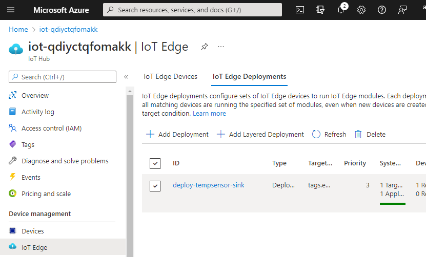

2. 选择您的部署，可以在此处查看部署的详细信息：您的部署的模块、路由和相关指标

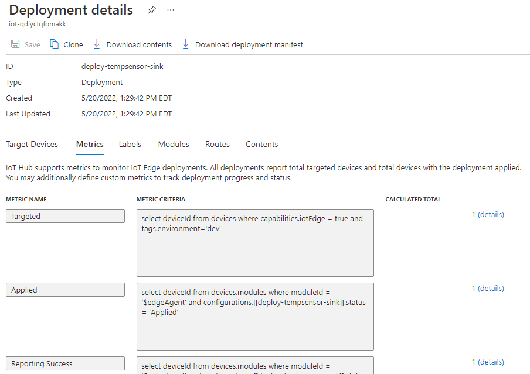

3. 等待您的设定部署到您的设备，然后继续下一部分。 这可能需要一定时间。

   如果您返回到第 1 步中使用的页面，可以点击刷新按钮，直到系统指标状态为“1 Targeted, 1 Applied”

# 8. 练习: 查看发送到 Grafana 的数据

Video: [https://youtu.be/TvzvFG79spE](https://youtu.be/TvzvFG79spE)

## 8.1. 登入 Windows 10 虚拟机

您应该仍然拥有之前的 RDP 会话。 如果您关闭它或它已结束，请再次按照“登录到您的 Windows 10 VM”部分中的步骤操作

## 8.2. 获取 EFLOW 虚拟机的 IP 地址

1. 转到或打开 PowerShell 窗口

2. 运行以下命令获取 EFlow VM 的IP地址

```
Get-EflowVmAddr
```
You'll get a result such as `172.20.126.50` Replace `{eflow_vm_ip}` below with the value

## 8.3. 登录到 Grafana

1. 在 VM 中打开 Edge 浏览器并导航到 http://{eflow_vm_ip}:3000

2.页面加载后，登录：
- 用户名 - username：`admin`
- 密码 - password：`admin`

1. 当提示更改密码时，在密码和确认框中使用“password1!”，然后单击“确定 - ok”。

## 8.4. 查看动手实验室提供的仪表板和图表

1. 查看所提供图表上的数据。

您可能需要等待一段时间才能在图表上显示大量数据


您还可以将时间范围更改为更短的时间并查看更好的图表。 你也可以使用自动刷新选项。


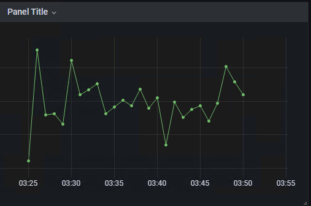

2. 看到数据后，继续进入下一个练习

# 9. 练习：监控 IoT Hub 事件

相关视频: [https://youtu.be/cWtMkYIblI0](https://youtu.be/cWtMkYIblI0)

## 9.1. 资源
[https://docs.microsoft.com/en-us/azure/iot-hub/iot-hub-vscode-iot-toolkit-cloud-device-messaging](https://docs.microsoft.com/en-us/azure/iot-hub/iot-hub-vscode-iot-toolkit-cloud-device-messaging)

## 9.2. 登录并选择正确的 IoT Hub

1. 打开 VSCode
2. 使用 command pallette, View -> Command Pallette
3. 输入 `select iot` 选择 `Azure IoT Hub: Select IoT Hub` 按回车
4. 选择您的订阅。 如果成功跳到步骤 6
5. 如果它不可见，您需要使用正确的帐户登录
    1. Command Pallette`Azure: Sign Out`
    2. Command Pallette`Azure：登录 Azure Cloud`
6. 选择为此动手实验实验室创建的 IoT Hub`

## 9.3. 开始监视 IoT Hub 内置事件端点

1. 右键选择 `Explorer -> Azure IoT Hub -> Your Hub -> Built-in endpoints -> events` and 点击 `Start Monitoring`


2. 平均温度遥测每分钟生成一次。 由于并非所有平均温度都符合“AverageTemperature > 21”的标准，因此可能需要一些时间才能看到事件的流动。 当它们达到时，您将在输出窗口中显示事件。
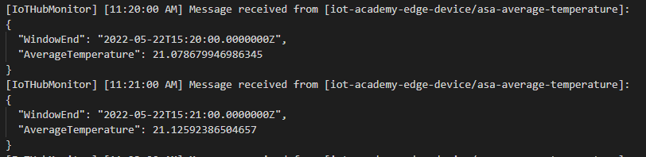

# 10. 练习:创建 Azure Logic App 以监视来自 IoT 中心的事件

Video: [https://youtu.be/n0ATDWwxfRg](https://youtu.be/n0ATDWwxfRg)

## 10.1. 资源
[https://docs.microsoft.com/en-us/azure/event-grid/publish-iot-hub-events-to-logic-apps](https://docs.microsoft.com/en-us/azure/event-grid/publish-iot-hub-events-to-logic-apps)
[https://docs.microsoft.com/en-us/connectors/azureloganalyticsdatacollector/#creating-a-connection](https://docs.microsoft.com/en-us/connectors/azureloganalyticsdatacollector/#creating-a-connection)


## 10.2. 在门户中打开您预先创建的 Logic App

转到 Azure 门户，搜索 `logic-`，搜索 `Logic App` 并选择它

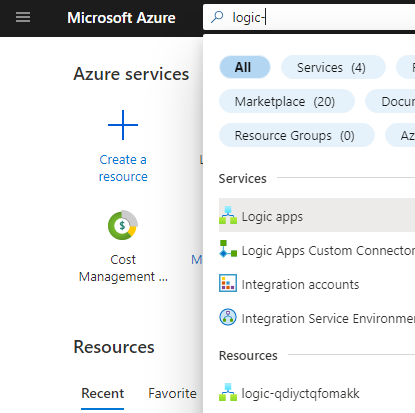

## 10.3. 向 Logic App 添加 HTTP 请求触发器

1. 选择 `空的 Logic App - Blank Logic App`

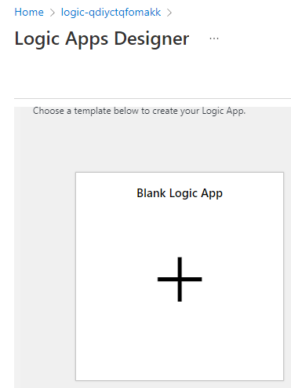

2. 查找 `http request` 选择 `When a HTTP request is received`

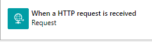

4. 选择 `Use sample payload to generate schema` 将 json 复制到剪贴板

```json
[
        {
            "id": "5749a230-6ebf-950f-3d26-53cc8315a4ad",
            "topic": "/SUBSCRIPTIONS/7451D6D6-9082-46D9-9373-CCD5FCDA6673/RESOURCEGROUPS/RG-IOT-ACADEMY/PROVIDERS/MICROSOFT.DEVICES/IOTHUBS/IOT-QDIYCTQFOMAKK",
            "subject": "devices/iot-academy-edge-device/asa-average-temperature",
            "eventType": "Microsoft.Devices.DeviceTelemetry",
            "data": {
                "properties": {},
                "systemProperties": {
                    "iothub-content-type": "application/json",
                    "iothub-content-encoding": "utf-8",
                    "iothub-connection-device-id": "iot-academy-edge-device",
                    "iothub-connection-module-id": "asa-average-temperature",
                    "iothub-connection-auth-method": "{\"scope\":\"module\",\"type\":\"sas\",\"issuer\":\"iothub\",\"acceptingIpFilterRule\":null}",
                    "iothub-connection-auth-generation-id": "637886649142604368",
                    "iothub-enqueuedtime": "2022-05-22T20:19:00.3160000Z",
                    "iothub-message-source": "Telemetry"
                },
                "body": {
                    "WindowEnd": "2022-05-22T20:19:00.0000000Z",
                    "AverageTemperature": 21.038353595978126
                }
            },
            "dataVersion": "",
            "metadataVersion": "1",
            "eventTime": "2022-05-22T20:19:00.316Z"
        }
    ]
```
5. 粘贴到 json
6. 点击 `完成 - Done`

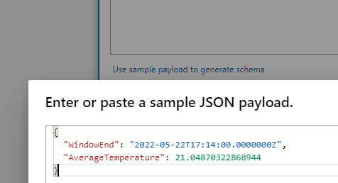

7. 点击 `保存 - Save`

8. 将“HTTP Post URL”复制到剪贴板，保存在记事本中

## 10.4. 添加用将数据发送到 Azure Log Analytics 工作区的步骤

1. 点击 `New step`
2. 查找 `Send data`. 选择 `Send Data: Azure Log Analytics Data Collector`

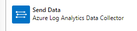

3. 接下来，您会注意到需要 Log Analytics 工作区的连接信息。


4. 名字: `log-analytics`

5. 在另一个浏览器选项卡中，转到 Azure 门户。 搜索“日志-”。 单击您的 Log Analytics 资源。

6. 将`Workspace ID`复制到剪贴板，例如 `7cee66af-aefc-4cf5-aa0d-a82c2ea8afe9`


7. 返回您的 Logic App 浏览器选项卡。 将您的 “工作区 ID - Workspace ID” 粘贴到相应的框中

8. 返回您的 Log Analytics 选项卡。 点击“代理管理 - Agents Management”。 将“主键 - Primary Key”复制到剪贴板

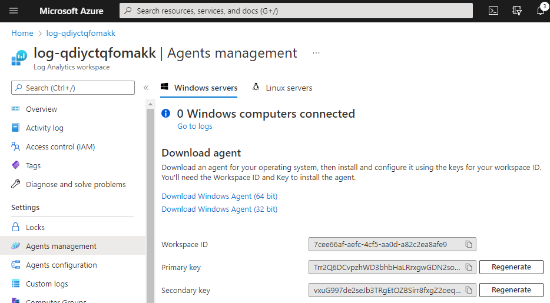

9. 返回您的 Logic App 浏览器选项卡。 粘贴您的“主键”。 单击确定。

10. 点击“创建”
    
11. 点击“保存”

12. 将以下 json 粘贴到 `JSON Request body` 框中

```json
{
"WindowEnd": "@{items('For_each')?['data']?['body']?['WindowEnd']}",
"AverageTemperature":"@{items('For_each')?['data']?['body']?['AverageTemperature']}"
}
```

13. 单击 JSON 请求正文字段并在动态内容框中选择“WindowEnd”。


14. 请注意，由于 json 的嵌套，Logic app 设计器会自动为您插入一个 foreach。


15. C单击 WindowEnd 字段上的“x”。 将光标放在两个`"`之间。查看右侧面板动态字段并单击WindowEnd。

16. 输入详细信息并点击“保存”


## 10.5. 配置 IoT Hub 将事件发送到 Logic App

1. 在新的浏览器选项卡中，搜索 `iot-`。 选择您的 IoT Hub 实例。

2. 单击事件。 点击`+活动订阅 - + Event Subscription`


3. 输入以下信息
- 名称 - Name: logicapp
- 网格事件架构 - Event Grid Schema
- 过滤到事件类型 - Filter to Event Types: Only Device Telemetry
- 断点 - Endpoint: The `HTTP Post URL` you saved to your notepad


4. 点击 `创建 - Create`

注意：也可以在此处添加过滤器，类似于我们在早前动手实验为 > 21 过滤遥测数据的方式。

## 10.6. 确保您的 Logic 正在成功接收 webhook 

1. 导航回打开 Logic App 的浏览器选项卡
2. 查看概览页面上的执行历史记录。 如果您没有看到任何运行，请等待几分钟以显示。 如有必要，请使用刷新按钮。


# 11. 联系: 查看 Log Analytics 数据并设置警报

相关视频: [https://youtu.be/GhwsPXFdye0](https://youtu.be/GhwsPXFdye0)

## 11.1. 查询 Log Analytics 数据

1. 返回到打开 Log Analytics 的浏览器选项卡。 如果找不到，请搜索 `iot-`

2. 点击“日志”，并关闭弹出的“查询”窗口。

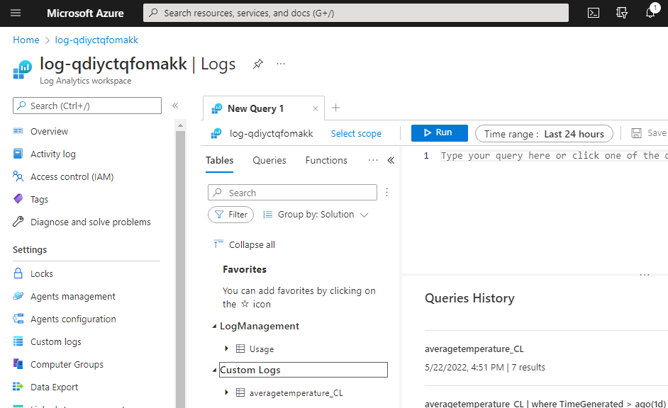

3. 确保您看到 `averagetemperature_CL` 表。 如果没有，可能需要一些时间才能显示

4. 将`averagetemperature_CL`粘贴到查询窗口中，然后点击`运行按钮`


5. 一旦你看到日志移动到下一部分
   
## 11.2. 创建 Azure Monitor 警报

1. 在右上角单击 `新建警报规则 -  New alert rule`

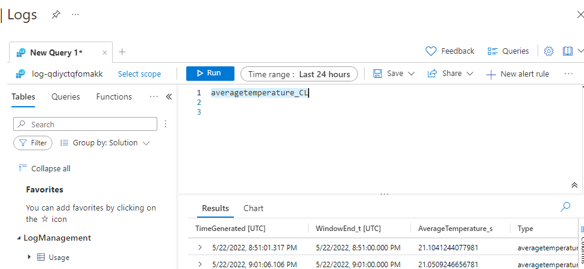

2. 现在在“条件 - Conditions”选项卡上。 输入以下内容
- 搜索查询 - Search Query: `averagetemperature_CL`
- 测量 - Measure: `Table Rows`
- 聚合类型 - Aggregation Type: `Count`
- 聚合粒度 - Aggregation Granularity: `5 minutes`
- 算子 - Operator: `Greater than`
- 阈值 - Threshold Value: 2
- 评估频率 - Frequency of Evaluation: `5 minutes`

3. 单击“下一步 - Next”。 查看“操作”选项卡。 您可以在此处配置要发送的电子邮件或短信。
4. 点击`下一步：详细信息 - Next: Details`
5. 输入名称：`alert-averagetemperature`
6. 将严重性更改为：`Warning`
7. 地区：默认或您的地区
8. 保留结果默认值，确保已启用
   
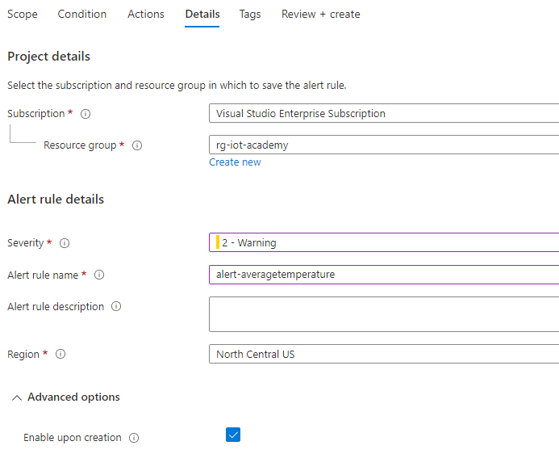

9. 点击“查看和创建 - Review and Create”
10. 点击`创建 - Create`

## 11.3. 在 Azure Monitor 中查看警报

1. 打开一个新的浏览器选项卡到 https://portal.azure.com 并搜索 Monitor。 点击监控 - Monitor。


2. 选择“警报”。 查看警报页面

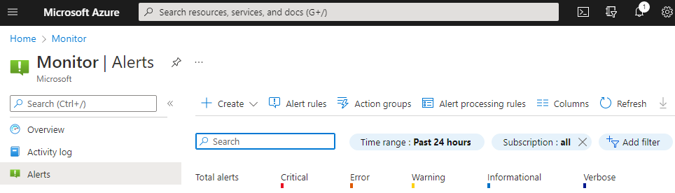

1. 等待一段时间后，根据发送的数据触发警报。 需要使用“刷新”按钮来查看新警报的到达。


# 12. 清空资源


   不要在下一次 Azure IoT Academy 动手实验之前超额使用 Azure 资源，

1. 导航到 Azure 门户主页
2. 选择 **资源组 - Resource groups***
3. 选择 **rg-iot-academy**
4. 点击 **删除资源组 - rg-iot-academy**

   

5. 键入您的资源组的名称，然后单击 **删除 - Delete**

   


