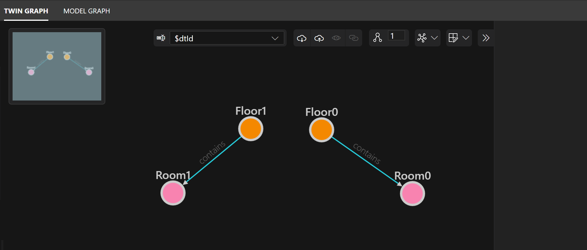
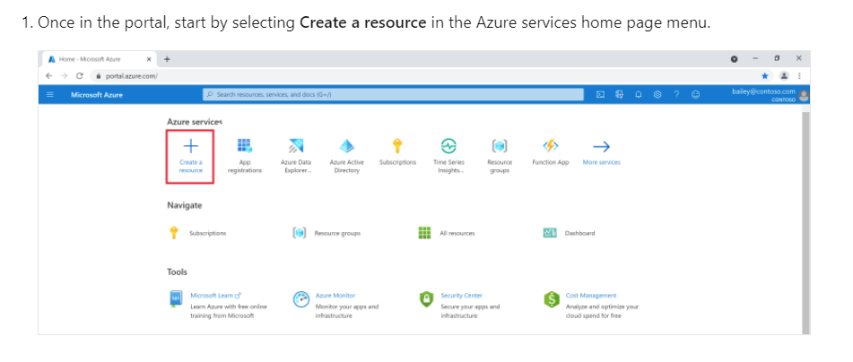
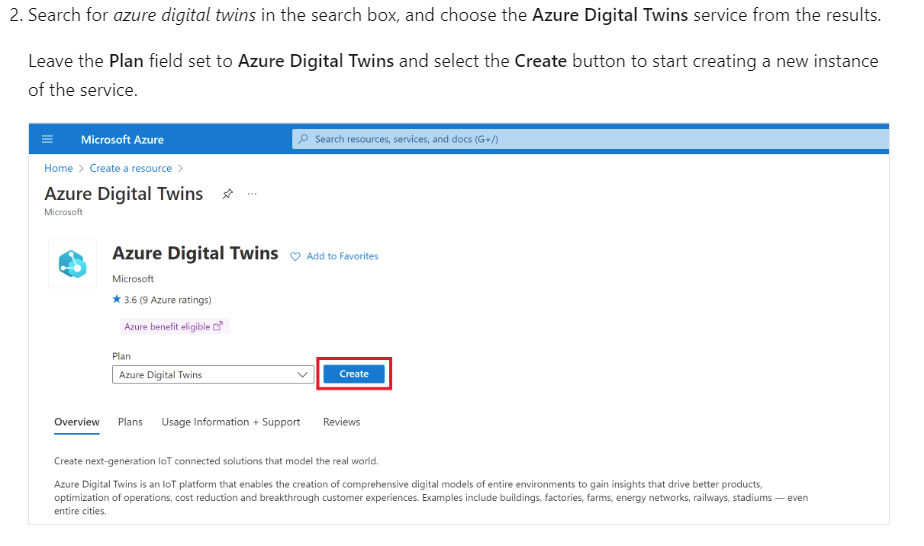
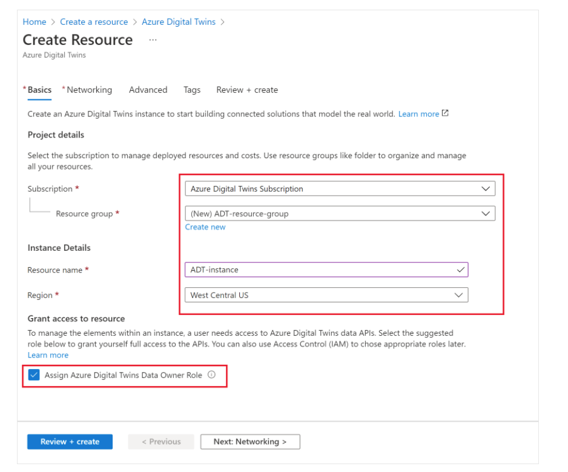
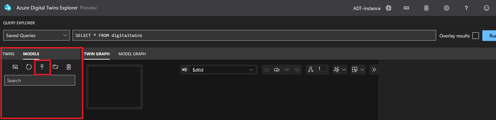

# 1.  Azure IoT 学院专题二:  动手实验 2.1
## 点击以下链接观看视频
## 1.1. [动手实验 2.1: 视频](https://youtu.be/I5_daPXxhYs)

此动手实验室旨在向大家介绍以下 Azure 相关服务和技术：

- Azure 数字孪生 - Azure Digital Twins 
- Azure 数字孪生资源管理器 - Azure Digital Twins Explorer 

在本实验室中，你将使用 [Azure 数字孪生资源管理器](https://docs.microsoft.com/en-us/azure/digital-twins/how-to-use-azure-digital-twins-explore）。 此工具允许您在 Azure 门户中可视化您的 Azure 数字孪生数据并与之交互。

借助 Azure 数字孪生，你可以创建真实环境的实时模型并与之交互，这可以成为更广泛的 IoT 解决方案的一部分。 首先，您将单个元素建模为数字双胞胎。 然后，您将它们连接到一个知识图谱中，该图可以响应实时事件并被查询以获取信息。

您将完成以下步骤：

1. 创建一个 Azure 数字孪生实例，并在 Azure 数字孪生资源管理器中连接到它。
2. 上传预建模型和图数据，构建示例场景。
3. 探索创建的场景图。
4. 更改图表。
5. 回顾你从经验中学到的东西。

你将使用的 Azure 数字孪生示例图表示具有两层楼和两个房间的建筑物。 Floor0 包含 Room0，Floor1 包含 Room1。 该图将如下图所示：



<b>课程内容</b>

- [1.  Azure IoT 学院专题二:  动手实验 2.1](#1--azure-iot-学院专题二--动手实验-21)
  - [点击以下链接观看视频](#点击以下链接观看视频)
  - [1.1. 动手实验 2.1: 视频](#11-动手实验-21-视频)
  - [1.2. 课前准备](#12-课前准备)
    - [1.2.1. 下载示例图的材料](#121-下载示例图的材料)
    - [1.2.2. 创建 Azure 数字孪生](#122-创建-azure-数字孪生)
    - [1.2.3. 创建 Azure 数字孪生实例](#123-创建-azure-数字孪生实例)
    - [1.2.4. 在 Azure 数字孪生资源管理器中打开实例](#124-在-azure-数字孪生资源管理器中打开实例)
    - [1.2.5. 传样本材料](#125-传样本材料)
    - [1.2.6. 模型](#126-模型)
      - [1.2.6.1. 上传模型（.json 文件）](#1261-上传模型json-文件)
    - [1.2.7. 孪生和孪生图](#127-孪生和孪生图)
      - [1.2.7.1. 倒入图 (.xlsx 文件)](#1271-倒入图-xlsx-文件)
  - [1.3. 浏览孪生图](#13-浏览孪生图)
    - [1.3.1. 查看孪生属性](#131-查看孪生属性)
    - [1.3.2. 查询孪生图](#132-查询孪生图)
  - [1.4. 编辑图中的数据](#14-编辑图中的数据)
    - [1.4.1. 查询和查看结果](#141-查询和查看结果)
  - [1.5. 回顾和情境化学习](#15-回顾和情境化学习)
    - [转到下一个动手实验中 <b>lab](#转到下一个动手实验中-blab)

## 1.2. 课前准备

### 1.2.1. 下载示例图的材料
使用以下说明下载三个必需的文件。 稍后，你将按照更多说明将它们上传到 Azure 数字孪生。

   * [Room.json](https://raw.githubusercontent.com/Azure-Samples/digital-twins-explorer/main/client/examples/Room.json): 这是一个模型文件，代表建筑物中的一个房间。 导航到该链接，右键单击屏幕上的任意位置，然后在浏览器的右键单击菜单中选择**另存为**。 使用以下“另存为”窗口将文件保存在计算机上的某个位置，名称为 *Room.json*。
   * [Floor.json](https://raw.githubusercontent.com/Azure-Samples/digital-twins-explorer/main/client/examples/Floor.json): 这是一个模型文件，代表建筑物中的楼层。 导航到该链接，右键单击屏幕上的任意位置，然后在浏览器的右键单击菜单中选择**另存为**。 使用以下另存为窗口将文件保存到与 *Room.json* 相同的位置，名称为 *Floor.json*。
   * [buildingScenario.xlsx](https://github.com/Azure-Samples/digital-twins-explorer/raw/main/client/examples/buildingScenario.xlsx): 此文件包含房间和地板孪生的图表，以及它们之间的关系。 根据您的浏览器设置，选择此链接可能会将 *buildingScenario.xlsx* 文件自动下载到您的默认下载位置，或者它可能会在您的浏览器中打开该文件并提供下载选项。 以下是该下载选项在 Microsoft Edge 中的效果：

  

> [!TIP]   
> 这些文件来自 [GitHub 中的 Azure 数字孪生资源管理器存储库](https://github.com/Azure-Samples/digital-twins-explorer)。 您可以访问 repo 以获取其他示例文件、资源管理器代码等。

### 1.2.2. 创建 Azure 数字孪生

使用 Azure 数字孪生的第一步是创建一个 Azure 数字孪生实例。 创建服务实例后，你可以在 Azure 数字孪生资源管理器中连接到该实例，在整个快速入门过程中你将使用它来处理该实例。

本节的其余部分将引导您完成实例创建。

### 1.2.3. 创建 Azure 数字孪生实例






 3. 选择您在专题一中创建的资源组：rg-iotacademy



 4. 填写设置的 **Basics** 选项卡上的字段，包括您的订阅、资源组、新实例的资源名称和区域。 选中**分配 Azure 数字孪生数据所有者角色 - Assign Azure Digital Twins Data Owner Role**框以授予自己管理实例中数据的权限。


 > [!NOTE]
> 如果分配 Azure 数字孪生数据所有者角色框显示为灰色，则表示您在 Azure 订阅中无权管理用户对资源的访问。 您可以在此部分继续创建实例，然后应该让特定的人拥有必要的权限 [在实例上为您分配此角 - assign you this role on the instance]、(https://docs.microsoft.com/en-us/azure/digital-twins/how-to-set-up-instance-portal#assign-the-role-using-azure-identity-management-iam)，然后再完成本快速入门的其余部分。
 >
 > 满足此要求的常见角色是 **Owner**、**Account admin** 或 **User Access Administrator** 和 **Contributor** 的组合。

 5. 选择 **预览+ 创建 - Review + Create** 以完成创建您的实例。
    
 6. 您将看到一个摘要页面，显示您输入的详细信息。 通过选择 **创建 - Create** 确认并创建实例。

 7. 这将带您进入跟踪实例部署状态的概览页面。


 8. 等待页面显示您的部署已完成。

### 1.2.4. 在 Azure 数字孪生资源管理器中打开实例

部署完成后，使用 **进入资源 - Go to resource** 按钮导航到门户中实例的概览页面。


### 1.2.5. 传样本材料

接下来，将示例模型和图形导入 Azure 数字孪生资源管理器。 您将使用在 [#课前准备](##12-课前准备) 部分下载到计算机的模型文件和图文件。

### 1.2.6. 模型

Azure 数字孪生解决方案的第一步是为你的环境定义词汇表。您将创建自定义 *模型 - models* 来描述您的环境中存在的实体类型。

每个模型都是用一种类似于 [JSON-LD](https://json-ld.org/) 的语言编写的，称为 *数字孪生定义语言 - Digital Twin Definition Language (DTDL)*。每个模型根据其属性、遥测、关系和组件描述单一类型的实体。稍后，您将使用这些模型作为表示这些类型的特定实例的数字孪生模型的基础。

通常，当您创建模型时，您将完成三个步骤：

1. 编写模型定义。在快速入门中，此步骤已作为示例解决方案的一部分完成。
1. 验证它以确保语法准确。在快速入门中，此步骤已作为示例解决方案的一部分完成。
1. 将其上传到您的 Azure 数字孪生实例。
 
对于这个快速入门，模型文件已为您编写和验证。它们包含在您下载的解决方案中。在本节中，您将上传两个预先编写的模型到您的实例，以定义构建环境的这些组件：

* 地面 - Floor
* 房间 - Room

#### 1.2.6.1. 上传模型（.json 文件）

按照以下步骤上传模型（您之前下载的 *.json* 文件）。

1. 在 **模型 - Models** 面板中，选择 **上传模型 - Upload a Model** 图标（该图标显示一个向上的箭头）

    
 
2. 在出现的打开窗口中，导航到包含您之前下载的 *Room.json* 和 *Floor.json* 文件的文件夹。

3. 选择 *Room.json* 和 *Floor.json*，然后选择 **打开 - Open** 将它们都上传。

Azure 数字孪生资源管理器会将这些模型文件上传到你的 Azure 数字孪生实例。 它们应该出现在 **模型 - Models** 面板中，并显示它们的友好名称和完整的模型 ID。

您可以为任一模型选择 **查看模型 - View Model** 以查看其背后的 DTDL 代码。


  
  

### 1.2.7. 孪生和孪生图

现在一些模型已上传到您的 Azure 数字孪生实例，可以根据模型定义添加*数字孪生*。

*数字孪生*代表您的业务环境中的实际实体。 它们可以是农场中的传感器、汽车中的灯，或者本快速入门 建筑楼层的房间。 您可以创建任何给定模型类型的多个孪生模型，例如全部使用 Room 模型的多个房间。 您将它们与关系连接成一个代表完整环境的*孪生 - twin graph*。

在本节中，您将上传连接到预先创建的图表中的预先创建的双胞胎。 该图包含两个楼层和两个房间，按以下布局连接：

* Floor0 0层
    - 包含 Room0
* Floor1 1楼
    - 包含 Room1

#### 1.2.7.1. 倒入图 (.xlsx 文件)

按照以下步骤导入图形（您之前下载的 *.xlsx* 文件）

1. 在 **孪生图 - Twin Graph** 面板中，选择 **导入图 - Import Graph** 图标(该图标显示一个指向云的箭头)


 


2. 在打开窗口中，导航到您之前下载的 *buildingScenario.xlsx* 文件。 此文件包含示例图的描述。 选择**打开 - Open**。

   几秒钟后，Azure 数字孪生资源管理器会打开一个 **倒入 - Import** 图，其中显示要加载的图的预览。

3. 要完成导入图，请选择图预览面板右上角的**保存 - Save**图标。

     

4. Azure 数字孪生资源管理器将使用上传的文件来创建请求的孪生对象和它们之间的关系。 在继续之前，请确保您看到以下指示导入成功的对话框。

      


    选择 **关闭 - Close**.

    该图现已上传到 Azure 数字孪生资源管理器，并且 **孪生图 - Twin Graph** 面板将重新加载。 它将显示为空。
 
5. 若要查看图，请选择 **查询浏览器 - Query Explorer** 面板中的 **运行查询 - Run Query** 按钮，该面板靠近 Azure 数字孪生资源管理器窗口的顶部。

   

此操作运行默认查询以选择和显示所有数字孪生。 Azure 数字孪生资源管理器从服务中检索所有孪生和关系。 它在 **孪生图 - Twin Graph** 面板中绘制由它们定义的图。

## 1.3. 浏览孪生图

现在您可以看到示例场景的上传图。


圆圈（图形“节点”）代表数字孪生。 线条代表关系。 Floor0 孪生包含 Room0，Floor1 孪生包含 Room1。

如果您使用鼠标，则可以在图中单击并拖动以移动元素。

### 1.3.1. 查看孪生属性

您可以选择孪生以在 **孪生属性 - Twin Properties** 面板中查看其属性及对应值的列表。

以下是 Room0 的属性：


    

Room0 的温度为 70。

以下是 Room1 的属性：


Room1 的温度为 80。

### 1.3.2. 查询孪生图

在 Azure 数字孪生中，您可以使用 SQL 风格的 *Azure 数字孪生查询语言 - Azure Digital Twins query language*查询您的孪生图以回答有关您的环境的问题。

查询图表中孪生的一种方法是通过它们的属性。 基于属性的查询有助于回答有关您的环境的问题。 例如，您可以在您的环境中找到可能需要注意的异常值。

在本部分中，您将运行查询来回答您的环境中有多少孪生的温度高于 75 的问题。

要查看答案，请在 **查询浏览器 - Query Explorer** 面板中运行以下查询。

```bash
SELECT * FROM DIGITALTWINS T WHERE T.Temperature > 75
```

回想一下之前查看孪生属性时，Room0 的温度为 70，Room1 的温度为 80。Floor 孪生根本没有 Temperature 属性。 由于这些原因，此处的结果中仅显示 Room1。
    


>[!TIP]  
> 前面的查询还支持其他比较运算符（<、>、= 或 !=）。 您可以尝试将这些运算符、不同的值或不同的孪生属性插入到查询中。

## 1.4. 编辑图中的数据

在完全连接的 Azure 数字孪生解决方案中，图形中的孪生可以接收来自真实 IoT 设备的实时更新并更新其属性以与您的真实环境保持同步。 您还可以使用 Azure 数字孪生资源管理器或其他开发接口（如 API 或 Azure CLI）手动设置图形中孪生的属性。

为简单起见，您将在此处使用 Azure 数字孪生资源管理器将 Room0 的温度手动设置为 76。

首先，重新运行以下查询以选择所有数字孪生。 这将在 **孪生图 - Twin Graph** 面板中再次显示完整的图表。

               
```
SELECT * FROM DIGITALTWINS
```

选择 **Room0** 以在 **孪生属性 - Twin Properties** 面板中显示其属性列表。

此列表中的属性是可编辑的。 选择 **70** 的温度值以启用输入新值。 输入 *76* 并选择 **保存 - Save** 图标以更新温度。


   


成功更新属性后，您将看到一个 **补丁信息 - Patch Information** 框，其中显示了在 [Azure 数字孪生 API](concepts-apis-sdks.md) 后台使用的补丁代码以进行更新。


**关闭 - Close**补丁信息。

### 1.4.1. 查询和查看结果

要验证图是否成功注册了您对 Room0 温度的更新，请重新运行之前的查询以获取环境中温度高于 75 的所有孪生。

```
SELECT * FROM DIGITALTWINS T WHERE T.Temperature > 75
```

现在 Room0 的温度已从 70 更改为 76，两个孪生都应该出现在结果中。

 

## 1.5. 回顾和情境化学习

在本快速入门中，你创建了一个 Azure 数字孪生实例并使用 Azure 数字孪生资源管理器使用了示例方案。

然后，您通过以下方式探索图：

* 使用查询来回答有关场景的问题。
* 编辑数字孪生的属性。
* 再次运行查询以查看答案因更新而发生的变化。

本动手实验的目的是演示如何使用 Azure 数字孪生图来解答有关环境的问题，即使环境继续发生变化。

在本快速入门中，您手动进行了温度更新。 Azure 数字孪生通常将数字孪生连接到真实的 IoT 设备，以便它们根据遥测数据自动接收更新。 通过这种方式，您可以构建始终反映环境真实状态的实时图表。 您可以使用查询来实时获取有关您的环境中正在发生的事情的信息。

### 转到下一个动手实验中 <b>[lab](./hands-on-lab2.md)
