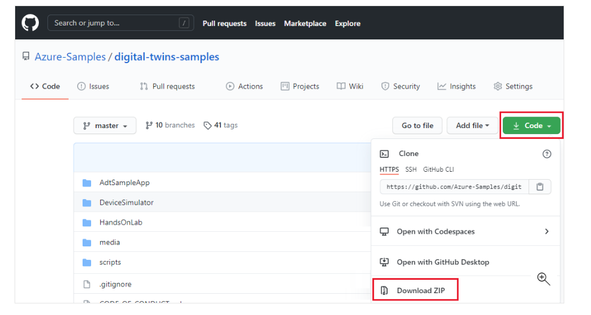
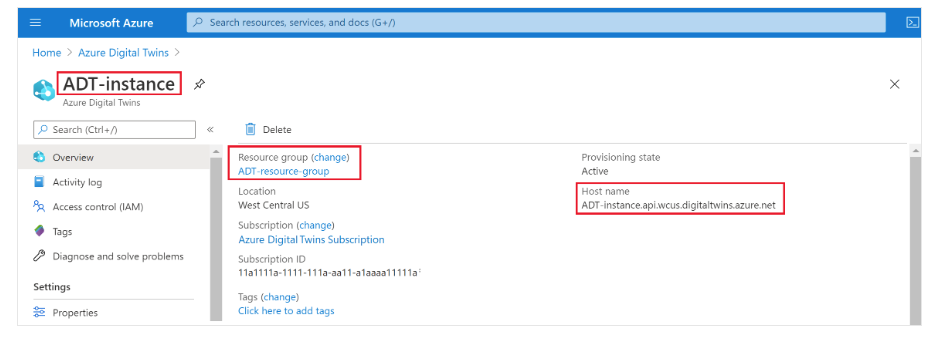
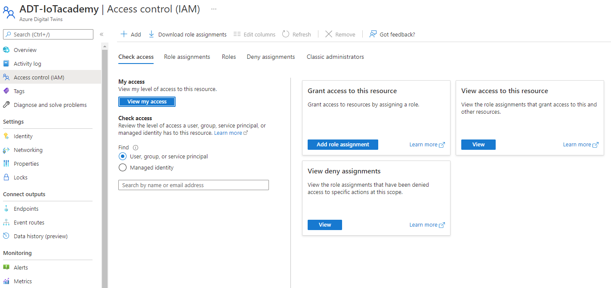
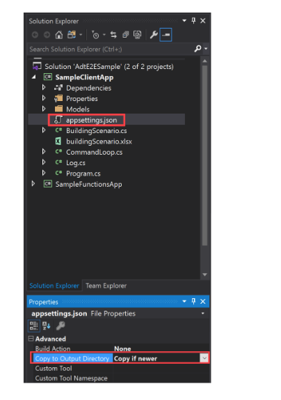
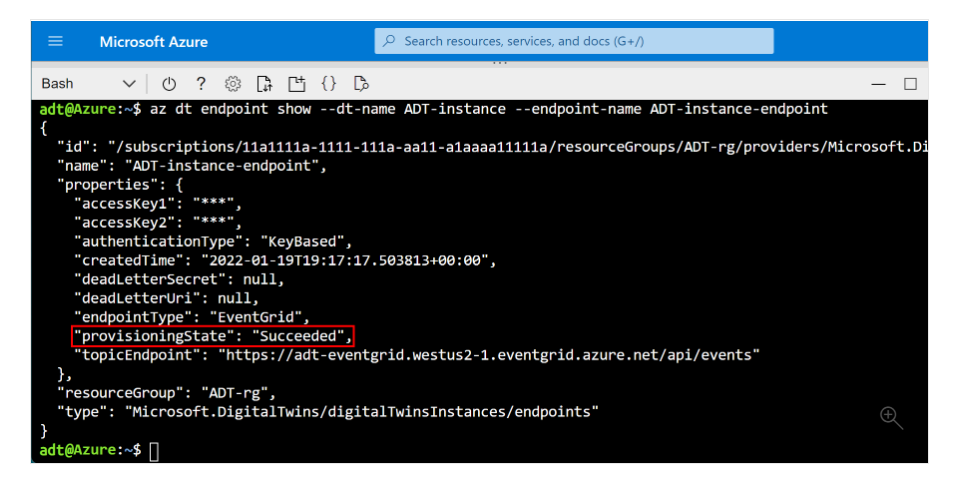

# 1. Azure IoT Academy Month Two, Day Two, Lab Three
## Click Below Link to Watch Lab Three Video
## 1.1. [Day Two: Hands on Lab Three Video](https://youtu.be/jwzhy3_uS-A)

This hands on lab seeks to introduce the student to the following Azure Services and Technologies:

- Visual Studio
- Azure Digital Twins
- Azure Cloud Shell
- Event Grid
- Azure Functions

This Azure Digital Twins lab describes how to build out an end-to-end solution that demonstrates the functionality of the service. To set up a full end-to-end solution driven by live data from your environment, you can connect your Azure Digital Twins instance to other Azure services for management of devices and data.

In this tutorial, you will...

 * Set up an Azure Digital Twins instance
 * Learn about the sample building scenario and instantiate the pre-written components
 * Use an [Azure Functions](../azure-functions/functions-overview.md) app to route simulated telemetry from an [IoT Hub](../iot-hub/about-iot-hub.md) device into digital twin properties
 * Propagate changes through the twin graph by processing digital twin notifications with Azure Functions, endpoints, and routes

 Course Content

- [1. Azure IoT Academy Month Two Day Two](#1-azure-iot-academy-month-two-day-two)
  - [1.1. Day Two: Hands on Lab Three Video](#11-Day-Two-Hands-on-Lab-Three-Video)
  - [1.2. Prerequisites](#12-prerequisites)
    - [1.2.1. Install VS Code](#121-install-vs-code)
    - [1.2.2. Download ZIP of Azure Digital Twins sample C# project](#122-Download-ZIP-of-Azure-Digital-Twins-sample-C#-project)
    - [1.2.3. Prepare an Azure Digital Twins instance](#123-Prepare-an-Azure-Digital-Twins-instance)
    - [1.2.4. Prepare your environment for the Azure CLI](#124-Prepare-your-environment-for-the-Azure-CLI)
    - [1.2.5. Set up CLI session](#125-Set-up-CLI-session)
  - [1.3. Exercise: Configure the ADT sample project](#13-Configure-the-ADT-sample-project)
    - [1.3.1. Get started with the building scenario](#131-Get-started-with-the-building-scenario)
    - [1.3.2. Instantiate the pre-created twin graph](#132-Instantiate-the-pre-created-twin-graph)
    - [1.3.3. Set up the sample function app](#133-Set-up-the-sample-function-app)
    - [1.3.4. Update dependencies](#134-Update-dependencies)
    - [1.3.5. Publish the app](#135-Publish-the-app)
    - [1.3.6. Configure permissions for the function app](#136-Configure-permissions-for-the-function-app)
    - [1.3.7. Assign access role](#137-Assign-access-role)
    - [1.3.8. Configure application settings](#138-Configure-application-settings)
  - [1.4. Excercise: Process simulated telemetry from an IoT Hub device](#14-Process-simulated-telemetry-from-an-IoT-Hub-device)
    - [1.4.1. Connect the IoT hub to the Azure function](#141-Connect-the-IoT-hub-to-the-Azure-function)
    - [1.4.2. Register the simulated device with IoT Hub](#142-Register-the-simulated-device-with-IoT-Hub)
    - [1.4.3. Configure and run the simulation](#143-Configure-and-run-the-simulation)
    - [1.4.4. See the results in Azure Digital Twins](#144-See-the-results-in-Azure-Digital-Twins)
  - [1.5. Exercise: Propagate Azure Digital Twins events through the graph](#15-Propagate-Azure-Digital-Twins-events-through-the-graph)
    - [1.5.1. Create the Event Grid topic](#151-Create-the-Event-Grid-topic)
    - [1.5.2. Create the endpoint](#152-Create-the-endpoint)
    - [1.5.3. Create the route](#153-Create-the-route)
    - [1.5.4. Connect the Azure function](#154-Connect-the-Azure-function)
  - [1.6. Exercise: Run the simulation and see the results](#16-Run-the-simulation-and-see-the-results)
    - [1.6.1. Review](#161-Review)
    - [1.6.2. Clean up Resources](#162-Clean-up-resources)
    - [1.6.3. Next Steps](#163-next-steps)

## 1.1. Prerequisites

### 1.1.1. Install Visual Studio
[Visual Studio Download](https://visualstudio.microsoft.com/vs/)
* For Mac users the latest version of Visual Studio 2022 for Mac (version 17.2) offers the most development features

### 1.1.2. Download ZIP of Azure Digital Twins C# sample project

The tutorial is driven by an [Azure Digital Twins end-to-end sample project written in C#](https://github.com/Azure-Samples/digital-twins-samples). Get the sample project on your machine by navigating to the sample link, and selecting the <b>Browse</b> code button underneath the title. This will take you to the GitHub repo for the samples, which you can download as a .zip by selecting the <b>Code</b> button followed by <b>Download ZIP.</b>



This will download a .zip folder to your machine as digital-twins-samples-master.zip. Unzip the folder and extract the files.

### 1.1.3. Prepare an Azure Digital Twins instance

We will be using the Azure Digital Twins instance that we set up in Lab One. 

Open your Azure Digital Twins instance from the Azure portal.

From the instance's <b>Overview</b> page, note its <b>Name, Resource group, and Host name.</b> These values are all important and you may need to use them as you continue working with your Azure Digital Twins instance.

 

You now have an Azure Digital Twins instance ready to go. Please ensure you have the appropriate Azure user permissions to manage it.
Setting up user access permissions: Azure users need to have the Azure Digital Twins Data <b>Owner</b> role on the Azure Digital Twins instance to be able to manage it and its data. 




### 1.1.4. Prepare your environment for the Azure CLI

Use the Bash environment in Azure Cloud Shell. Right click the image below and open in a new window. 

[<b>](https://portal.azure.com/#cloudshell/)</b>


### 1.1.5. Set up CLI session


If this is the first time you've used this subscription with Azure Digital Twins, run this command to register with the Azure Digital Twins namespace. (If you're not sure, it's ok to run it again even if you've done it sometime in the past.)

```
az provider register --namespace 'Microsoft.DigitalTwins'
```
Next you'll add the [Microsoft Azure IoT Extension for Azure CLI](https://docs.microsoft.com/en-us/cli/azure/service-page/azure%20iot?view=azure-cli-latest&preserve-view=true), to enable commands for interacting with Azure Digital Twins and other IoT services. Run this command to make sure you have the latest version of the extension:

```

az extension add --upgrade --name azure-iot
```

Now you are ready to work with Azure Digital Twins in the Azure CLI.

You can verify this by running ```az dt --help``` at any time to see a list of the top-level Azure Digital Twins commands that are available.

## 1.2. Configure the ADT sample project

Next, set up a sample client application that will interact with your Azure Digital Twins instance.

Navigate on your machine to the file you downloaded earlier from [Azure Digital Twins end-to-end samples](https://docs.microsoft.com/en-us/samples/azure-samples/digital-twins-samples/digital-twins-samples/) (and unzip it if you haven't already).

Once inside the folder, navigate into <b>AdtSampleApp</b>. Open A<b>dtE2ESample.sln</b> in Visual Studio.

In Visual Studio, select the <b>SampleClientApp > appsettings.json</b> file to open it in the editing window. This will serve as a pre-set JSON file with the necessary configuration variables to run the project.

In the file body, change the ```instanceUrl``` to your Azure Digital Twins instance host name URL (by adding https:// in front of the host name, as shown below).

```
{
  "instanceUrl": "https://<your-Azure-Digital-Twins-instance-host-name>"
}
```
Save and close the file.

Next, configure the <b>appsettings.json</b> file to be copied to the output directory when you build the SampleClientApp. To do this, right-select the <b>appsettings.json</b> file, and choose <b>Properties</b>. In the <b>Properties</b> inspector, look for the <b>Copy to Output Directory</b> property. Change the value to <b>Copy if newer</b> if it is not set to that already.

 

Keep the AdtE2ESample project open in Visual Studio to continue using it in the tutorial.


### 1.2.1. Get started with the building scenario

The sample project used in this tutorial represents a real-world building scenario, containing a floor, a room, and a thermostat device. These components will be digitally represented in an Azure Digital Twins instance, which will then be connected to [IoT Hub](../iot-hub/about-iot-hub.md), [Event Grid](../event-grid/overview.md), and two [Azure functions](../azure-functions/functions-overview.md) to enable movement of data.

Below is a diagram representing the full scenario. 

You'll first create the Azure Digital Twins instance (**section A** in the diagram), then set up the telemetry data flow into the digital twins (**arrow B**), then set up the data propagation through the twin graph (**arrow C**).

 

To work through the scenario, you'll interact with components of the pre-written sample app you downloaded earlier.

Here is a breakdown of the components that are implemented by the building scenario AdtSampleApp sample app:
* Device authentication 
* [.NET (C#) SDK](https://docs.microsoft.com/en-us/dotnet/api/overview/azure/digitaltwins/client?view=azure-dotnet&preserve-view=true) usage examples (found in *CommandLoop.cs*)
* Console interface to call the Azure Digital Twins API
* SampleClientApp - A sample Azure Digital Twins solution
* SampleFunctionsApp - An Azure Functions app that updates your Azure Digital Twins graph based on telemetry from IoT Hub and Azure Digital Twins events

### 1.2.2. Instantiate the pre-created twin graph

First, you'll use the AdtSampleApp solution from the sample project to build the Azure Digital Twins piece of the end-to-end scenario (**section A**):


In your Visual Studio window where the *AdtE2ESample.sln* solution is open, run the SampleClientApp project with this button in the toolbar:


A console window will open, carry out authentication, and wait for a command. In this console, run the next command to instantiate the sample Azure Digital Twins solution.

> [!IMPORTANT] 
> If you already have digital twins and relationships in your Azure Digital Twins instance, running this command will delete them and replace them with the twins and relationships for the sample scenario.

```cmd/sh
SetupBuildingScenario
```

The output of this command is a series of confirmation messages as three [digital twins](https://docs.microsoft.com/en-us/dotnet/api/overview/azure/digitaltwins/client?view=azure-dotnet&preserve-view=true) are created and connected in your Azure Digital Twins instance: a floor named floor1, a room named room21, and a temperature sensor named thermostat67. These digital twins represent the entities that would exist in a real-world environment.

They're connected via relationships into the following [twin graph](https://docs.microsoft.com/en-us/azure/digital-twins/concepts-twins-graph). The twin graph represents the environment as a whole, including how the entities interact with and relate to each other.


You can verify the twins that were created by running the following command, which queries the connected Azure Digital Twins instance for all the digital twins it contains:


```
Query
```

You can now stop running the project. Keep the solution open in Visual Studio, though, as you'll continue using it throughout the tutorial.

### 1.2.3. Set up the sample function app

The next step is setting up an [Azure Functions app](../azure-functions/functions-overview.md) that will be used throughout this tutorial to process data. The function app, SampleFunctionsApp, contains two functions:
* *ProcessHubToDTEvents*: processes incoming IoT Hub data and updates Azure Digital Twins accordingly
* *ProcessDTRoutedData*: processes data from digital twins, and updates the parent twins in Azure Digital Twins accordingly

In this section, you'll publish the pre-written function app, and ensure the function app can access Azure Digital Twins by assigning it an Azure Active Directory (Azure AD) identity. Completing these steps will allow the rest of the tutorial to use the functions inside the function app. 

Back in your Visual Studio window where the *AdtE2ESample.sln* solution is open, the function app is located in the SampleFunctionsApp project. You can view it in the **Solution Explorer** pane.

### 1.2.4. Update dependencies

Before publishing the app, it's a good idea to make sure your dependencies are up to date, making sure you have the latest version of all the included packages.

In the **Solution Explorer** pane, expand **SampleFunctionsApp > Dependencies**. Right-select **Packages** and choose **Manage NuGet Packages...**.


Doing so will open the NuGet Package Manager. Select the **Updates** tab and if there are any packages to be updated, check the box to **Select all packages**. Then select **Update**.


### 1.2.5. Publish the app

To publish the function app to Azure, you'll first need to create a storage account, then create the function app in Azure, and finally publish the functions to the Azure function app. This section completes these actions using the Azure CLI.

1. Create an Azure storage account by running the following command. Make sure you update the storage account and resource group with your existing RG group name:

    ```azurecli-interactive
    az storage account create --name <name-for-new-storage-account> --location <location> --resource-group <resource-group> --sku Standard_LRS
    ```

1. Create an Azure function app by running the following command:

    ```azurecli-interactive
    az functionapp create --name <name-for-new-function-app> --storage-account <name-of-storage-account-from-previous-step> --consumption-plan-location <location> --runtime dotnet --resource-group <resource-group>
    ```

1. Next, you'll zip up the functions and publish them to your new Azure function app.

    1. Open a terminal like PowerShell on your local machine, and navigate to the [Digital Twins samples repo](https://github.com/azure-samples/digital-twins-samples/tree/master/) you downloaded earlier in the tutorial. Inside the downloaded repo folder, navigate to *digital-twins-samples-master\AdtSampleApp\SampleFunctionsApp*.
    
    1. In your terminal, run the following command to publish the project:

        ```powershell
        dotnet publish -c Release
        ```

        This command publishes the project to the *digital-twins-samples-master\AdtSampleApp\SampleFunctionsApp\bin\Release\netcoreapp3.1\publish* directory.

    1. Create a zip of the published files that are located in the *digital-twins-samples-master\AdtSampleApp\SampleFunctionsApp\bin\Release\netcoreapp3.1\publish* directory. Name the zipped folder *publish.zip*.
        
       >[!TIP] 
       >If you're using PowerShell, you can create the zip by copying the full path to that *\publish* directory and pasting it into the following command:
       >
       >```powershell
       >Compress-Archive -Path <full-path-to-publish-directory>\* -DestinationPath .\publish.zip
       >```
        
        The cmdlet will create the *publish.zip* file in the directory location of your terminal. Please ensure your publish.zip file is located directly within SampleFunctionsApp (see below screenshot)

        Your *publish.zip* file should contain folders for *bin*, *ProcessDTRoutedData*, and *ProcessHubToDTEvents*, and there should also be a *host.json* file.

        


    
    >Using the Azure Cloud Shell, upload the ZIP file to Cloud Shell with this button before running the command:
    

    
    

    > In this case, the file will be uploaded to the root directory of your Cloud Shell storage, so you can refer to the file directly by its name for the `--src` parameter of the command (as in, `--src publish.zip`).


1. In the Azure Cloud Shell, run the following command to deploy the published and zipped functions to your Azure function app:

    ```azurecli-interactive
    az functionapp deployment source config-zip --resource-group <resource-group> --name <name-of-your-function-app> --src "publish.zip"
    ```

    A successful deployment will respond with status code 202 and output a JSON object containing details of your new function. You can confirm the deployment succeeded by looking for this field in the result:

    ```json
    {
      ...
      "provisioningState": "Succeeded",
      ...
    }
    ```

You've now published the functions to a function app in Azure.

Next, your function app will need to have the right permission to access your Azure Digital Twins instance. You'll configure this access in the next section.

### 1.2.6. Configure permissions for the function app

There are two settings that need to be set for the function app to access your Azure Digital Twins instance, both of which can be done using the Azure CLI. 

### 1.2.7. Assign access role

The first setting gives the function app the **Azure Digital Twins Data Owner** role in the Azure Digital Twins instance. This role is required for any user or function that wants to perform many data plane activities on the instance. You can read more about security and role assignments in [Security for Azure Digital Twins solutions](concepts-security.md). 

1. Use the following command to see the details of the system-managed identity for the function. Take note of the **principalId** field in the output.

    ```azurecli-interactive	
    az functionapp identity show --resource-group <your-resource-group> --name <your-function-app-name>	
    ```

    >[!NOTE]
    > If the result is empty instead of showing details of an identity, create a new system-managed identity for the function using this command:
    > 
    >```azurecli-interactive	
    >az functionapp identity assign --resource-group <your-resource-group> --name <your-function-app-name>	
    >```
    >
    > The output will then display details of the identity, including the **principalId** value required for the next step. 

1. Use the **principalId** value in the following command to assign the function app's identity to the **Azure Digital Twins Data Owner** role for your Azure Digital Twins instance.

    ```azurecli-interactive	
    az dt role-assignment create --dt-name <your-Azure-Digital-Twins-instance> --assignee "<principal-ID>" --role "Azure Digital Twins Data Owner"
    ```

The result of this command is outputted information about the role assignment you've created. The function app now has permissions to access data in your Azure Digital Twins instance.
 
### 1.2.8. Configure application settings

The second setting creates an environment variable for the function with the URL of your Azure Digital Twins instance. The function code will use the value of this variable to refer to your instance. For more information about environment variables, see [Manage your function app](../azure-functions/functions-how-to-use-azure-function-app-settings.md?tabs=portal). 

Run the command below, filling in the placeholders with the details of your resources.

```azurecli-interactive
az functionapp config appsettings set --resource-group <your-resource-group> --name <your-function-app-name> --settings "ADT_SERVICE_URL=https://<your-Azure-Digital-Twins-instance-host-name>"
```

The output is the list of settings for the Azure Function, which should now contain an entry called `ADT_SERVICE_URL`.


## 1.3. Exercise: Process simulated telemetry from an IoT Hub device

An Azure Digital Twins graph is meant to be driven by telemetry from real devices. 

In this step, you'll connect a simulated thermostat device registered in [IoT Hub](https://docs.microsoft.com/en-us/azure/iot-hub/iot-concepts-and-iot-hub) to the digital twin that represents it in Azure Digital Twins. As the simulated device emits telemetry, the data will be directed through the *ProcessHubToDTEvents* Azure function that triggers a corresponding update in the digital twin. In this way, the digital twin stays up to date with the real device's data. In Azure Digital Twins, the process of directing events data from one place to another is called [routing events](https://docs.microsoft.com/en-us/azure/digital-twins/concepts-route-events).

Processing the simulated telemetry happens in this part of the end-to-end scenario (**arrow B**):


Here are the actions you'll complete to set up this device connection:
1. Use IoT hub from Day 1 - this will manage the simulated device
2. Connect the IoT hub to the appropriate Azure function by setting up an event subscription
3. Register the simulated device in IoT hub
4. Run the simulated device and generate telemetry
5. Query Azure Digital Twins to see the live results

Azure Digital Twins is designed to work alongside [IoT Hub](../iot-hub/about-iot-hub.md), an Azure service for managing devices and their data. In this step, you'll set up an IoT hub that will manage the sample device in this tutorial.

### 1.3.1. Connect the IoT hub to the Azure function

Next, connect your IoT hub from Day 1 to the *ProcessHubToDTEvents* Azure function in the function app you published earlier, so that data can flow from the device in IoT Hub through the function, which updates Azure Digital Twins.

To do so, you'll create an *Event Subscription* on your IoT Hub, with the Azure function as an endpoint. This "subscribes" the function to events happening in IoT Hub.

In the [Azure portal](https://portal.azure.com/), navigate to your IoT hub from Day 1 by searching for its name in the top search bar. Select **Events** from the hub menu, and select **+ Event Subscription**.


Selecting this option will bring up the **Create Event Subscription** page.

Fill in the fields as follows (fields filled by default aren't mentioned):
* **EVENT SUBSCRIPTION DETAILS** > **Name**: ADT-event-iotacademy(alias)
* **TOPIC DETAILS** > **System Topic Name**: Give a name to use for the system topic: ADT-system-topic(alias)
* **EVENT TYPES** > **Filter to Event Types**: Select **Device Telemetry** from the menu options.
* **ENDPOINT DETAILS** > **Endpoint Type**: Select **Azure Function** from the menu options.
* **ENDPOINT DETAILS** > **Endpoint**: Select the **Select an endpoint** link, which will open a **Select Azure Function** window:
* 


Fill in your **Subscription**, **Resource group**, **Function app**, and **Function** (**ProcessHubToDTEvents**). Some of these values may auto-populate after selecting the subscription.


    - Select **Confirm Selection**.

Back on the **Create Event Subscription** page, select **Create**.

### 1.3.2. Register the simulated device with IoT Hub 

This section creates a device representation in IoT Hub with the ID thermostat67. The simulated device will connect into this representation, which is how telemetry events will go from the device into IoT Hub. The IoT hub is where the subscribed Azure function from the previous step is listening, ready to pick up the events and continue processing.

In the Azure CLI, create a device in IoT Hub with the following command:

```azurecli-interactive
az iot hub device-identity create --device-id thermostat67 --hub-name <your-IoT-hub-name> --resource-group <your-resource-group>
```

The output is information about the device that was created.

### 1.3.3. Configure and run the simulation

Next, configure the device simulator to send data to your IoT Hub instance.

Begin by getting the IoT hub connection string with this command:

```azurecli-interactive
az iot hub connection-string show --hub-name <your-IoT-hub-name>
```

Then, get the device connection string with this command:

```azurecli-interactive
az iot hub device-identity connection-string show --device-id thermostat67 --hub-name <your-IoT-hub-name>
```

You'll plug these values into the device simulator code in your local project to connect the simulator into this IoT hub and IoT hub device.

In a new Visual Studio window, open (from the downloaded solution folder) *DeviceSimulator* > **DeviceSimulator.sln**.

>[!NOTE]
> You should now have two Visual Studio windows, one with *DeviceSimulator.sln* and one from earlier with *AdtE2ESample.sln*.

From the **Solution Explorer** pane in this new Visual Studio window, select **DeviceSimulator > AzureIoTHub.cs** to open it in the editing window. Change the following connection string values to the values you gathered above:

```csharp
iotHubConnectionString = <your-hub-connection-string>
deviceConnectionString = <your-device-connection-string>
```

Save the file.

Now, to see the results of the data simulation that you've set up, run the **DeviceSimulator** project with this button in the toolbar:


A console window will open and display simulated temperature telemetry messages. These messages are being sent to IoT Hub, where they're then picked up and processed by the Azure function.


You don't need to do anything else in this console, but leave it running while you complete the next steps.

### 1.3.4. See the results in Azure Digital Twins

The *ProcessHubToDTEvents* function you published earlier listens to the IoT Hub data, and calls an Azure Digital Twins API to update the `Temperature` property on the thermostat67 twin.

To see the data from the Azure Digital Twins side, go to your Visual Studio window where the *AdtE2ESample.sln* solution is open and run the SampleClientApp project.

In the project console window that opens, run the following command to get the temperatures being reported by the digital twin thermostat67:

```cmd
ObserveProperties thermostat67 Temperature
```

You should see the live updated temperatures from your Azure Digital Twins instance being logged to the console every two seconds.

>[!NOTE]
> It may take a few seconds for the data from the device to propagate through to the twin. The first few temperature readings may show as 0 before data begins to arrive.


Once you've verified the live temperatures logging is working successfully, you can stop running both projects. Keep the Visual Studio windows open, as you'll continue using them in the rest of the tutorial.

## 1.4 Exercise: Propagate Azure Digital Twins events through the graph

So far in this tutorial, you've seen how Azure Digital Twins can be updated from external device data. Next, you'll see how changes to one digital twin can propagate through the Azure Digital Twins graph—in other words, how to update twins from service-internal data.

To do so, you'll use the *ProcessDTRoutedData* Azure function to update a Room twin when the connected Thermostat twin is updated. The update functionality happens in this part of the end-to-end scenario (**arrow C**):


Here are the actions you'll complete to set up this data flow:
1. [Create an event grid topic](https://docs.microsoft.com/en-us/azure/digital-twins/tutorial-end-to-end#create-the-event-grid-topic) to enable movement of data between Azure services
1. [Create an endpoint](https://docs.microsoft.com/en-us/azure/digital-twins/tutorial-end-to-end#create-the-endpoint) in Azure Digital Twins that connects the instance to the event grid topic
1. [Set up a route](https://docs.microsoft.com/en-us/azure/digital-twins/tutorial-end-to-end#create-the-route) within Azure Digital Twins that sends twin property change events to the endpoint
1. [Set up an Azure function](https://docs.microsoft.com/en-us/azure/digital-twins/tutorial-end-to-end#connect-the-azure-function) that listens on the event grid topic at the endpoint, receives the twin property change events that are sent there, and updates other twins in the graph accordingly

### 1.4.1. Create the Event Grid topic

[Event Grid](https://docs.microsoft.com/en-us/azure/event-grid/overview) is an Azure service that helps route and deliver events from Azure Services to other places within Azure. You can create an [Event Grid topic](https://docs.microsoft.com/en-us/azure/event-grid/concepts) to collect certain events from a source, and then subscribers can listen on the topic to receive the events as they come through.

In the Azure CLI, run the following command to create an Event Grid topic (use the system topic name created earlier):

```
az eventgrid topic create --resource-group <your-resource-group> --name <name-for-your-event-grid-topic> --location <region>
```
The output from this command is information about the Event Grid topic you've created. Save the <b>Unique Name</b> that you gave to your Event Grid topic, because you'll use it later.

### 1.4.2. Create the endpoint

Next, create an Event Grid endpoint in Azure Digital Twins, which will connect your instance to your Event Grid topic. Use the command below, filling in the name of your Event Grid topic and the other placeholder fields as needed.

```
az dt endpoint create eventgrid --dt-name <Azure-Digital-Twins-instance> --eventgrid-resource-group <your-resource-group> --eventgrid-topic <your-event-grid-topic> --endpoint-name <name-for-your-Azure-Digital-Twins-endpoint>
```

The output from this command is information about the endpoint you've created.

Look for the provisioningState field in the output, and check that the value is "Succeeded."




It may also say "Provisioning", meaning that the endpoint is still being created. If so, wait a few seconds and run the following command to check the status of the endpoint. Repeat until the ```provisioningState``` shows "Succeeded."

```
az dt endpoint show --dt-name <your-Azure-Digital-Twins-instance> --endpoint-name <your-Azure-Digital-Twins-endpoint>
```
Save the name of your endpoint, because you'll use it later.

### 1.4.3. Create the route

Next, create an Azure Digital Twins route that sends events to the Event Grid endpoint you created.

You can do so with the following CLI command (fill in the name of your endpoint and the other placeholder fields as needed). This command forwards all events that occur in the twin graph. You can limit the events to only specific ones if you want, by using [filters](https://docs.microsoft.com/en-us/azure/digital-twins/how-to-manage-routes?tabs=portal%2Cportal2%2Cportal3#filter-events).
```
az dt route create --dt-name <your-Azure-Digital-Twins-instance> --endpoint-name <use-above-name-createdfor-Azure-Digital-Twins-endpoint> --route-name <Create-uniquename-for-your-Azure-Digital-Twins-route>
```
The output from this command is some information about the route you've created.

 
 > Note <br>
 > Endpoints (from the previous step) must be finished provisioning before you can set up an event route that uses them. If the route creation fails because the endpoints aren't ready, wait a few minutes and then try again.

### 1.4.4. Connect the Azure function

Next, subscribe the *ProcessDTRoutedData* Azure function to the event grid topic you created earlier, so that telemetry data can flow from the thermostat67 twin through the event grid topic to the function, which goes back into Azure Digital Twins and updates the room21 twin accordingly.

To do so, you'll create an Event Grid subscription that sends data from the event grid topic that you created earlier to your *ProcessDTRoutedData* Azure function.

In the [Azure portal](https://portal.azure.com/), navigate to your event grid topic by searching for its name in the top search bar. Select **+ Event Subscription**.


The steps to create this event subscription are similar to when you subscribed the first Azure function to IoT Hub earlier in this tutorial. This time, you don't need to specify **Device Telemetry** as the event type to listen for, and you'll connect to a different Azure function.

On the **Create Event Subscription** page, fill in the fields as follows (fields filled by default aren't mentioned):
* **EVENT SUBSCRIPTION DETAILS** > **Name**: Give a name to your event subscription - adt-event-subscription(alias)
* **ENDPOINT DETAILS** > **Endpoint Type**: Select **Azure Function** from the menu options.
* **ENDPOINT DETAILS** > **Endpoint**: Select the **Select an endpoint** link, which will open a **Select Azure Function** window:
    - Fill in your **Subscription**, **Resource group**, **Function app**, and **Function** (**ProcessDTRoutedData**) - Will prepopulate based on Zip File you published earlier in lab. Some of these values may auto-populate after selecting the subscription.
    - Select **Confirm Selection**.

Back on the **Create Event Subscription** page, select **Create**.

## 1.5. Exercise: Run the simulation and see the results

Now, events should have the capability to flow from the simulated device into Azure Digital Twins, and through the Azure Digital Twins graph to update twins as appropriate. In this section, you'll run the device simulator again to kick off the full event flow you've set up, and query Azure Digital Twins to see the live results

Go to your Visual Studio window where the *DeviceSimulator.sln* solution is open, and run the DeviceSimulator project.

Like when you ran the device simulator earlier, a console window will open and display simulated temperature telemetry messages. These events are going through the flow you set up earlier to update the thermostat67 twin, and then going through the flow you set up recently to update the room21 twin to match.


You don't need to do anything else in this console, but leave it running while you complete the next steps.

To see the data from the Azure Digital Twins side, go to your Visual Studio window where the *AdtE2ESample.sln* solution is open, and run the SampleClientApp project.

In the project console window that opens, run the following command to get the temperatures being reported by both the digital twin thermostat67 and the digital twin room21.

```cmd
ObserveProperties thermostat67 Temperature room21 Temperature
```

You should see the live updated temperatures from your Azure Digital Twins instance being logged to the console every two seconds. Notice that the temperature for room21 is being updated to match the updates to thermostat67.


Once you've verified the live temperatures logging from your instance is working successfully, you can stop running both projects. You can also close the Visual Studio windows, as the tutorial is now complete.

### 1.5.1. Review

Here's a review of the scenario that you built out in this tutorial.

1. An Azure Digital Twins instance digitally represents a floor, a room, and a thermostat (represented by **section A** in the diagram below)
2. Simulated device telemetry is sent to IoT Hub, where the *ProcessHubToDTEvents* Azure function is listening for telemetry events. The *ProcessHubToDTEvents* Azure function uses the information in these events to set the `Temperature` property on thermostat67 (**arrow B** in the diagram).
3. Property change events in Azure Digital Twins are routed to an event grid topic, where the *ProcessDTRoutedData* Azure function is listening for events. The *ProcessDTRoutedData* Azure function uses the information in these events to set the `Temperature` property on room21 (**arrow C** in the diagram).


### 1.5.2. Clean up resources

After completing this tutorial, ......... depending on what we want to do next.


### 1.5.3. Next steps

In this tutorial, you created an end-to-end scenario that shows Azure Digital Twins being driven by live device data.

Next, start looking at the [concept documentation](https://docs.microsoft.com/en-us/azure/digital-twins/concepts-models) to learn more about elements you worked with in the tutorial:
