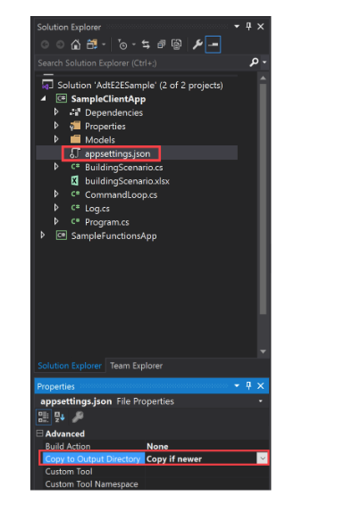

# 1. Azure IoT 学院专题二:  动手实验 2.3
## 通过以下链接观看有关视频
## 1.1. [专题二:  动手实验 2.3](https://youtu.be/jwzhy3_uS-A)

此动手实验室旨在向学生介绍以下 Azure 服务和技术：

- Visual Studio
- Azure 数字孪生
- Azure 云外壳
- 事件网格
- Azure 函数

此 Azure 数字孪生实验室描述了如何构建一个端到端的解决方案来演示服务的功能。 若要设置由环境中的实时数据驱动的完整端到端解决方案，可以将 Azure 数字孪生实例连接到其他 Azure 服务以管理设备和数据。

在本教程中，您将学会

  * 设置 Azure 数字孪生实例
  * 了解示例构建场景并实例化预先编写的组件
  * 使用 [Azure Functions](../azure-functions/functions-overview.md) 应用程序将模拟遥测数据从 [IoT Hub](../iot-hub/about-iot-hub.md) 设备路由到 数字孪生属性
  * 通过使用 Azure Functions、端点和路由处理数字孪生通知，通过孪生图传播更改

 课程内容

- [1. Azure IoT 学院专题二:  动手实验 2.3](#1-azure-iot-学院专题二--动手实验-23)
  - [通过以下链接观看有关视频](#通过以下链接观看有关视频)
  - [1.1. 专题二:  动手实验 2.3](#11-专题二--动手实验-23)
  - [1.1. 课前准备](#11-课前准备)
    - [1.1.1. 安装 Visual Studio](#111-安装-visual-studio)
    - [1.1.2. 下载 Azure 数字孪生 C# 示例项目的 ZIP 文件](#112-下载-azure-数字孪生-c-示例项目的-zip-文件)
    - [1.1.3. 准备 Azure 数字孪生实例](#113-准备-azure-数字孪生实例)
    - [1.1.4. 安装 Azure CLI](#114-安装-azure-cli)
    - [1.1.5. 建立 CLI 会话](#115-建立-cli-会话)
  - [1.2. 配置 ADT 示例项目](#12-配置-adt-示例项目)
    - [1.2.1. 开始构建场景](#121-开始构建场景)
    - [1.2.2. 实例化预先创建的孪生图](#122-实例化预先创建的孪生图)
    - [1.2.3. 设置示例函数应用](#123-设置示例函数应用)
    - [1.2.4. 更新依赖项](#124-更新依赖项)
    - [1.2.5. 发布应用](#125-发布应用)
    - [1.2.6. 为函数应用配置权限](#126-为函数应用配置权限)
    - [1.2.7. 分配访问角色](#127-分配访问角色)
    - [1.2.8. 配置应用程序设置](#128-配置应用程序设置)
  - [1.3. 练习: 处理来自 IoT Hub 设备的模拟遥测数据](#13-练习-处理来自-iot-hub-设备的模拟遥测数据)
    - [1.3.1. 将 IoT 中心连接到 Azure 函数](#131-将-iot-中心连接到-azure-函数)
    - [1.3.2. 向 IoT Hub 注册模拟设备](#132-向-iot-hub-注册模拟设备)
    - [1.3.3. 配置并运行模拟设备](#133-配置并运行模拟设备)
    - [1.3.4. See the results in Azure Digital Twins](#134-see-the-results-in-azure-digital-twins)
  - [1.4 练习: 通过图传播 Azure 数字孪生事件](#14-练习-通过图传播-azure-数字孪生事件)
    - [1.4.1. 创建事件网格主题](#141-创建事件网格主题)
    - [1.4.2. 创建端点](#142-创建端点)
    - [1.4.3. 创建路由](#143-创建路由)
    - [1.4.4. 🔗 Azure function](#144--azure-function)
  - [1.5. 练习：运行模拟并查看结果](#15-练习运行模拟并查看结果)
    - [1.5.1. 回顾](#151-回顾)
    - [1.5.2. 清空资源](#152-清空资源)
    - [1.5.3. 下一步](#153-下一步)

## 1.1. 课前准备

### 1.1.1. 安装 Visual Studio
[Visual Studio Download](https://visualstudio.microsoft.com/vs/)
* 针对 Mac 用户，最新版本的 Visual Studio 2022 for Mac（版本 17.2）提供了最多的开发功能

### 1.1.2. 下载 Azure 数字孪生 C# 示例项目的 ZIP 文件

本教程由 [用 C# 编写的 Azure 数字孪生端到端示例项目](https://github.com/Azure-Samples/digital-twins-samples) 驱动。 通过导航到示例链接并选择标题下方的 <b>浏览 - Browse</b> 代码按钮，在您的计算机上获取示例项目。 这会将您带到示例的 GitHub 存储库，您可以通过选择 <b>Code</b> 按钮，点击选择 <b>下载 Zip 文件 - Download ZIP。</b> 将其下载为 .zip。


这会将 .zip 文件夹作为 digital-twins-samples-master.zip 下载到您的计算机。 解压缩文件夹并提取文件。

### 1.1.3. 准备 Azure 数字孪生实例

我们将使用我们在动手实验专题二动手实验 2.1 中设置的 Azure 数字孪生实例。

从 Azure 门户打开你的 Azure 数字孪生实例。

在实例的 <b>预览 - Overview</b> 页面中，记下它的 <b>名字 - Name、资源组 - Resource group 和 主机名 - Host name。</b> 这些值都很重要，您可能需要在继续使用 Azure 时使用它们数字孪生实例

 

你现在已经准备好使用 Azure 数字孪生实例了。 请确保您具有适当的 Azure 用户权限来管理它。
设置用户访问权限：Azure 用户需要在 Azure 数字孪生实例上拥有 Azure 数字孪生数据 <b>Owner</b> 角色才能管理它及其数据。


### 1.1.4. 安装 Azure CLI

在 Azure Cloud Shell 中使用 Bash 环境。 右键单击下面的图像并在新窗口中打开。

[<b>](https://portal.azure.com/#cloudshell/)</b>


### 1.1.5. 建立 CLI 会话


如果这是你第一次将此订阅与 Azure 数字孪生一起使用，请运行此命令以向 Azure 数字孪生命名空间注册。 （如果您不确定，可以再次运行它，即使您过去曾经做过。）

```
az provider register --namespace 'Microsoft.DigitalTwins'
```
接下来，您将添加 [Microsoft Azure IoT Extension for Azure CLI](https://docs.microsoft.com/en-us/cli/azure/service-page/azure%20iot?view=azure-cli-latest&preserve- view=true)，以启用与 Azure 数字孪生和其他 IoT 服务交互的命令。 运行此命令以确保您拥有最新版本：

```

az extension add --upgrade --name azure-iot
```

现在，你已准备好在 Azure CLI 中使用 Azure 数字孪生。

您可以随时通过运行 ```az dt --help``` 来验证这一点，以查看可用的 Azure 数字孪生命令的列表。

## 1.2. 配置 ADT 示例项目

接下来，设置将与 Azure 数字孪生实例交互的示例客户端应用程序。

在您的计算机上导航到您之前从 [Azure 数字孪生端到端示例](https://docs.microsoft.com/en-us/samples/azure-samples/digital-twins-samples/digital-twins-samples/) （

进入文件夹后，进入到 <b>AdtSampleApp</b>。 在 Visual Studio 中打开 A<b>dtE2ESample.sln</b>。

在 Visual Studio 中，选择 <b>SampleClientApp > appsettings.json</b> 文件以在编辑窗口中打开它。 这将作为一个预设的 JSON 文件，其中包含运行项目所需的配置变量。

在文件正文中，将 ```instanceUrl``` 更改为您的 Azure 数字孪生实例主机名 URL（通过在主机名前添加 https://，如下所示）。

```
{
  "instanceUrl": "https://<your-Azure-Digital-Twins-instance-host-name>"
}
```
保存和关闭文件

接下来，配置 <b>appsettings.json</b> 文件以在构建 SampleClientApp 时复制到输出目录。 为此，请右键选择 <b>appsettings.json</b> 文件，然后选择 <b>Properties</b>。 在 <b>Properties</b> 检查器中，查找 <b>Copy to Output Directory</b> 属性。 如果尚未设置，请将值更改为 <b>Copy if newer</b>。

 

在 Visual Studio 中保持 AdtE2ESample 项目处于打开状态，以便在教程中继续使用它。


### 1.2.1. 开始构建场景

本教程中使用的示例项目代表了一个真实的建筑场景，其中包含一个楼层、一个房间和一个恒温器设备。这些组件将在 Azure 数字孪生实例中以数字方式表示，然后将连接到 [IoT Hub](../iot-hub/about-iot-hub.md)、[Event Grid](../event- grid/overview.md) 和两个 [Azure 函数](../azure-functions/functions-overview.md) 以启用数据移动。

下面是代表完整场景的图表。

您将首先创建 Azure 数字孪生实例（图中的**A 部分**），然后设置进入数字孪生的遥测数据流（**箭头 B**），然后设置通过孪生图（**箭头 C**）。

 

要完成该场景，您将与之前下载的预先编写的示例应用程序的组件进行交互。

以下是构建场景 AdtSampleApp 示例应用程序实现的组件的细分：
* 设备认证
* [.NET (C#) SDK](https://docs.microsoft.com/en-us/dotnet/api/overview/azure/digitaltwins/client?view=azure-dotnet&preserve-view=true) 使用示例（找到在 *CommandLoop.cs*)
* 调用 Azure 数字孪生 API 的控制台界面
* SampleClientApp - Azure 数字孪生解决方案示例
* SampleFunctionsApp - 一个 Azure Functions 应用，可根据来自 IoT Hub 的遥测数据和 Azure 数字孪生事件更新 Azure 数字孪生图形

### 1.2.2. 实例化预先创建的孪生图

首先，您将使用示例项目中的 AdtSampleApp 解决方案来构建端到端场景的 Azure 数字孪生部分（**A 部分**）：


在 *AdtE2ESample.sln* 解决方案打开的 Visual Studio 窗口中，使用工具栏中的此按钮运行 SampleClientApp 项目：


控制台窗口将打开，执行身份验证并等待命令。 在此控制台中，运行下一个命令以实例化示例 Azure 数字孪生解决方案。

> [!IMPORTANT] 
> 如果 Azure 数字孪生实例中已有数字孪生和关系，则运行此命令将删除它们并将其替换为示例场景的孪生和关系。

```cmd/sh
SetupBuildingScenario
```

此命令的输出是一系列确认消息，作为三个 [数字孪生](https://docs.microsoft.com/en-us/dotnet/api/overview/azure/digitaltwins/client?view=azure-dotnet&preserve-view=true) 在 Azure 数字孪生实例中创建并连接：一个名为 floor1 的楼层、一个名为 room21 的房间和一个名为 thermostat67 的温度传感器。这些数字孪生代表了现实世界环境中存在的实体。

它们通过关系连接到以下 [孪生图](https://docs.microsoft.com/en-us/azure/digital-twins/concepts-twins-graph)。孪生图将环境表示为一个整体，包括实体如何交互和相互关联。


您可以通过运行以下命令来验证创建的孪生，该命令会查询连接的 Azure 数字孪生实例以获取它包含的所有数字孪生：


```
Query
```

您现在可以停止运行该项目。 但是，请在 Visual Studio 中保持该解决方案处于打开状态，因为您将在整个教程中继续使用它。

### 1.2.3. 设置示例函数应用

下一步是设置一个 [Azure Functions 应用程序](../azure-functions/functions-overview.md)，将在本教程中用于处理数据。 函数应用 SampleFunctionsApp 包含两个函数：
* *ProcessHubToDTEvents*：处理传入的 IoT 中心数据并相应地更新 Azure 数字孪生
* *ProcessDTRoutedData*：处理来自数字孪生的数据，并相应地更新 Azure 数字孪生中的父孪生

在本部分中，你将发布预先编写的函数应用，并通过为其分配 Azure Active Directory (Azure AD) 标识来确保函数应用可以访问 Azure 数字孪生。 完成这些步骤将允许本教程的其余部分使用函数应用内的函数。

返回打开 *AdtE2ESample.sln* 解决方案的 Visual Studio 窗口，函数应用位于 SampleFunctionsApp 项目中。 您可以在 **Solution Explorer** 窗格中查看它。

### 1.2.4. 更新依赖项

在发布应用程序之前，最好确保您的依赖项是最新的，确保您拥有所有包含的包的最新版本。

在 **Solution Explorer** 窗格中，展开 **SampleFunctionsApp > Dependencies**。 右键选择 **Packages** 并选择 **Manage NuGet Packages...**。


这样做将打开 NuGet 包管理器。 选择 **Updates** 选项卡，如果有要更新的包，请选中复选框以 **Select all packages**。 然后选择**Updates**。


### 1.2.5. 发布应用

要将函数应用发布到 Azure，首先需要创建一个存储帐户，然后在 Azure 中创建函数应用，最后将函数发布到 Azure 函数应用。 本部分使用 Azure CLI 完成这些操作。

1. 通过运行以下命令创建一个 Azure 存储帐户。 确保使用现有的 RG 组名称更新存储帐户和资源组：

    ```azurecli-interactive
    az storage account create --name <name-for-new-storage-account> --location <location> --resource-group <resource-group> --sku Standard_LRS
    ```

2. 通过运行以下命令创建 Azure Function 应用：

    ```azurecli-interactive
    az functionapp create --name <name-for-new-function-app> --storage-account <name-of-storage-account-from-previous-step> --consumption-plan-location <location> --runtime dotnet --resource-group <resource-group>
    ```

3. 接下来，你将压缩函数并将它们发布到新的 Azure Function 应用.

    1. 在本地计算机上打开类似 PowerShell 的终端，然后导航到您在本教程前面下载的 [Digital Twins 示例存储库](https://github.com/azure-samples/digital-twins-samples/tree/master/) . 在下载的 repo 文件夹中，导航到 *digital-twins-samples-master\AdtSampleApp\SampleFunctionsApp*。
    
    2. 在终端中，运行以下命令以发布项目

        ```powershell
        dotnet publish -c Release
        ```

        This command publishes the project to the *digital-twins-samples-master\AdtSampleApp\SampleFunctionsApp\bin\Release\netcoreapp3.1\publish* directory.

    3. 创建位于 *digital-twins-samples-master\AdtSampleApp\SampleFunctionsApp\bin\Release\netcoreapp3.1\publish* 目录的 zip。 将压缩文件夹命名为 *publish.zip*。
        
       >[!TIP] 
       >如果您使用的是 PowerShell，则可以通过将完整路径复制到该 *\publish* 目录并将其粘贴到以下命令中来创建 zip:
       >
       >```powershell
       >Compress-Archive -Path <full-path-to-publish-directory>\* -DestinationPath .\publish.zip
       >```
        
        该 cmdlet 将在终端的目录位置创建 *publish.zip* 文件。 请确保您的 publish.zip 文件直接位于 SampleFunctionsApp 中（请参见下面的屏幕截图）

         您的 *publish.zip* 文件应该包含 *bin*、*ProcessDTRoutedData* 和 *ProcessHubToDTEvents* 的文件夹，并且还应该有一个 *host.json* 文件。

        


    
    >使用 Azure Cloud Shell，在运行命令之前使用此按钮将 ZIP 文件上传到 Cloud Shell：
    

    
    

    > 在这种情况下，文件将被上传到您的 Cloud Shell 存储的根目录，因此您可以在命令的 `--src` 参数中直接通过文件名引用文件（如 `--src publish .zip`).


4. 在 Azure Cloud Shell 中，运行以下命令将已发布和压缩的函数部署到 Azure Function App:

    ```azurecli-interactive
    az functionapp deployment source config-zip --resource-group <resource-group> --name <name-of-your-function-app> --src "publish.zip"
    ```

    A successful deployment will respond with status code 202 and output a JSON object containing details of your new function. You can confirm the deployment succeeded by looking for this field in the result:

    ```json
    {
      ...
      "provisioningState": "Succeeded",
      ...
    }
    ```

你现在已将函数发布到 Azure 中的函数应用。

接下来，您的函数应用将需要具有访问 Azure 数字孪生实例的正确权限。 您将在下一节中配置此访问权限

### 1.2.6. 为函数应用配置权限

需要为函数应用设置两个设置才能访问 Azure 数字孪生实例，这两个设置都可以使用 Azure CLI 完成

### 1.2.7. 分配访问角色

第一个设置为函数应用提供了 Azure 数字孪生实例中的 **Azure 数字孪生数据所有者** 角色。 任何想要在实例上执行许多数据平面活动的用户或功能都需要此角色。 您可以在 [Azure 数字孪生解决方案的安全性](concepts-security.md) 中阅读有关安全性和角色分配的更多信息。

1. 使用以下命令查看函数的系统管理标识的详细信息。 记下输出中的 **principalId** 字段。

    ```azurecli-interactive	
    az functionapp identity show --resource-group <your-resource-group> --name <your-function-app-name>	
    ```

    >[!NOTE]
    > 如果结果为空而不是显示身份的详细信息，请使用以下命令为函数创建一个新的系统管理的身份：
    > 
    >```azurecli-interactive	
    >az functionapp identity assign --resource-group <your-resource-group> --name <your-function-app-name>	
    >```
    >
    > 然后，输出将显示身份的详细信息，包括下一步所需的 **principalId** 值. 

2. 使用以下命令中的 **principalId** 值将函数应用的标识分配给 Azure 数字孪生实例的 **Azure 数字孪生数据所有者** 角色

    ```azurecli-interactive	
    az dt role-assignment create --dt-name <your-Azure-Digital-Twins-instance> --assignee "<principal-ID>" --role "Azure Digital Twins Data Owner"
    ```

此命令的结果是有关您创建的角色分配的输出信息。 函数应用现在有权访问 Azure 数字孪生实例中的数据。
 
### 1.2.8. 配置应用程序设置

第二个设置使用 Azure 数字孪生实例的 URL 为函数创建环境变量。 函数代码将使用此变量的值来引用您的实例。 有关环境变量的详细信息，请参阅[管理您的函数应用](../azure-functions/functions-how-to-use-azure-function-app-settings.md?tabs=portal)。

运行以下命令，在占位符中填写资源的详细信息。

```azurecli-interactive
az functionapp config appsettings set --resource-group <your-resource-group> --name <your-function-app-name> --settings "ADT_SERVICE_URL=https://<your-Azure-Digital-Twins-instance-host-name>"
```

输出是 Azure 函数的设置列表，现在应该包含一个名为“ADT_SERVICE_URL”的条目。


## 1.3. 练习: 处理来自 IoT Hub 设备的模拟遥测数据

Azure 数字孪生图旨在由来自真实设备的遥测驱动。

在此步骤中，您将在 [IoT Hub](https://docs.microsoft.com/en-us/azure/iot-hub/iot-concepts-and-iot-hub) 中注册的模拟恒温器设备连接到 在 Azure 数字孪生中表示它的数字孪生。 当模拟设备发出遥测数据时，数据将通过 *ProcessHubToDTEvents* Azure 函数引导，该函数触发数字孪生中的相应更新。 通过这种方式，数字孪生与真实设备的数据保持同步。 在 Azure 数字孪生中，将事件数据从一个地方定向到另一个地方的过程称为 [路由事件](https://docs.microsoft.com/en-us/azure/digital-twins/concepts-route-events)。

处理模拟遥测发生在端到端场景的这一部分（**箭头 B**）：


以下是设置此设备连接需要完成的操作：
1. 从专题一开始使用 IoT Hub - 这将管理模拟设备
2. 通过设置事件订阅将 IoT 中心连接到相应的 Azure 功能
3. 在 IoT 中心注册模拟设备
4. 运行模拟设备并生成遥测
5. 查询 Azure 数字孪生以查看实时结果

Azure 数字孪生旨在与 [IoT Hub](../iot-hub/about-iot-hub.md) 一起工作，这是一种用于管理设备及其数据的 Azure 服务。 在此步骤中，你将设置一个 IoT 中心来管理本教程中的示例设备。

### 1.3.1. 将 IoT 中心连接到 Azure 函数

接下来，将第 1 天的 IoT 中心连接到之前发布的函数应用中的 *ProcessHubToDTEvents* Azure 函数，以便数据可以从 IoT 中心的设备通过该函数流动，从而更新 Azure 数字孪生。

为此，您将在 IoT 中心创建一个*事件订阅*，并将 Azure 函数用作端点。 这会将函数“订阅”到 IoT 中心中发生的事件。

在 [Azure 门户] (https://portal.azure.com/) 中，通过在顶部搜索栏中搜索其名称，从专题导航到您的 IoT 中心。 从中心菜单中选择**事件 - Events**，然后选择**+事件订阅 - + Event Subscription**。


选择此选项将打开 **创建事件订阅 - Create Event Subscription** 页面。

填写如下字段（默认填写的字段不提）：
* **事件订阅详情** > **名称**：ADT-event-iotacademy（别名）
* **主题细节** > **System Topic Name**：为系统主题命名：ADT-system-topic（别名）
* **事件类型** > **过滤到事件类型**：从菜单选项中选择**设备遥测**。
* **端细节** > **Endpoint Type**：从菜单选项中选择 **Azure Function**。
* **端点细节** > **Endpoint**：选择 **Select an endpoint** 链接，这将打开一个 **Select Azure Function** 窗口：


填写您的 **订阅 - Subscription**、**资源组 - Resource group**、**Function app** 和 **Function** (**ProcessHubToDTEvents**)。 其中一些值可能会在选择订阅后自动填充。


    - Select **Confirm Selection**.

返回**创建事件订阅 - Create Event Subscription**页面，选择**创建 - Create**。

### 1.3.2. 向 IoT Hub 注册模拟设备

本部分在 IoT 中心创建一个 ID 为 thermostat67 的设备表示。 模拟设备将连接到此表示中，这就是遥测事件从设备进入 IoT 中心的方式。 IoT 中心是上一步中订阅的 Azure 函数正在侦听的位置，准备好接收事件并继续处理。

在 Azure CLI 中，使用以下命令在 IoT 中心创建设备：

```azurecli-interactive
az iot hub device-identity create --device-id thermostat67 --hub-name <your-IoT-hub-name> --resource-group <your-resource-group>
```

输出是有关已创建设备的信息。

### 1.3.3. 配置并运行模拟设备

接下来，配置设备模拟器以将数据发送到 IoT 中心实例。

首先使用以下命令获取 IoT Hub 连接字符串：

```azurecli-interactive
az iot hub connection-string show --hub-name <your-IoT-hub-name>
```

然后，使用以下命令获取设备连接字符串：

```azurecli-interactive
az iot hub device-identity connection-string show --device-id thermostat67 --hub-name <your-IoT-hub-name>
```

您将这些值插入到本地项目中的设备模拟器代码中，以将模拟器连接到此 IoT Hub 和 IoT Hub 设备。

在新的 Visual Studio 窗口中，打开（从下载的解决方案文件夹）*DeviceSimulator* > **DeviceSimulator.sln**。

>[!NOTE]
> 您现在应该有两个 Visual Studio 窗口，一个带有 *DeviceSimulator.sln*，另一个带有 *AdtE2ESample.sln*。

在这个新的 Visual Studio 窗口的 **Solution Explorer** 窗格中，选择 **DeviceSimulator > AzureIoTHub.cs** 以在编辑窗口中打开它。 将以下连接字符串值更改为您在上面收集的值：

```csharp
iotHubConnectionString = <your-hub-connection-string>
deviceConnectionString = <your-device-connection-string>
```

保存文件。

现在，要查看您设置的数据模拟的结果，请使用工具栏中的此按钮运行 **DeviceSimulator** 项目：


控制台窗口将打开并显示模拟温度遥测消息。 这些消息被发送到 IoT Hub ，然后由 Azure 函数提取和处理。


您无需在此控制台中执行任何其他操作，但在完成后续步骤时让它运行。

### 1.3.4. See the results in Azure Digital Twins

您之前发布的 *ProcessHubToDTEvents* 函数侦听 IoT Hub 数据，并调用 Azure 数字孪生 API 来更新 thermostat67 孪生的“温度”属性。

若要查看 Azure 数字孪生端的数据，请转到打开 *AdtE2ESample.sln* 解决方案的 Visual Studio 窗口并运行 SampleClientApp 项目。

在打开的项目控制台窗口中，运行以下命令以获取数字孪生恒温器 67 报告的温度：

```cmd
ObserveProperties thermostat67 Temperature
```

你应该会看到每两秒将来自 Azure 数字孪生实例的实时更新温度记录到控制台。

>[!注意]
> 来自设备的数据可能需要几秒钟才能传播到数字孪生。 在数据开始到达之前，前几个温度读数可能显示为 0。


验证实时温度记录成功运行后，您可以停止运行这两个项目。 保持 Visual Studio 窗口打开，因为您将在本教程的其余部分继续使用它们。

## 1.4 练习: 通过图传播 Azure 数字孪生事件

到目前为止，在本教程中，你已经了解了如何从外部设备数据更新 Azure 数字孪生。 接下来，您将了解如何通过 Azure 数字孪生图传播对一个数字孪生的更改，换句话说，如何从服务内部数据更新孪生。

为此，您将使用 *ProcessDTRoutedData* Azure 函数在更新连接的恒温器孪生时更新房间孪生。 更新功能发生在端到端场景的这一部分（**箭头 C**）：


以下是设置此数据流所需完成的操作：
1. [创建事件网格主题](https://docs.microsoft.com/en-us/azure/digital-twins/tutorial-end-to-end#create-the-event-grid-topic) 启用 Azure 服务之间的数据移动
2. [创建端点](https://docs.microsoft.com/en-us/azure/digital-twins/tutorial-end-to-end#create-the-endpoint) 在将实例连接到事件网格主题的 Azure 数字孪生中
3. [创建路由](https://docs.microsoft.com/en-us/azure/digital-twins/tutorial-end-to-end#create-the-route) 在将孪生属性更改事件发送到终结点的 Azure 数字孪生中
4. [创建 Azure function](https://docs.microsoft.com/en-us/azure/digital-twins/tutorial-end-to-end#connect-the-azure-function) 监听端点的事件网格主题，接收发送到那里的孪生属性更改事件，并相应地更新图中的其他孪生

### 1.4.1. 创建事件网格主题

[事件网格](https://docs.microsoft.com/en-us/azure/event-grid/overview) 是一项 Azure 服务，可帮助将事件从 Azure 服务路由和传递到 Azure 中的其他位置。 您可以创建一个 [Event Grid 主题](https://docs.microsoft.com/en-us/azure/event-grid/concepts) 来从某个源收集某些事件，然后订阅者可以监听该主题以接收 事件发生时。

在 Azure CLI 中，运行以下命令来创建事件网格主题（使用之前创建的系统主题名称）：

```
az eventgrid topic create --resource-group <your-resource-group> --name <name-for-your-event-grid-topic> --location <region>
```
此命令的输出是有关您创建的事件网格主题的信息。 保存您为事件网格主题提供的<b>唯一名称</b>，因为稍后您将使用它。

### 1.4.2. 创建端点 

接下来，在 Azure 数字孪生中创建一个事件网格终结点，它将您的实例连接到您的事件网格主题。 使用以下命令，根据需要填写事件网格主题的名称和其他占位符字段。

```
az dt endpoint create eventgrid --dt-name <Azure-Digital-Twins-instance> --eventgrid-resource-group <your-resource-group> --eventgrid-topic <your-event-grid-topic> --endpoint-name <name-for-your-Azure-Digital-Twins-endpoint>
```

此命令的输出是有关您创建的端点的信息。

在输出中查找 provisioningState 字段，并检查该值是否为“Succeeded”。


它也可能说“Provisioning”，表示仍在创建端点。 如果是这样，请等待几秒钟并运行以下命令来检查端点的状态。 重复直到 ```provisioningState``` 显示“Succeeded”。

```
az dt endpoint show --dt-name <your-Azure-Digital-Twins-instance> --endpoint-name <your-Azure-Digital-Twins-endpoint>
```
Save the name of your endpoint, because you'll use it later.

### 1.4.3. 创建路由

接下来，创建一个 Azure 数字孪生路由，将事件发送到您创建的事件网格终结点。

您可以使用以下 CLI 命令执行此操作（根据需要填写端点名称和其他占位符字段）。 此命令转发孪生图中发生的所有事件。 如果需要，您可以使用 [过滤器](https://docs.microsoft.com/en-us/azure/digital-twins/how-to-manage-routes?tabs=portal%2Cportal2%2Cportal3#filter-events)。
```
az dt route create --dt-name <your-Azure-Digital-Twins-instance> --endpoint-name <use-above-name-createdfor-Azure-Digital-Twins-endpoint> --route-name <Create-uniquename-for-your-Azure-Digital-Twins-route>
```
此命令的输出是有关您创建的路由的一些信息。

 
 > 注意 <br>
 > 端点（来自上一步）必须先完成配置，然后才能设置使用它们的事件路由。 如果由于端点未准备好而导致路由创建失败，请等待几分钟，然后重试。

### 1.4.4. 🔗 Azure function

接下来，将 *ProcessDTRoutedData* Azure 函数订阅到您之前创建的事件网格主题，以便遥测数据可以从 thermostat67 双胞胎通过事件网格主题流向函数，该函数返回 Azure 数字双胞胎并相应地更新 room21 双胞胎 .

为此，您将创建一个事件网格订阅，该订阅将数据从您之前创建的事件网格主题发送到您的 *ProcessDTRoutedData* Azure 函数。

在 [Azure 门户] (https://portal.azure.com/) 中，通过在顶部搜索栏中搜索其名称来导航到您的事件网格主题。 选择 **+ 活动订阅 - Event Subscription**。


创建此事件订阅的步骤与您在本教程前面将第一个 Azure 函数订阅到 IoT Hub 时的步骤类似。 这一次，您无需将 **Device Telemetry** 指定为要侦听的事件类型，您将连接到不同的 Azure 函数。

在**创建事件订阅**页面，填写如下字段（默认填写的字段不提）：
* **事件订阅详细信息** > **名称**：为您的事件订阅命名 - adt-event-subscription（别名）
* **ENDPOINT DETAILS** > **Endpoint Type**：从菜单选项中选择 **Azure Function**。
* **ENDPOINT DETAILS** > **Endpoint**：选择 **Select an endpoint** 链接，这将打开一个 **Select Azure Function** 窗口：
     - 填写您的 **Subscription**、**Resource group**、**Function app** 和 **Function** (**ProcessDTRoutedData**) - 将根据您之前在实验室中发布的 Zip 文件进行预填充。 其中一些值可能会在选择订阅后自动填充。
     - 选择**确认选择**。

返回**创建事件订阅 - Create Event Subscription**页面，选择**创建 - Create**。

## 1.5. 练习：运行模拟并查看结果

现在，事件应该能够从模拟设备流入 Azure 数字孪生，并通过 Azure 数字孪生图来适当地更新孪生。 在本部分中，您将再次运行设备模拟器以启动您设置的完整事件流，并查询 Azure 数字孪生以查看实时结果

转到 *DeviceSimulator.sln* 解决方案打开的 Visual Studio 窗口，然后运行 DeviceSimulator 项目。

就像您之前运行设备模拟器时一样，控制台窗口将打开并显示模拟温度遥测消息。 这些事件将通过您之前设置的流程来更新 thermostat67 twin，然后通过您最近设置的流程来更新 room21 以匹配孪生。


您无需在此控制台中执行任何其他操作，但在完成后续步骤时让它运行。

若要查看 Azure 数字孪生端的数据，请转到打开 *AdtE2ESample.sln* 解决方案的 Visual Studio 窗口，然后运行 SampleClientApp 项目。

在打开的项目控制台窗口中，运行以下命令以获取数字孪生恒温器 67 和数字孪生房间 21 报告的温度。

```cmd
ObserveProperties thermostat67 Temperature room21 Temperature
```

你应该会看到每两秒将来自 Azure 数字孪生实例的实时更新温度记录到控制台。 请注意，房间 21 的温度正在更新以匹配 thermostat67 的更新。


一旦您验证了从您的实例记录的实时温度是否成功运行，您就可以停止运行这两个项目。 您也可以关闭 Visual Studio 窗口，因为教程现已完成。

### 1.5.1. 回顾

Here's a review of the scenario that you built out in this tutorial.

这是您在本教程中构建的场景的回顾。

1. Azure Digital Twins 实例以数字方式表示楼层、房间和恒温器（由下图中的**A 部分**表示）
2. 模拟设备遥测被发送到 IoT 中心，其中 *ProcessHubToDTEvents* Azure 函数正在侦听遥测事件。 *ProcessHubToDTEvents* Azure 函数使用这些事件中的信息来设置 thermostat67 上的 `Temperature` 属性（图中的**箭头 B**）。
3. Azure 数字孪生中的属性更改事件被路由到事件网格主题，其中 *ProcessDTRoutedData* Azure 函数正在侦听事件。 *ProcessDTRoutedData* Azure 函数使用这些事件中的信息来设置 room21 上的 `Temperature` 属性（图中的**箭头 C**）。


### 1.5.2. 清空资源

完成本教程后，…………取决于我们接下来要做什么。


### 1.5.3. 下一步

在本教程中，你创建了一个端到端方案，展示了由实时设备数据驱动的 Azure 数字孪生。

接下来，开始查看 [概念文档](https://docs.microsoft.com/en-us/azure/digital-twins/concepts-models) 以了解有关您在本教程中使用的元素的更多信息。
