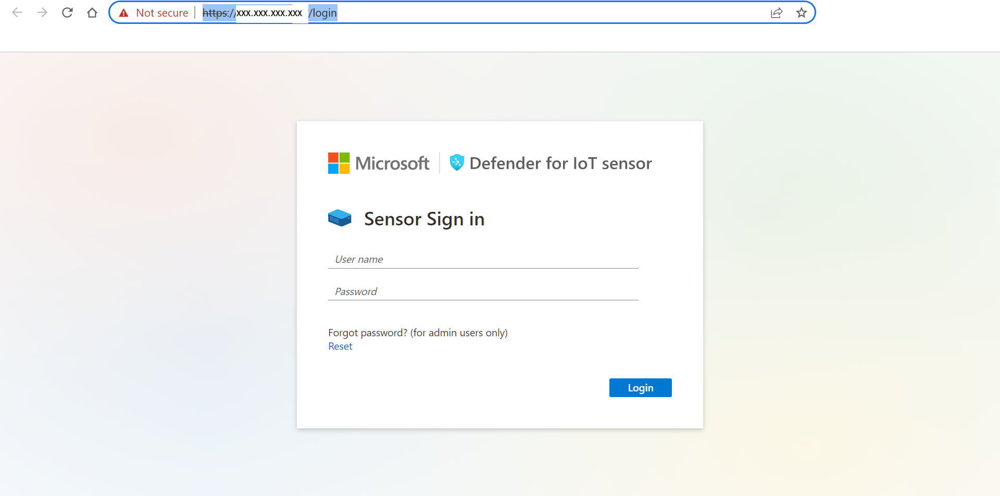
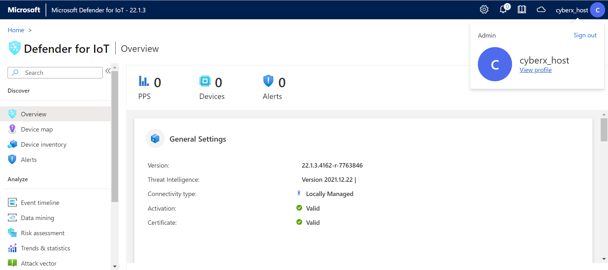
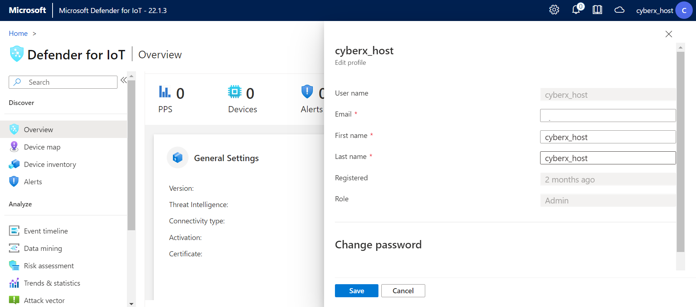
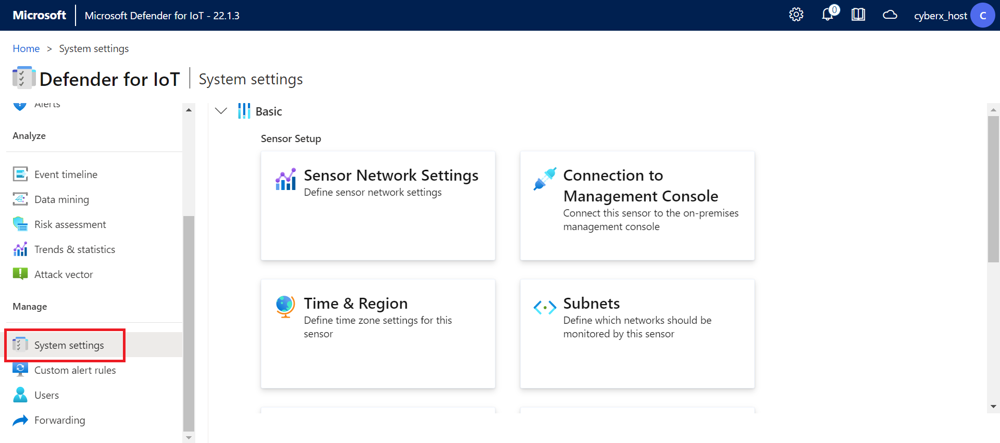
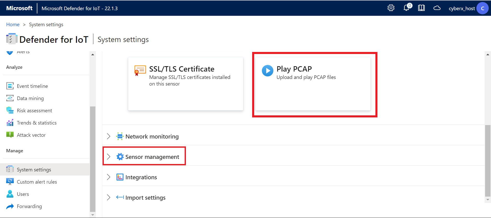
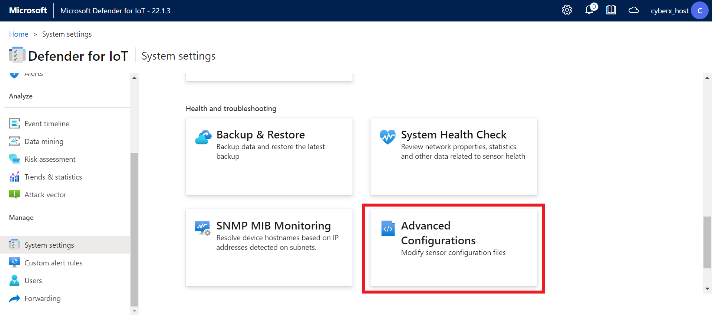
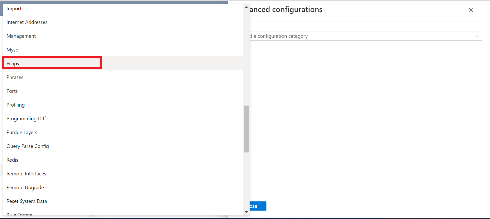
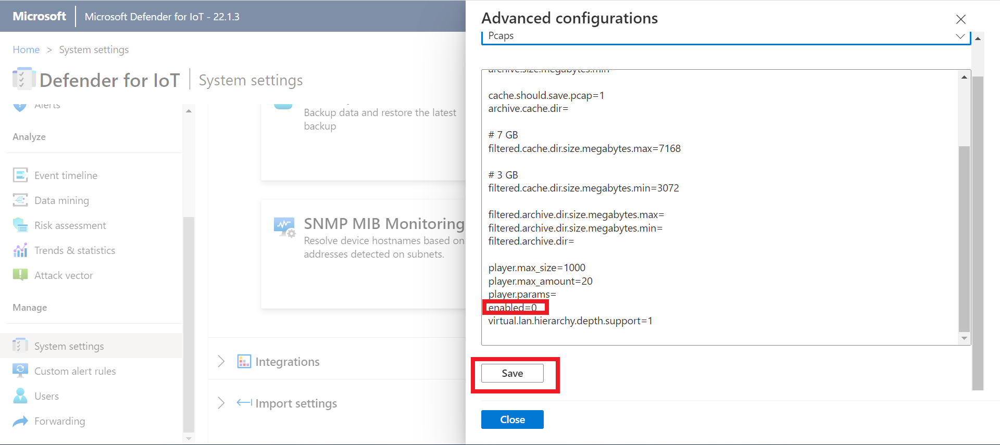

 Installation and Setup

#### ⌛ Estimated time to complete this lab: 20 minutes

## Objectives

This module guides you through the deployment of the Microsoft Defender for IoT Training Lab solution that will be used in all subsequent modules.

#### Prerequisites

To get started with Microsoft Defender for IoT, you must have a Microsoft Azure subscription. If you do not have a subscription, you can sign up for a free account [here](https://azure.microsoft.com/en/free).

Permissions to create a resource group in your Azure subscription.

Proceed to access the console by using the URL provided in email to you

Use the user name & password as provided by you MS contact.

Upon successful login please proceed immediately to change the password by clicking on the username on the top right corner and selecting 
View Profile link

And change the password (Scroll down)

### Exercise 2: Enabling the PCAP player

The PCAP player needs to be enabled to be visibly avialble for use in the UI. 
To do so, please select the "System settings" option from the scrolled down left side menu

Scroll all the way down to the bottom to locate if the PCAP Player is enabled (Shown in the image below in the red top squre) or not.
If the PCAP player is not shown, proceed to click on the arrow next to the Sensor Managment button (Shown in the image below in the red lower squre).

From the newly opend menu, scroll down to locate the "Advanced Configuration" option (Shown in the image below in the red squre)

From the opened "Configuration Selection" menu, scroll down to locate the "PCAP" category

Scroll down to locate the "enabled" option, it should be set to 1. if it is not so, chne it now, and click the save button and approv to commit the change.

