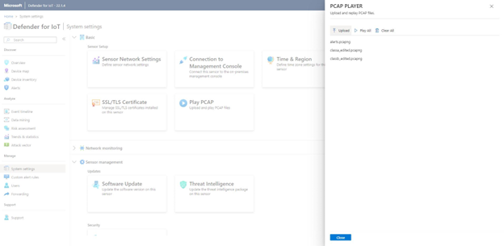

# Internet of Things - Microsoft Defender for IoT  HOL

Before starting this Lab make sure you completed the steps specified in the [Installation & Setup](./DeploySensorV22/Modules/Module-1-Setting-up-the-environment.md) file in this repository.

## Architecture Diagram ## 

During this workshop we will be focusing on setting up our Microsoft Defender for IoT sensors, for online alerts and also for offline scenarios.
You will learn how to configure your environment, assess the results, and integrate with SIEM systems like Microsoft Sentinel.
This Hands-on-Lab (HOL) will be focus on securing your facilities. 
It will cover brownfield and greenfield devices (currently not part of the HOL).
The scenario below is one of many you would apply these lessons to, other scenarios are Oil, Gas, Utility, and Energy companies.


## **Content:** ##
- [Exercise #1: Edit System Properties](#Exercise-1-Edit-System-Properties)
    - [Task 1: Enable pcap player](#Task-1-Enable-PCAP-Player)
    - [Task 2: Upload PCAPS](#Task-2-Upload-PCAPS)
    - [Task 3: Import Firewall Rules](#Task-3-Import-Firewall-Rules)
    - [Task 4: Play PCAPS](#Task-3-Play-PCAPS)
    - [Task 5: Verify Data Collection](#Task-3-Verify-Data-Collection)
- [Exercise #2: Setting up your offline sensor](#Exercise-2-Setting-up-your-offline-sensor)
    - [Task 1: Set up your offline sensor](#Task-1-Set-up-your-nested-Virtual-Machine)
    - [Task 2: Collect Information](#Task-2-Configure-a-Microsoft-Defender-for-IoT-offline-sensor)
- [Exercise 3: Enabling system settings](#exercise-3-enabling-system-settings)
    - [Task 1: System Properties](#task-1-System-properties)
    - [Task 2: Pcap Files](#task-2-Pcap-Files)
- [Exercise 4: Analyzing the Data](#Exercise-4-Analyzing-the-Data)
    - [Task 1: Devices Map](#Task-1-Devices-Map)
    - [Task 2: Alerts](#Task-2-Alerts)
    - [Task 3: Device Inventory](#Task-3-Device-Inventory)
    - [Task 4: Event Timeline](#Task-4-Event-Timeline)
    - [Task 5: Data Mining](#Task-5-Data-Mining)
- [Exercise 5: Online Sensor](#Exercise-5-Online-Sensor)
    - [Task 1: Reconfiguring sensor](#Task-1-reconfiguring-sensor)
- [Exercise 6: Integrate with Sentinel](#Exercise-6-Integrate-with-Sentinel)
    - [Task 1: Enabling IoT to Integrate with Sentinel](#Task-1-Enabling-IoT-to-Integrate-with-Sentinel)
    - [Task 2: Connecting Data Connectors](#Task-2-Connecting-Data-Connectors)
    - [Task 3: Acknowledge Alerts and Re-run PCAPs](#Task-3-Acknowledge-Alerts-and-Re-run-PCAPs)
    - [Task 4: Sentinel interaction with IoT Incidents](#Task-4-Sentinel-interaction-with-IoT-Incidents)
    - [Task 5: Kusto Query Language to Find Alert Details](#Task-5-Kusto-Query-Language-to-Find-Alert-Details)
- [Exercise 7: Clean Up](#Exercise-7-Clean-Up)
    - [Task 1: Delete resources](#Task-1-Delete-resources)
- [Appendix 1: Troubleshooting](#Appendix-1-Troubleshooting)

## Exercise #1: Edit System Properties to enable pcap player


1. Enable pcap player

   

2. Upload pcaps

   

3. Import firewall rules from the System Settings -> Firewall Rules -> Select file

   

   


4. Import Subnets - 
   This will assign names to some of the subnets that we will encounter during the exercise

   

5. Play pcaps by hitting -  Play All

   

6. Verify data collection

   




 Observe the following are populating as the pcap plays 
    
   - PPS rate
   - Devices
   - Alerts   

In this screen there is a great deal of information available about the sensor and what it is observing 
Look at each of these fields and what they tell you
    
   <b>General Settings</b>

	 Version
	 Threat Intelligence
	 Connection Type   
	 Interfaces (collecting data)

	 Traffic Monitor- Histogram of traffic presented to sensor, measured in Mb/s
		- Link to Trends and Statistics page
	 Top OT Protocols- Top 5 displayed
		- Link to Device Map
	 Traffic by Port
		- Link to Device Inventory
	 Top Open Alerts
		- Link to Alerts

### Task 2: Device Map


1. Use the four icon bar on the left to select **Layout by Purdue**. In this model you will see the different layers between Corporate IT and site operations.

   

1. Check your notifications available and you can take action at this point.

   

1. For each device right click to analyze properties, show events, reports and simulate attack vectors.

   

1. In the hamburger menu on the left, click the highlights and select one of the **OT Protocols** i.e. **MODBUS** and click on **Filter**. Now your map will show those devices only

   

1. Then filter your devices by **CIP** OT Protocol, at the bottom of your map you will see a PLC, where the Vendor is Rockwell Automation, has already 3 alerts activated. Right click on the device, **View Properties**. In this view you will be able to analyze the Backbone of your PLCs, take actions and analyze the Alerts.

   

### Task 2: Alerts

1. Once you click Alerts in your PLC you will see a new window pop up showing three different types of alerts.

   - Operational(high Alert and lower alert)
   - Policy Violation

   For each of these alerts you will be able to analyze the pcap file, export a report, analyze the timeline or mute the alert.

   
    
1. If we remove the device filter from the top of the screen, then click **Confirm** you will see 20 Alerts in process.

1. Apply **Custom Groups** to filter different scenarios, such as **Unclassified subnets** then **Confirm**

   

### Task 3: Device Inventory

1. In this view, filter all your devices by **Is Authorized**, True or False are possible values.

   > **NOTE:** if you don't see the column "Is Authorized", click on the "Device Inventory Settings" gear icon (upper-right corner) and add it to the view.

   

1. Organize your devices based on filters.

1. Export the list to a csv files.

### Task 4: Event Timeline

This view will allow you a Forensic analysis of your alerts.

1. Choose **Advanced Filters**, filter the timeline by **CIP**, let's analyze the alert timeline.

   

### Task 5: Data Mining

In this section you can create multiple custom reports.
As an example we will create a Report based on firmware updates versions.

1. Go To **+**, **New report**, in the categories section select **Modules and Firmware update versions**

1. Assign a name to your report. Then go to Filters, **add** and select **Firmware version(generic)**

   

1. In the new field added **Firmware Version(GENERIC)** add **0.4.1**, then **Save**.

1. You can remove the filter to list all the firmware updates version in your list also.

1. Export you report(pdf, csv) for further actions. 

### Task 6: Risk Assessment

1. Go to the Risk assessment, run the assessment. During this task we will show you how to analyze the assessment. 

## Exercise 5: Online Sensor

To modify our sensor to become an online sensor, we will use the same virtual machine that we used for the offline sensor, but we will reactivate the sensor using **System settings**. In a real scenario you probably would create a new sensor, running in its own virtual machine or physical appliance.

### Task 1: Reconfiguring sensor

To modify your sensor to be connected with Azure, you will need to modify the network configuration.

1. In your sensor's Azure Defender for IoT Portal (in the Virtual Machine), select **System Settings** and **Network**.

   

1. Change the IP Address of the Default Gateway to 192.168.0.1 or 172.27.0.1, depending on the settings you used earlier in the HOL.
 
    

1. On the "md4iotsensoroffline" Virtual Machine Connection, select **Action** and **Ctrl+Alt+Delete** to reboot the sensor.

   

1. Login to your sensor's Azure Defender for IoT Portal (in the Virtual Machine) again, select **System Settings** and then, **Reactivation**.

1. In the new window, select **Upload**, **Browse File**, select the zip file you downloaded from the storage account in previous steps **myonlinesensor.zip**, then **Open** and **Activate**, **Ok** to the instructions

   

1. Last, you should receive a message showing your sensor modified to **Connected**. 

1. Close the screen, open again the **Reactivation** window and double check if your sensor is **Cloud Connected** as shown below:

   

1. Run the Pcap files again in your console. In a few minutes you can verify if IoT Hub in Azure Portal on your physical machine is receiving messages from your sensor:

   

1. In the same IoT Hub now you should see the alerts generated by Defender for IoT. Scroll down to **Defender for IoT**, select **Security Alerts**, on the right side you will see some alerts already available.

   

## Exercise 6: Integrate with Sentinel

You will execute most of this task on your physical machine, not in the Virtual Machine that hosts your your Microsoft Defender for IoT sensor.

> **Note**: Please ensure you have completed Task 6 in the ['Before HOL'](../Before%20HOL/Microsoft%20Defender%20for%20IoT%20BHOL.md "Microsoft Defender for IoT Before Hands-on-Lab") instructions prior to working through the following tasks.

### Task 1: Enabling IoT to Integrate with Sentinel

1. Ensure your IoT Hub is configured to send Security Alerts to Sentinel.
1. Navigate to your IoT Hub > Defender for IoT > Settings > Data Collection

   

1. Double check that Data Collection blade, is enabled for **Enable Microsoft Defender for IoT**
 
   

### Task 2: Connecting Data Connectors
	
1. With the *Microsoft Defender for IoT* switch enabled, go to **Microsoft Sentinel** > Configuration > Data Connectors > Search **Microsoft Defender for IoT** to connect Microsoft Defender for IoT to Microsoft Sentinel.
 
   

1. Click the **Open Connector Page**
 
   

1. Review the instructions and click the “Connect” button to connect Microsoft Defender for IoT to Sentinel. If the connection continues to fail, this will most likely be due to the user not having the "Contributor" permissions and you may have missed the access step in the prerequisites. 

   

1. If connected correctly you should expect to see the Status change to “Connected” and the link light up green.
 
   

1. Use the next steps tab to enable Out of the Box alerts. For example, click the create rule and follow the instructions to turn on the rule.
 
   

1. Fill in the “Name” and click **Review and Create**, followed by **Create**. This is enabling incidents to be created based on the Azure Defender IoT alerts that are ingested into Sentinel.
 
   

1. Additionally, you can create the rule not only on the data connectors page but also on the Microsoft Sentinel “Analytics” blade. See an example below when you go to the “Rule Templates” tab and filter data sources by “Microsoft Defender for IoT (Preview)”.

   

### Task 3: Acknowledge Alerts and Re-run PCAPs

You will execute most of this task on the Virtual Machine that hosts your your Microsoft Defender for IoT sensor.

1. Go back to your browser interface and acknowledge all of the alerts. The reason we are doing this is so we can re-run the alerts to show how they are sent and analyzed by Sentinel.

	1. Navigate to the Alerts Page
	1. Click the double check box
	1. Click **Ok** to acknowledge the alerts 
    
   

    1. Now go to the System Setting tab.
    1. Click the **Play All** on the PCAP Files to replay simulating the alerts.

   

### Task 4: Sentinel interaction with IoT Incidents

You will execute most of this task on your physical machine, not in the Virtual Machine that hosts your your Microsoft Defender for IoT sensor.

1. Go back to the Sentinel console and under the **Threat Management** section, select the **Incidents** tab.  Filter by Product Name **Azure Defender for IoT**.

   

1. Select one of the alerts and click **View full details**

   

1. It will take you to this screen to get all the information relative to the incident. This allows analyst to get more details on the entity including what other alerts made up the incident, playbooks to enrich the context of the alert, and comments section to leave details on what the analyst discovered during review or how they came to the determination to dismiss the incident.

   

1. By clicking the **Investigate** button, you can dig deeper in the cause of the incident and the relation to other incidents.

   

### Task 5: Kusto Query Language to Find Alert Details

1. Navigate to the “Logs” tab and run this query. Querying the data will provide the ability to join tables and datasets to curate data from multiple sources. KQL is a similar language to SQL but will take some research and some dedicated time to become familiar with.

   Here are two basic examples:

   ```sql
	SecurityAlert | where ProviderName contains "IoTSecurity"
   ``` 
 
   

   ```sql
   SecurityAlert | where CompromisedEntity == "hub-md4iot-mst01"
   ```
 
   

## Exercise 7: Clean Up

### Task 1: Delete resources

The Azure Passes will allow you to run the services for 90 days for training purposes. Although it is a best practice to delete all your resources after the training. 

Search for the Resource Group created for this training.

Select Delete resource group on the top right side.

Enter your-resource-group-name for **TYPE THE RESOURCE GROUP NAME** and select Delete. This operation will take a few minutes.

After that is done go to Microsoft Defender for IoT and deactivate the subscription.


## Appendix 1: Troubleshooting

1. If your Defender portal is not working properly run the following command to validate if the components are running properly

   ```powershell
   cyberx-xsense-sanity
   ```
   

1. If your IoT hub is not receiving messages, check if ubuntu machine can reach IoT Hub, first run the following command to identify the IP of your IoT Hub:

   ```powershell
   netstat -na | grep EST | grep -v 127.0.0.1
   ```

   

   Then, ping the IoT Hub using the connection string from the overview blade in Azure Portal.

   

