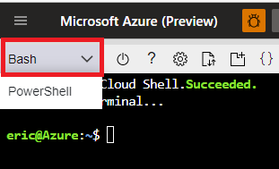
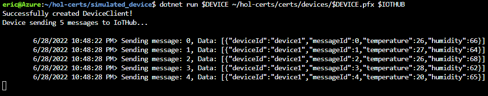
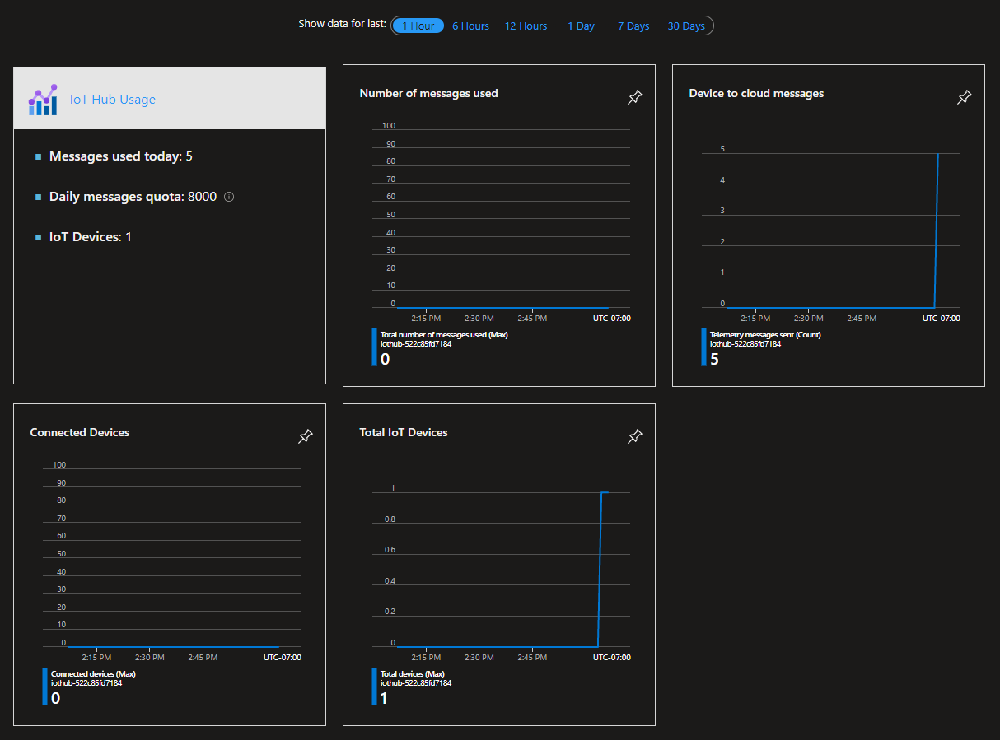

 Azure IoT Academy Month Three Day Two<!-- omit in toc -->
===

**Course Content**
- [1. Introduction](#1-introduction)
- [2. Open Azure Cloud Shell](#2-open-azure-cloud-shell)
- [3. Download, unzip files, and set variables](#3-download-unzip-files-and-set-variables)
- [4. Create CA chain and a device certificate](#4-create-ca-chain-and-a-device-certificate)
  - [1. Create a root CA](#1-create-a-root-ca)
  - [2. Create a subordinate CA](#2-create-a-subordinate-ca)
  - [3. Create a device certificate](#3-create-a-device-certificate)
- [5. Create and configure your IoT Hub](#5-create-and-configure-your-iot-hub)
- [6. Run simulated device](#6-run-simulated-device)
  - [1. Verify activity on the IoT Hub](#1-verify-activity-on-the-iot-hub)
- [7. Cleanup](#7-cleanup)

# 1. Introduction

This hands on lab introduces you to use of X.509 certificates for authentication of devices to Azure IoT services.

# 2. Open Azure Cloud Shell

In a browser, open your Azure Cloud Shell: https://shell.azure.com/

Ensure your shell is set to Bash:



# 3. Download, unzip files, and set variables

In your Cloud Shell, copy and paste to run the following:

```bash
cd ~
wget https://github.com/AzureIoTGBB/iot-academy/raw/main/Month_3/Day_2/files/hol-certs.zip
unzip hol-certs.zip
RAND=`openssl rand -hex 6`
REGION="eastus"
RG="rg-hol-x509"
IOTHUB="iothub-$RAND"
DEVICE="device1"

```

There is no need to change any of the variables above, but for your reference as they are used elsewhere in this lab:

| Variable | Description |
| -------- | ----------- |
| ***RAND*** | Random string of 6 hex digits to make your IoT Hub name unique. |
| ***REGION*** | Region to create the resource group and IoT Hub. |
| ***RG*** | Resource group name. |
| ***IOTHUB*** | Unique name of the IoT Hub. |
| ***DEVICE*** | Valid name in IoT Hub for your simulated device. |

# 4. Create CA chain and a device certificate

## 1. Create a root CA

First, generate a private key and the certificate signing request (CSR) in the rootca directory.

Enter a pass phrase for your root CA when prompted and remember it, as you will need it in following steps.

```bash
cd ~/hol-certs/certs/rootca
openssl rand -hex 16 > db/serial
openssl req -new -config rootca.conf -out rootca.csr -keyout private/rootca.key

```

Next, create a self-signed CA certificate. Self-signing is suitable for testing purposes. This root CA can be used to sign certificates and certificate revocation lists (CRLs).

Sign the certificate and enter the root CA pass phrase when prompted.

```bash
openssl ca -selfsign -batch -config rootca.conf -in rootca.csr -out rootca.crt -extensions ca_ext

```

## 2. Create a subordinate CA

In this lab we will also create a subordinate or registration CA. Because you can use the root CA to sign certificates, creating a subordinate CA isn’t strictly necessary, but this mimics real world certificate hierarchies in which the root CA is kept offline and subordinate CAs issue client certificates. Enter a pass phrase for the subordinate CA and remember it, as you will need it in following steps.

```bash
cd ~/hol-certs/certs/subca
openssl rand -hex 16 > db/serial
openssl req -new -config subca.conf -out subca.csr -keyout private/subca.key

```

Create the subordinate CA and sign it. Enter the root CA pass phrase when prompted.

```bash
openssl ca -batch -config ../rootca/rootca.conf -in subca.csr -out subca.crt -extensions sub_ca_ext

```

Convert subca.crt to subca.pem so it can be imported to IoT Hub.

```bash
openssl x509 -in subca.crt -out subca.pem -outform PEM

```

## 3. Create a device certificate

Create a private key for the device and certificate signing request (CSR) for the key. Note that the CN must equal the device ID.

```bash
openssl genpkey -out $DEVICE.key -algorithm RSA -pkeyopt rsa_keygen_bits:2048
openssl req -new -key $DEVICE.key -out $DEVICE.csr -subj "/CN=$DEVICE"
openssl req -text -in $DEVICE.csr -noout

```

Create & sign the device certificate, create the .pfx that you will be using to connect to the IoT Hub, copy the important files, and clean up. Note that this uses a blank password for the .pfx and you will likely wish to supply one in a production environment. Enter the subordinate CA pass phrase when prompted.

```bash
openssl rand -hex 16 > db/serial
openssl ca -batch -config subca.conf -in $DEVICE.csr -out $DEVICE.crt -extensions client_ext

```

Export the certificate to a .pfx format and move to the directory it will be used from by your simulated device.

```bash
openssl pkcs12 -export -passout pass: -in $DEVICE.crt -inkey $DEVICE.key -out $DEVICE.pfx
mv $DEVICE.pfx ../devices

```

# 5. Create and configure your IoT Hub

Create a new resource group in the specified region, create an IoT Hub with a unique name, add the subordinate CA, and create a device that will be authenticated using an X.509 certificate.

```bash
az group create -l $REGION -g $RG
az iot hub create -n $IOTHUB -g $RG --sku F1 --partition-count 2
az iot hub certificate create --hub-name $IOTHUB --name "SubCA" --path ~/hol-certs/certs/subca/subca.pem --verified
az iot hub device-identity create -n $IOTHUB -d $DEVICE --am x509_ca

```

Wait as these resources are created.

# 6. Run simulated device

The below will restore the dotnet environment and run the simulated device with the name, pfx, and destination IoT Hub specified.

```bash
cd ~/hol-certs/simulated_device
dotnet restore
dotnet run $DEVICE ~/hol-certs/certs/devices/$DEVICE.pfx $IOTHUB

```

This will send 5 random temperature messages to the IoT Hub then wait for 5 minutes to show a connection. The output will look similar to below:



These messages being sent is confirmation that the simulated device connected using X.509 certificate authentication.

## 1. Verify activity on the IoT Hub

Open your Azure portal: https://portal.azure.com/

Navigate to the resource group **rg-hol-x509** and click on the IoT Hub in this resource group.

Wait 1-5 minutes, switch "Show data for last" to 1 hour, and observe "Device to cloud messages" has increased to 5.

If this is not seen, try clicking "Refresh".



# 7. Cleanup

Once you're done testing with the simulated device, clean up after this lab.

```bash
az group delete -g $RG --no-wait -y
cd ~
rm -rf hol-certs hol-certs.zip

```
